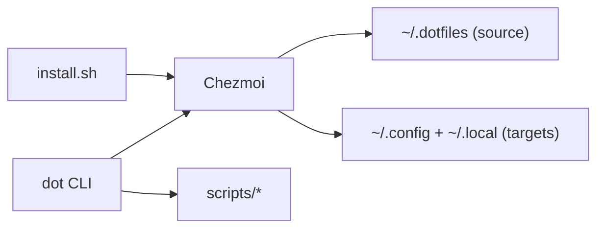

<p align="right">
  
</p>

# Your Development Environment. Perfected.

[](https://github.com/sebastienrousseau/dotfiles/actions)
[](https://github.com/sebastienrousseau/dotfiles/releases)
[](LICENSE)
[](https://github.com/sebastienrousseau/dotfiles/releases)
[](https://github.com/sebastienrousseau/dotfiles/commits)

---

## One Command. Every Machine.

Your environment is your edge. It should move with you.

Dotfiles ends drift. It turns a fresh machine into your machine in minutes.

One command. Every machine. The same power, every time.

---

## The Vision

Every developer deserves a shell that amplifies intelligence.

Not a maze. Not a reset. A multiplier.

Dotfiles makes your environment portable, secure, and exact.

### Why It Works

**Instant readiness.** Zsh, Neovim, tmux, and modern CLI tools arrive configured from the first keystroke.

**One command control.** The `dot` CLI runs updates, secrets, security, and themes from one place.

**Safety by design.** Nothing destructive runs without consent. Every privileged change is logged.

**Clean source.** Generated files stay separate. Your source stays clean.


---

## Your Environment. Instantly.

Run this once:

```bash
sh -c "$(curl -fsSL https://raw.githubusercontent.com/sebastienrousseau/dotfiles/master/install.sh)"
exec zsh
```

Your entire development environment. Configured. Secured. Ready.

**Works everywhere:** macOS, Linux, WSL. No exceptions.

### For Teams and CI

```bash
DOTFILES_NONINTERACTIVE=1 sh -c "$(curl -fsSL https://raw.githubusercontent.com/sebastienrousseau/dotfiles/master/install.sh)"
```

### What Just Happened?

Dotfiles backs up your current state, boots Chezmoi, applies your environment, and runs verified OS hooks.

No destruction. No surprises. No downtime.

---

## Master Your Environment

### Stay Current
```bash
dot update
```
Pull the latest improvements. Apply them instantly. Stay current.

### Go Deeper

**[Operations Guide](docs/OPERATIONS.md)** — Workflows across platforms
**[Security Guide](docs/SECURITY.md)** — Hardening without friction
**[Secrets Guide](docs/SECRETS.md)** — Age encryption, made clear
**[Tools Catalog](docs/TOOLS.md)** — The tools that multiply output
**[Utilities Guide](docs/UTILS.md)** — Aliases that save hours
**[Troubleshooting](docs/TROUBLESHOOTING.md)** — Fixes that stick

### For Teams and Automation
```bash
DOTFILES_NONINTERACTIVE=1 dot apply
```
Perfect for servers, CI/CD, and team onboarding.

**Prerequisites:** `git` and `curl`. Everything else is handled.

---

## Your New Superpower: The `dot` CLI

**One command. Full control.** Every aspect of your environment from one interface.

Run `dot --help` or `dot <command> --help` for complete documentation.

| Command | Description | Category |
|---|---|---|
| `dot apply` | Apply dotfiles (chezmoi apply) | Core |
| `dot sync` | Alias of apply | Core |
| `dot update` | Pull latest changes and apply | Core |
| `dot add` | Add a file to chezmoi source | Core |
| `dot diff` | Show chezmoi diff (excludes scripts) | Core |
| `dot status` | Show configuration drift | Core |
| `dot remove` | Safely remove a managed file | Core |
| `dot cd` | Print source directory path | Core |
| `dot upgrade` | Update flake, plugins, and dotfiles | Core |
| `dot edit` | Open chezmoi source in your editor | Core |
| `dot docs` | Show repo README | Core |
| `dot --version` | Show version information | Core |
| `dot help` | Show help | Core |
| `dot drift` | Drift dashboard (chezmoi status) | Diagnostics |
| `dot history` | Shell history analysis | Diagnostics |
| `dot doctor` | Check system health and configuration | Diagnostics |
| `dot heal` | Auto-repair common dotfiles issues | Diagnostics |
| `dot health` | Comprehensive health dashboard (37 checks) | Diagnostics |
| `dot security-score` | Security assessment with grading | Diagnostics |
| `dot benchmark` | Shell startup benchmark (`--detailed`, `--profile`) | Diagnostics |
| `dot restore` | Restore from backup or git ref | Diagnostics |
| `dot rollback` | Rollback dotfiles to a previous state | Diagnostics |
| `dot theme` | Switch terminal theme (dark/light) | UX |
| `dot wallpaper` | Apply a wallpaper from your library | UX |
| `dot keys` | Show keybindings catalog | UX |
| `dot learn` | Interactive tour of tools (requires `gum`) | UX |
| `dot fonts` | Install Nerd Fonts | UX |
| `dot tune` | Apply OS tuning (opt-in) | UX |
| `dot sandbox` | Launch a safe sandbox preview | Tools |
| `dot tools` | Show tools or install through Nix | Tools |
| `dot tools install` | Enter Nix development shell | Tools |
| `dot new` | Create a new project from a template | Tools |
| `dot packages` | List installed packages | Tools |
| `dot log-rotate` | Rotate `~/.local/share/dotfiles.log` | Tools |
| `dot secrets-init` | Initialise age key for secrets | Secrets |
| `dot secrets` | Edit encrypted secrets | Secrets |
| `dot secrets-create` | Create an encrypted secrets file | Secrets |
| `dot ssh-key` | Encrypt an SSH key locally with age | Secrets |
| `dot backup` | Create a compressed backup of your home directory | Security |
| `dot firewall` | Apply firewall hardening (opt‑in) | Security |
| `dot telemetry` | Disable OS telemetry (opt‑in) | Security |
| `dot dns-doh` | Enable DNS‑over‑HTTPS (opt‑in) | Security |
| `dot encrypt-check` | Check disk encryption status | Security |
| `dot lock-screen` | Enforce lock‑screen idle settings (opt‑in) | Security |
| `dot usb-safety` | Disable automount for removable media | Security |

### Developer CLI Tools

These utilities are installed to `~/.local/bin/`:

| Tool | Description |
|------|-------------|
| `jsonv` | JSON validator and formatter |
| `yamlv` | YAML validator |
| `epoch` | Unix timestamp converter |
| `b64` | Base64 encoder/decoder |
| `jwt` | JWT token decoder |
| `hex` | Hex viewer/converter |
| `regex` | Regex tester |
| `lorem` | Lorem ipsum generator |
| `uuid` | UUID generator |
| `hash` | MD5/SHA hash calculator |
| `ip` | Show public/local IP addresses |
| `kill-port` | Kill process by port |
| `extract` | Universal archive extraction |
| `update` | Update all system packages |

**Examples**

```bash
# Initialise secrets (prints a public key)
DOTFILES_NONINTERACTIVE=1 dot secrets-init
# Output: Age key created at ~/.config/chezmoi/key.txt
```

### Security That Doesn't Get in Your Way

Every security enhancement is opt-in. Your machine, your choice, your control.
All changes are logged to `~/.local/share/dotfiles.log`.

| Script | macOS | Linux |
|---|---|---|
| `dot firewall` | Enables macOS firewall and stealth mode via `socketfilterfw` | Configures UFW defaults and OpenSSH allow |
| `dot telemetry` | Writes `DiagnosticMessagesHistory.plist` flags | Disables `whoopsie`, `apport`, `popularity-contest` |
| `dot dns-doh` | No system change (browser‑level only) | Enables DoH via `resolvectl` with Cloudflare DNS |
| `dot lock-screen` | `com.apple.screensaver` defaults and idleTime | GNOME `gsettings` lock and idle timeout |
| `dot usb-safety` | No system change (manual UI) | GNOME `gsettings` automount off |
| `dot encrypt-check` | Reads FileVault status via `fdesetup` | Detects LUKS via `lsblk` |

### Nix: Reproducibility When You Want It

Nix support is **completely optional.** We never install the daemon without your explicit choice.

**When you're ready:**
- `nix develop` — Enter a perfectly reproducible shell environment
- `dot tools` — Explore our curated utility collection
- Full coexistence with Homebrew, Apt, and other package managers

---

## The Architecture of Elegance

**Simple on the surface. Sophisticated underneath.**

Here's how we achieve the impossible: perfect environment management with zero complexity for you.



### Lightning Fast. Always.

**Our shell startup is obsessively optimized:**

```
.zshenv ─▶ .zshrc ─▶ rc.d/{10..50} ─▶ shell/{00,05,40,50,90} ─▶ [precmd: 91-lazy] ─▶ tool init
   │          │            │                    │                        │                   │
   │          │            │                    │                        │                   ├─ atuin
  XDG      zinit      options,            paths, safety,          tool-specific          ├─ starship
  PATH     plugins    lazy fnm/nvm        functions,              aliases (deferred)     ├─ zoxide
                                          core aliases (eager)                           └─ fzf
```

**The secret:** Core aliases (~40KB) load instantly. Heavy tooling (~137KB of aliases) loads after your first prompt. You get immediate responsiveness *and* complete functionality.

*Fast enough for impatient developers. Complete enough for power users.*

See [docs/ARCHITECTURE.md](docs/ARCHITECTURE.md) for the complete engineering behind this magic.

### Everything in Its Place

**Perfectly organized. Logically structured. Instantly understandable.**

```text
~/.dotfiles/
├── dot_config/                 # Your app configurations (~/.config/)
│   ├── nvim/                    # Neovim: Lua-powered editing perfection
│   ├── zsh/                     # Zsh: Modular shell intelligence
│   ├── tmux/                    # Tmux: Terminal multiplexing mastery
│   ├── shell/                   # Shell logic: aliases, functions, paths
│   ├── wezterm/ alacritty/ kitty/ ghostty/ # Terminal choices
│   ├── btop/ fastfetch/ atuin/ yazi/ ...   # Productivity tools
│   └── docker/ containers/ ...              # Container tooling
├── dot_local/                  # Your personal binaries (~/.local/)
│   └── bin/                     # dot CLI and helper utilities
├── dot_etc/                    # System-level configurations
├── dot_ssh/                    # SSH configuration templates
├── templates/                  # Project scaffolds for `dot new`
├── scripts/                    # Installation, security, themes, diagnostics
├── install/                    # Chezmoi lifecycle hooks
├── nix/                        # Optional Nix development environment
├── docs/                       # Complete documentation suite
└── install.sh                  # The magic begins here
```

*Clean separation. No pollution. Total clarity.*

---

## Join the Evolution

**This is just the beginning.** Track our roadmap on [GitHub Issues](https://github.com/sebastienrousseau/dotfiles/issues) and [Milestones](https://github.com/sebastienrousseau/dotfiles/milestones).

### Make It Better

**Every great tool is built by its community.** Read [CONTRIBUTING.md](.github/CONTRIBUTING.md) and help us perfect the developer experience.

**Found something sensitive?** See [SECURITY.md](.github/SECURITY.md) for responsible disclosure.

### Need Help?

**Every problem has a solution.** Check [docs/TROUBLESHOOTING.md](docs/TROUBLESHOOTING.md) for fixes to common issues.

### Stay Updated

**Never miss an improvement.** See [CHANGELOG.md](CHANGELOG.md) for the complete evolution story.

---

## Open Source, Open Future

**MIT Licensed.** See [LICENSE](LICENSE) for complete terms.

*Some bundled utilities are GPL-3.0 licensed — full details in LICENSE file.*

---

<div align="center">

🎨 Designed by **[Sebastien Rousseau](https://sebastienrousseau.com/)**
🚀 Engineered with **[Euxis](https://euxis.co/)** — Enterprise Unified eXecution Intelligence System

</div>
