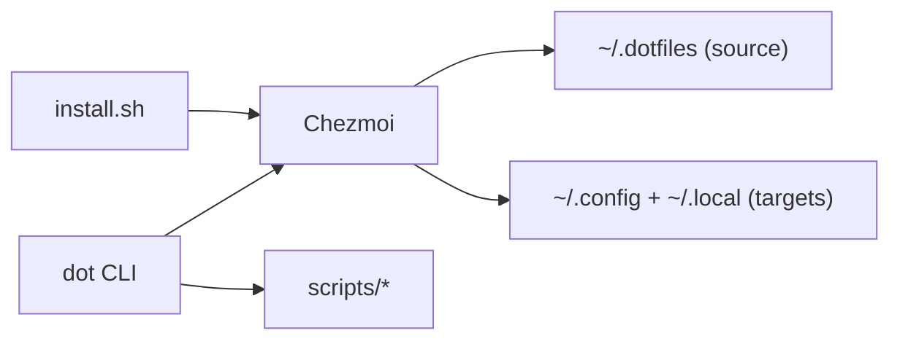

<p align="right">
  
</p>

# Dotfiles — A Fast, Idempotent Shell Environment

[](https://github.com/sebastienrousseau/dotfiles/actions)
[](https://github.com/sebastienrousseau/dotfiles/releases/tag/v0.2.481)
[](LICENSE)
[](https://github.com/sebastienrousseau/dotfiles/releases)
[](https://github.com/sebastienrousseau/dotfiles/commits)

---

## Overview

Set up your development environment in minutes and keep it consistent across every machine. Dotfiles is a cross‑platform shell distribution managed by [Chezmoi](https://github.com/twpayne/chezmoi) that works on macOS, Linux, and WSL. It is **idempotent** by design: run it once or a hundred times, and the result is always the same.

Git + templates + guarded scripts = a reproducible shell.

---

## Table of contents

- [Why dotfiles](#why-dotfiles)
- [Safety](#safety)
- [Get started](#get-started)
- [Discover](#discover)
- [Install details](#install-details)
- [Make it yours](#make-it-yours)
- [Reference](#reference)
- [How it works](#how-it-works)
- [Roadmap](#roadmap)
- [Contribute](#contribute)
- [Changelog](#changelog)
- [License](#license)

---

## Why dotfiles

Dotfiles takes an infrastructure‑oriented approach to managing your shell. It is designed for developers who work across multiple machines and value **daily usability, reproducibility, and auditability.**

- **The Stack.** Zsh, Neovim, tmux, and AI CLI tools configured with sane defaults so you can start working immediately.
- **Unified Control.** The `dot` CLI wraps common workflows such as syncing, upgrading, and managing secrets.
- **Safety First.** Every system or security change requires explicit opt‑in.
- **Clean Slate.** Source files, generated configs, and system state stay cleanly separated.


## Safety

This is **infrastructure**, not an ad‑hoc shell script.

- No destructive actions without explicit opt‑in.
- No background daemons install automatically.
- No system settings change by default.
- System‑level behavior requires explicit opt‑in through environment variables.
- Dotfiles logs all privileged actions to `~/.local/share/dotfiles.log`.

---

## Get started

> [!IMPORTANT]
> The installer automatically backs up any existing dotfiles that chezmoi will overwrite (to `~/.dotfiles.bak.<timestamp>/`). It bootstraps `chezmoi` and applies this repo. OS packages install through Chezmoi hooks during the first apply.

```bash
# Works on macOS, Linux, and WSL
sh -c "$(curl -fsSL https://raw.githubusercontent.com/sebastienrousseau/dotfiles/v0.2.481/install.sh)"
exec zsh
```

For non‑interactive installs (servers and CI):
```bash
DOTFILES_NONINTERACTIVE=1 sh -c "$(curl -fsSL https://raw.githubusercontent.com/sebastienrousseau/dotfiles/v0.2.481/install.sh)"
```

---

## Discover

- [Installation Guide](docs/INSTALL.md) — Prerequisites and supported platforms.
- [Operations Guide](docs/OPERATIONS.md) — Common workflows and platform notes.
- [Security Guide](docs/SECURITY.md) — Hardening matrix and logging.
- [Secrets Guide](docs/SECRETS.md) — Age setup and encrypted files.
- [Tools Catalog](docs/TOOLS.md) — Core tools and optional utilities.
- [Dot Utils](docs/UTILS.md) — Aliases and dot CLI helpers.
- [Troubleshooting](docs/TROUBLESHOOTING.md) — Fixes for common issues.

---

## Install details

**Prerequisites**
- Required: `git`, `curl`
- Optional: Homebrew (macOS), `apt-get` (Linux/WSL), Nix (toolchain)

**Update**
```bash
dot update
```

**Non‑interactive apply**
```bash
DOTFILES_NONINTERACTIVE=1 dot apply
```

## Make it yours

- [Operations](docs/OPERATIONS.md)
- [Secrets](docs/SECRETS.md)
- [Security](docs/SECURITY.md)
- [Troubleshooting](docs/TROUBLESHOOTING.md)

---

## Reference

Run `dot --help` or `dot <command> --help` for inline documentation.

| Command | Description | Category |
|---|---|---|
| `dot apply` | Apply dotfiles (chezmoi apply) | Core |
| `dot sync` | Alias of apply | Core |
| `dot update` | Pull latest changes and apply | Core |
| `dot add` | Add a file to chezmoi source | Core |
| `dot diff` | Show chezmoi diff (excludes scripts) | Core |
| `dot status` | Show configuration drift | Core |
| `dot remove` | Safely remove a managed file | Core |
| `dot cd` | Print source directory path | Core |
| `dot upgrade` | Update flake, plugins, and dotfiles | Core |
| `dot edit` | Open chezmoi source in your editor | Core |
| `dot docs` | Show repo README | Core |
| `dot --version` | Show version information | Core |
| `dot help` | Show help | Core |
| `dot drift` | Drift dashboard (chezmoi status) | Diagnostics |
| `dot history` | Shell history analysis | Diagnostics |
| `dot doctor` | Check system health and configuration | Diagnostics |
| `dot health` | Comprehensive health dashboard (37 checks) | Diagnostics |
| `dot security-score` | Security assessment with grading | Diagnostics |
| `dot benchmark` | Shell startup benchmark (`--detailed`, `--profile`) | Diagnostics |
| `dot restore` | Restore from backup or git ref | Diagnostics |
| `dot theme` | Switch terminal theme (dark/light) | UX |
| `dot wallpaper` | Apply a wallpaper from your library | UX |
| `dot keys` | Show keybindings catalog | UX |
| `dot learn` | Interactive tour of tools (requires `gum`) | UX |
| `dot fonts` | Install Nerd Fonts | UX |
| `dot sandbox` | Launch a safe sandbox preview | Tools |
| `dot tools` | Show tools or install through Nix | Tools |
| `dot tools install` | Enter Nix development shell | Tools |
| `dot new` | Create a new project from a template | Tools |
| `dot log-rotate` | Rotate `~/.local/share/dotfiles.log` | Tools |
| `dot secrets-init` | Initialise age key for secrets | Secrets |
| `dot secrets` | Edit encrypted secrets | Secrets |
| `dot secrets-create` | Create an encrypted secrets file | Secrets |
| `dot ssh-key` | Encrypt an SSH key locally with age | Secrets |
| `dot backup` | Create a compressed backup of your home directory | Security |
| `dot firewall` | Apply firewall hardening (opt‑in) | Security |
| `dot telemetry` | Disable OS telemetry (opt‑in) | Security |
| `dot dns-doh` | Enable DNS‑over‑HTTPS (opt‑in) | Security |
| `dot encrypt-check` | Check disk encryption status | Security |
| `dot lock-screen` | Enforce lock‑screen idle settings (opt‑in) | Security |
| `dot usb-safety` | Disable automount for removable media | Security |

### Developer CLI Tools

These utilities are installed to `~/.local/bin/`:

| Tool | Description |
|------|-------------|
| `jsonv` | JSON validator and formatter |
| `yamlv` | YAML validator |
| `epoch` | Unix timestamp converter |
| `b64` | Base64 encoder/decoder |
| `jwt` | JWT token decoder |
| `hex` | Hex viewer/converter |
| `regex` | Regex tester |
| `lorem` | Lorem ipsum generator |
| `uuid` | UUID generator |
| `hash` | MD5/SHA hash calculator |
| `ip` | Show public/local IP addresses |
| `kill-port` | Kill process by port |
| `extract` | Universal archive extraction |
| `update` | Update all system packages |

**Examples**

```bash
# Initialise secrets (prints a public key)
DOTFILES_NONINTERACTIVE=1 dot secrets-init
# Output: Age key created at ~/.config/chezmoi/key.txt
```

### Security changes

These scripts are **opt‑in** and run only when you set the matching environment variable.
All security changes are logged to `~/.local/share/dotfiles.log`.

| Script | macOS | Linux |
|---|---|---|
| `dot firewall` | Enables macOS firewall and stealth mode via `socketfilterfw` | Configures UFW defaults and OpenSSH allow |
| `dot telemetry` | Writes `DiagnosticMessagesHistory.plist` flags | Disables `whoopsie`, `apport`, `popularity-contest` |
| `dot dns-doh` | No system change (browser‑level only) | Enables DoH via `resolvectl` with Cloudflare DNS |
| `dot lock-screen` | `com.apple.screensaver` defaults and idleTime | GNOME `gsettings` lock and idle timeout |
| `dot usb-safety` | No system change (manual UI) | GNOME `gsettings` automount off |
| `dot encrypt-check` | Reads FileVault status via `fdesetup` | Detects LUKS via `lsblk` |

### Nix

Nix is **optional**. The repo does **not** install the Nix daemon.

- Use `nix develop` to enter a reproducible shell environment.
- Use `dot tools` to see the curated utilities overview.
- No toggle replaces Homebrew or Apt with Nix automatically.

---

### Install guide

See [docs/INSTALL.md](docs/INSTALL.md) for prerequisites, supported platforms, and the full install flow.

<p align="right"><a href="#dotfiles--your-shell-everywhere">↑ Back to Top</a></p>

## How it works

If Mermaid does not render, the flow is: `install.sh` → `Chezmoi` → `~/.dotfiles` → `~/.config + ~/.local`.



### Shell startup flow

```
.zshenv ─▶ .zshrc ─▶ rc.d/{10..50} ─▶ shell/{00,05,40,50,90} ─▶ [precmd: 91-lazy] ─▶ tool init
   │          │            │                    │                        │                   │
   │          │            │                    │                        │                   ├─ atuin
  XDG      zinit      options,            paths, safety,          tool-specific          ├─ starship
  PATH     plugins    lazy fnm/nvm        functions,              aliases (deferred)     ├─ zoxide
                                          core aliases (eager)                           └─ fzf
```

Core aliases (~40KB) load at startup. Tool-specific aliases (~137KB) load after the first prompt via a `precmd` hook — keeping shell startup fast while still providing full alias coverage. See [docs/ARCHITECTURE.md](docs/ARCHITECTURE.md) for the full startup sequence and ordering conventions.

**Repository Layout**

```text
~/.dotfiles/
├── dot_config/                 # Maps to ~/.config/ (app configs)
│   ├── nvim/                    # Neovim config (Lua)
│   ├── zsh/                     # Zsh config (modular)
│   ├── tmux/                    # Tmux config
│   ├── shell/                   # Shell logic (aliases, functions, paths)
│   ├── wezterm/ alacritty/ kitty/ ghostty/
│   ├── btop/ fastfetch/ atuin/ yazi/ ...
│   └── docker/ containers/ ...
├── dot_local/                  # Maps to ~/.local/ (CLI tools)
│   └── bin/                     # dot CLI and helpers
├── dot_etc/                    # System configs (sudoers, sysctl, Chrome policies; may require sudo)
├── dot_ssh/                    # SSH config templates
├── templates/                  # Project scaffolds used by `dot new`
├── scripts/                    # Install, security, theme, diagnostics
├── install/                    # Chezmoi run_onchange and run_before hooks
├── nix/                        # Optional Nix shell environment
├── docs/                       # Guides, keys, roadmap, architecture
└── install.sh                  # Bootstrap installer
```

---

## Roadmap

Track progress on [GitHub Issues](https://github.com/sebastienrousseau/dotfiles/issues) and [Milestones](https://github.com/sebastienrousseau/dotfiles/milestones).

---

## Contribute

Please read [CONTRIBUTING.md](.github/CONTRIBUTING.md) before opening a pull request.

For security issues, see [SECURITY.md](.github/SECURITY.md).

---

## Troubleshooting

See [docs/TROUBLESHOOTING.md](docs/TROUBLESHOOTING.md).

---

## Changelog

See [CHANGELOG.md](CHANGELOG.md).

---

## License

This project is licensed under the **MIT License**. See [LICENSE](LICENSE).

Some bundled third‑party dependencies are licensed under GPL‑3.0; the LICENSE file lists them explicitly.

---

<div align="center">

Made with ❤️ by [Sebastien Rousseau](https://github.com/sebastienrousseau)

---

🎨 Designed by **[Sebastien Rousseau](https://sebastienrousseau.com/)**
🚀 Engineered with **[Euxis](https://euxis.co/)** — Enterprise Unified eXecution Intelligence System

</div>
