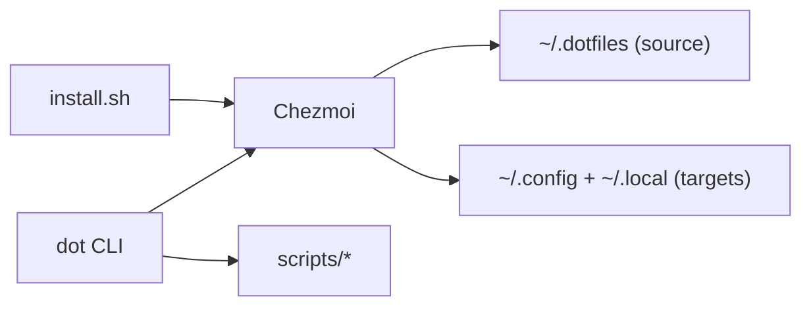

<p align="right">
  
</p>

# Dotfiles — a fast, idempotent shell environment distribution in minutes

[](https://github.com/sebastienrousseau/dotfiles/actions) [](https://github.com/sebastienrousseau/dotfiles/releases/tag/v0.2.474) [](LICENSE) [](https://github.com/sebastienrousseau/dotfiles/releases) [](https://github.com/sebastienrousseau/dotfiles/commits)

---

## Elevator Pitch

Dotfiles is a cross-platform shell environment distribution managed by [Chezmoi](https://github.com/twpayne/chezmoi) that installs in minutes and keeps your development environment consistent across macOS, Linux, and WSL. It is **idempotent** by design: running it multiple times is safe, predictable, and produces the same result.

Git + templates + guarded scripts = a reproducible shell.

---

## Table of Contents

- [Why Dotfiles?](#why-dotfiles)
- [Safety Guarantees](#safety-guarantees)
- [Quick Start (60 seconds)](#quick-start-60-seconds)
- [Documentation](#documentation)
- [Installation Details](#installation-details)
- [How-to Guides](#how-to-guides)
- [Reference](#reference)
- [Architecture (How it Works)](#architecture-how-it-works)
- [Roadmap](#roadmap)
- [Contributing](#contributing)
- [Changelog](#changelog)
- [License](#license)

---

## Why Dotfiles?

Dotfiles takes an infrastructure-oriented approach to managing dotfiles. It is designed for developers who manage multiple machines and value **daily usability, reproducibility, and auditability.**

- **The Stack:** Zsh, Neovim, and tmux with sane defaults.
- **Unified Control:** The `dot` CLI wraps common workflows such as syncing, upgrading, and managing secrets.
- **Safety First:** Explicit opt-in for any system or security changes.
- **Clean Slate:** Clear separation between source files, generated configs, and system state.

## Safety Guarantees

This is **infrastructure**, not an ad-hoc shell script.

- No destructive actions without explicit opt-in.
- No background daemons installed automatically.
- No system settings are changed by default.
- Any system-level behavior must be explicitly enabled via environment variables.
- All privileged actions are logged locally to `~/.local/share/dotfiles.log`.

---

## Quick Start (60 seconds)

> [!IMPORTANT]
> The installer automatically backs up an existing `~/.dotfiles` directory and cleans up legacy configuration files. The installer **only** bootstraps `chezmoi` and applies this repo. OS packages are installed via Chezmoi hooks during the first apply.

```bash
# Works on macOS, Linux, and WSL
sh -c "$(curl -fsSL https://raw.githubusercontent.com/sebastienrousseau/dotfiles/v0.2.474/install.sh)"
exec zsh
```

For non‑interactive installs (servers/CI), add:
```bash
DOTFILES_NONINTERACTIVE=1 sh -c "$(curl -fsSL https://raw.githubusercontent.com/sebastienrousseau/dotfiles/v0.2.474/install.sh)"
```

---

## Documentation

- [Installation Guide](docs/INSTALL.md) — prerequisites and supported platforms.
- [Operations Guide](docs/OPERATIONS.md) — common workflows and platform notes.
- [Security Guide](docs/SECURITY.md) — hardening matrix and logging.
- [Secrets Guide](docs/SECRETS.md) — age setup and encrypted files.
- [Tools Catalog](docs/TOOLS.md) — core tools and optional utilities.
- [Dot Utils](docs/UTILS.md) — aliases and dot CLI helpers.
- [Troubleshooting](docs/TROUBLESHOOTING.md) — fixes for common issues.

---

## Installation Details

**Prerequisites**
- Required: `git`, `curl`
- Verification: `sha256sum` (Linux) or `shasum` (macOS)
- Optional: Homebrew (macOS), `apt-get` (Linux/WSL), Nix (toolchain)

**Updates**
```bash
dot update
```

**Non‑interactive apply**
```bash
DOTFILES_NONINTERACTIVE=1 dot apply
```

## How-to Guides

- [Operations](docs/OPERATIONS.md)
- [Secrets](docs/SECRETS.md)
- [Security](docs/SECURITY.md)
- [Troubleshooting](docs/TROUBLESHOOTING.md)

---

## Reference

Use `dot --help` or `dot <command> --help` for inline docs.

| Command | Description | Category |
|---|---|---|
| `dot apply` | Apply dotfiles (chezmoi apply) | Core |
| `dot sync` | Alias of apply | Core |
| `dot update` | Pull latest changes and apply | Core |
| `dot diff` | Show chezmoi diff (excludes scripts) | Core |
| `dot remove` | Safely remove a managed file | Core |
| `dot upgrade` | Update flake, plugins, and dotfiles | Core |
| `dot edit` | Open chezmoi source in editor | Core |
| `dot docs` | Show repo README | Core |
| `dot help` | Show help | Core |
| `dot drift` | Drift dashboard (chezmoi status) | Diagnostics |
| `dot history` | Shell history analysis | Diagnostics |
| `dot doctor` | Check system health and configuration | Diagnostics |
| `dot benchmark` | Shell startup benchmark | Diagnostics |
| `dot theme` | Switch terminal theme (dark/light) | UX |
| `dot wallpaper` | Apply a wallpaper from your library | UX |
| `dot keys` | Show keybindings catalog | UX |
| `dot learn` | Interactive tour of tools (requires `gum`) | UX |
| `dot fonts` | Install Nerd Fonts | UX |
| `dot sandbox` | Launch a safe sandbox preview | Tools |
| `dot tools` | Show dot utils overview | Tools |
| `dot new` | Create a new project from a template | Tools |
| `dot log-rotate` | Rotate `~/.local/share/dotfiles.log` | Tools |
| `dot secrets-init` | Initialize age key for secrets | Secrets |
| `dot secrets` | Edit encrypted secrets | Secrets |
| `dot secrets-create` | Create an encrypted secrets file | Secrets |
| `dot ssh-key` | Encrypt an SSH key locally with age | Secrets |
| `dot backup` | Create a compressed backup of your home directory | Security |
| `dot firewall` | Apply firewall hardening (opt‑in) | Security |
| `dot telemetry` | Disable OS telemetry (opt‑in) | Security |
| `dot dns-doh` | Enable DNS‑over‑HTTPS (opt‑in) | Security |
| `dot encrypt-check` | Check disk encryption status | Security |
| `dot lock-screen` | Enforce lock screen idle settings (opt‑in) | Security |
| `dot usb-safety` | Disable automount for removable media | Security |

**Examples**

```bash
# Initialize secrets (prints a public key)
DOTFILES_NONINTERACTIVE=1 dot secrets-init
# Output: Age key created at ~/.config/chezmoi/key.txt
```

### Security Auditing (What Changes)

These scripts are **opt‑in** and only run when the matching env var is set.
All security changes are logged to `~/.local/share/dotfiles.log`.

| Script | macOS changes | Linux changes |
|---|---|---|
| `dot firewall` | Enables macOS firewall + stealth mode via `socketfilterfw` | Configures UFW defaults + OpenSSH allow |
| `dot telemetry` | Writes `DiagnosticMessagesHistory.plist` flags | Disables `whoopsie`, `apport`, `popularity-contest` |
| `dot dns-doh` | No system change (browser‑level only) | Enables DoH via `resolvectl` and sets Cloudflare DNS |
| `dot lock-screen` | `com.apple.screensaver` defaults + idleTime | GNOME `gsettings` lock + idle timeout |
| `dot usb-safety` | No system change (manual UI) | GNOME `gsettings` automount off |
| `dot encrypt-check` | Reads FileVault status via `fdesetup` | Detects LUKS via `lsblk` |

### Nix Integration

Nix is **optional**. The repo does **not** install the Nix daemon.

- Use `nix develop` for a reproducible shell environment.
- `dot tools` prints the curated utilities overview.
- There is no toggle that replaces Brew/Apt with Nix automatically.

---

### Install Guide

See [docs/INSTALL.md](docs/INSTALL.md) for prerequisites, supported platforms, and the full install flow.

<p align="right"><a href="#dotfiles--a-fast-idempotent-shell-environment-distribution-in-minutes">↑ Back to Top</a></p>

## Architecture (How it Works)

If Mermaid does not render, the flow is: `install.sh → Chezmoi → ~/.dotfiles → ~/.config + ~/.local`.



**Repository layout**

```text
~/.dotfiles/
├── dot_config/                 # Maps to ~/.config/ (app configs)
│   ├── nvim/                    # Neovim config (Lua)
│   ├── zsh/                     # Zsh config (modular)
│   ├── tmux/                    # Tmux config
│   ├── shell/                   # Shell logic (aliases/functions/paths)
│   ├── wezterm/ alacritty/ kitty/ ghostty/
│   ├── btop/ fastfetch/ atuin/ yazi/ ...
│   └── docker/ containers/ ...
├── dot_local/                  # Maps to ~/.local/ (CLI tools)
│   └── bin/                     # dot CLI + helpers
├── dot_etc/                    # System configs (sudoers, sysctl, chrome policies; may require sudo)
├── dot_ssh/                    # SSH config templates
├── templates/                  # Project scaffolds used by `dot new`
├── scripts/                    # Install, security, theme, diagnostics
├── install/                    # Chezmoi run_onchange/run_before hooks
├── nix/                        # Optional Nix shell environment
├── docs/                       # Guides, keys, roadmap, architecture
└── install.sh                  # Bootstrap installer
```

---

## Roadmap

Tracked via [GitHub issues](https://github.com/sebastienrousseau/dotfiles/issues) and [milestones](https://github.com/sebastienrousseau/dotfiles/milestones).

---

## Contributing

Please read [CONTRIBUTING.md](.github/CONTRIBUTING.md) before opening a PR.

Security issues: see [SECURITY.md](.github/SECURITY.md).

---

## Troubleshooting

See [docs/TROUBLESHOOTING.md](docs/TROUBLESHOOTING.md).

---

## Changelog

See [CHANGELOG.md](CHANGELOG.md).

---

## License

This repo is licensed under the **MIT License**. See [LICENSE](LICENSE).

Some bundled third‑party dependencies are GPL‑3.0; the LICENSE file lists them explicitly.
