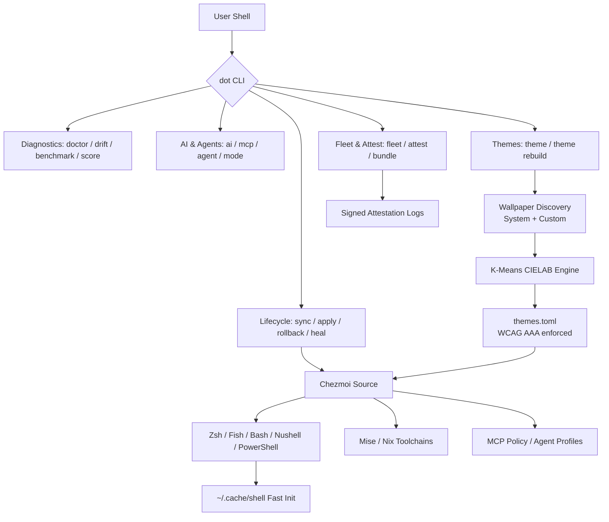

<p align="center">
  
</p>

<h1 align="center">.dotfiles</h1>

<p align="center">
  <strong>Declarative dotfiles for macOS, Linux, WSL, and Windows-native PowerShell 7.4 LTS / 7.5+. Multi-shell by default. Sub-100ms CLI cold-start. Wallpaper-driven themes. Signed + attested releases. Fleet apply over SSH.</strong>
</p>

<p align="center">
  <a href="https://github.com/sebastienrousseau/dotfiles/actions"></a>
  <a href="https://github.com/sebastienrousseau/dotfiles/releases/latest"></a>
  <a href="https://github.com/sebastienrousseau/dotfiles/releases"></a>
  <a href="https://codespaces.new/sebastienrousseau/dotfiles"></a>
  <a href="https://scorecard.dev/viewer/?uri=github.com/sebastienrousseau/dotfiles"></a>
</p>

---

> **Why this is different.** You won't find these three things in `mathiasbynens/`, `holman/`, or `paulirish/`. First, wallpaper-driven terminal themes. We use K-Means clustering in CIELAB and enforce WCAG AAA contrast. Second, first-class agent governance. That covers MCP policy, A2A discovery, signed attestation logs, and bounded profiles (`ask` / `plan` / `apply` / `audit`). Third, verified multi-shell parity across zsh, fish, bash, nushell, and PowerShell. The suite is tested on macOS, Linux, WSL2, and Apple Silicon CI runners. Signed commits are enforced. The installer is idempotent. The CLI heals itself.

<!-- ASCIINEMA DEMO — closes #874 once recorded.
     30-second clip covering: install.sh → dot doctor → dot theme rebuild.
     Recording recipe (maintainer):

       asciinema rec ~/dotfiles-demo.cast \
         --idle-time-limit 1 --rows 30 --cols 100 \
         --title "Dotfiles: install → doctor → theme"
       # in the recording shell:
       #   curl -fsSL https://raw.githubusercontent.com/sebastienrousseau/dotfiles/master/install.sh | bash
       #   dot doctor
       #   dot theme rebuild --force
       # then Ctrl-D to stop

     Upload with `asciinema upload ~/dotfiles-demo.cast`, grab the
     resulting `https://asciinema.org/a/<id>` URL, and replace this
     comment with:

       <p align="center">
         <a href="https://asciinema.org/a/<id>">
           .svg" alt="install → doctor → theme demo" />
         </a>
       </p>
-->

## Install

**Verified install (recommended).** Pin to a release tag. Download the installer. Check its SHA256 against the value published with the release. Then run it. See [docs/security/INSTALL_VERIFICATION.md](docs/security/INSTALL_VERIFICATION.md) for the per-release hash and how it's generated.

```bash
curl -fsSL -o /tmp/dotfiles-install.sh \
  https://raw.githubusercontent.com/sebastienrousseau/dotfiles/v0.2.502/install.sh
echo "4c0303a2d88d5aed98428ab0da37618c9795af4dae0e6549646c2fce5235c280  /tmp/dotfiles-install.sh" \
  | shasum -a 256 -c
bash /tmp/dotfiles-install.sh
```

**Trust-source one-liner** (skips the SHA check — fine for sandboxes and ephemeral CI, not recommended for primary workstations):

```bash
bash -c "$(curl -fsSL https://raw.githubusercontent.com/sebastienrousseau/dotfiles/master/install.sh)"
```

Then verify and explore:

```bash
dot doctor        # verify installation
dot learn         # interactive tour
```

The install needs `git` and `curl`. The verified path also needs `shasum` or `sha256sum`. The script runs on macOS, Ubuntu, Debian, Arch, WSL2, and GitHub Codespaces.

<details>
<summary>CI/CD and Docker options</summary>

Silent install (no prompts):

```bash
DOTFILES_SILENT=1 DOTFILES_NONINTERACTIVE=1 \
  bash -c "$(curl -fsSL https://raw.githubusercontent.com/sebastienrousseau/dotfiles/master/install.sh)"
```

Docker sandbox:

```bash
docker run --rm -e DOTFILES_NONINTERACTIVE=1 ubuntu:24.04 bash -c \
  'apt-get update -qq && apt-get install -y -qq git curl sudo >/dev/null 2>&1 \
  && git clone --depth 1 https://github.com/sebastienrousseau/dotfiles.git ~/.dotfiles \
  && bash ~/.dotfiles/install.sh \
  && export PATH="$HOME/.local/bin:$PATH" \
  && dot doctor'
```

</details>

---

## Why this repo is different

Most dotfiles repos are personal collections. This one ships as workstation infrastructure. It's signed, attested, multi-platform, AI-aware, and self-healing.

| Capability | What you get | Where |
|:---|:---|:---|
| **Wallpaper-driven themes** | K-Means clustering in CIELAB extracts terminal palettes from any wallpaper. WCAG AAA enforced. Dynamic HEIC dark/light. | `dot theme rebuild` |
| **AI and MCP native** | Agent profiles, MCP policy enforcement, attestation logs, AI commit messages. | `dot ai`, `dot mcp`, `dot agent`, `dot mode` |
| **Cryptographic attestation** | Signed commits, machine-readable evidence, policy bundle releases. | `dot attest`, `dot secrets verify` |
| **Fleet management** | Multi-node drift dashboard, per-host profiles. | `dot fleet` |
| **Self-healing** | Auto-repair tools, chezmoi drift, broken symlinks, missing files. | `dot heal`, `dot chaos`, `dot rollback`, `dot bundle` |
| **Sub-second startup** | Lazy loading, `_cached_eval` pattern, mtime-based cache invalidation, realpath sidecar pins. | `dot perf`, `dot health` |
| **Multi-shell parity** | Tier-1 (full): zsh, bash. Tier-2 (bridged): fish. Tier-3 (compatible): nushell. PowerShell is supported as a contract-tested parity target. See [ADR-007](docs/adr/ADR-007-multi-shell-parity.md) and [ADR-011](docs/adr/ADR-011-nushell-tier3-keep.md). | `dot env`, `dot profile` |
| **Build artifacts → /tmp** | Cargo, Go, pip, uv, and Zig caches redirect to `/tmp/builds/`. Project dirs stay clean. | `~/.config/mise/config.toml`, `~/.cargo/config.toml` |
| **Encrypted secrets** | Age and SOPS keep per-machine secrets out of plaintext history. | `dot secrets` |
| **Portable runtimes** | Mise for managed toolchains. Nix Flakes for strict reproducibility. | `dot env`, `dot upgrade` |
| **Schema-validated config** | `.chezmoidata.toml` is checked against a JSON Schema in CI via taplo. Typos in feature flags or profile names fail at PR time. | `config/chezmoidata.schema.json` |

---

## Architecture

The CLI is idempotent. Run it once or a hundred times. Same machine state.


```mermaid
graph TD
    A[User Shell] --> B{dot CLI}
    B --> C[Lifecycle: sync / apply / rollback / heal]
    B --> D[Diagnostics: doctor / drift / benchmark / score]
    B --> E[AI & Agents: ai / mcp / agent / mode]
    B --> F[Themes: theme / theme rebuild]
    B --> G[Fleet & Attest: fleet / attest / bundle]

    C --> H[Chezmoi Source]
    F --> I[Wallpaper Discovery<br/>System + Custom]
    I --> J[K-Means CIELAB Engine]
    J --> K[themes.toml<br/>WCAG AAA enforced]
    K --> H

    H --> L[Zsh / Fish / Bash / Nushell / PowerShell]
    H --> M[Mise / Nix Toolchains]
    H --> N[MCP Policy / Agent Profiles]
    L --> O[~/.cache/shell Fast Init]

    G --> P[Signed Attestation Logs]
```

---

## Wallpaper-Driven Themes

Drop a wallpaper. Get a theme.

`dot theme rebuild` discovers system wallpapers and your custom ones. On macOS it looks in `/System/Library/Desktop Pictures/`. On Linux it looks in `/usr/share/backgrounds/`. Custom wallpapers live in `~/Pictures/Wallpapers/`. K-Means clustering in CIELAB color space extracts dominant colors. The engine then generates a 16-color terminal palette, enforces WCAG AAA contrast, and assembles `themes.toml` on its own.

| Tier | Source | Format |
|:---|:---|:---|
| **System** | macOS `/System/Library/Desktop Pictures/`<br/>Linux `/usr/share/backgrounds/` | `.heic`, `.jpg`, `.png` |
| **Custom** | `~/Pictures/Wallpapers/` (overrides system on name collision) | Apple-compatible dynamic HEIC (single file, both appearances) |

```bash
dot theme              # interactive picker (paired themes only)
dot theme tahoe-dark   # switch directly
dot theme toggle       # swap dark↔light within current family
dot theme rebuild      # regenerate from current wallpapers
```

On theme switch, every managed surface updates. Terminals: Ghostty, Alacritty, Kitty, WezTerm, Warp, iTerm2, tmux. Editors: Neovim and VS Code. The theme also sets GTK and icon themes, the macOS accent and dark-mode toggle (with a forced UI refresh), the browser color mode, and the wallpaper. On Linux, the engine auto-converts HEIC to PNG via `magick` or `heif-convert`.

Full guide: [docs/guides/THEMING.md](docs/guides/THEMING.md)

---

## The `dot` CLI

Over 80 commands grouped by intent. Run `dot help` for the full reference.

### Start Here

| | |
|:---|:---|
| `dot init <user>` | Bootstrap any GitHub user's dotfiles repo through this harness |
| `dot sync` | Apply dotfiles to this machine |
| `dot doctor` | Check the environment and surface issues |
| `dot learn` | Open the guided tour |
| `dot agents render` | Sync `CLAUDE.md` → `AGENTS.md` + Cursor + Codex stubs |
| `dot fleet apply` | SSH out to every host in `~/.config/dotfiles/fleet.toml` |
| `dot registry list` | Browse reusable dotfile modules from the registry |

A [Claude Code skill](dot_claude/skills/dotfiles-bootstrap/SKILL.md) is also shipped — `/skills` discovers `dotfiles-bootstrap` and runs `dot init` with profile-aware safety defaults.

### Daily Use

| | |
|:---|:---|
| `dot status` / `dot diff` | Show local drift; preview pending changes |
| `dot edit` | Open the source directory |
| `dot upgrade` | Update tools and dotfiles |
| `dot commit` | Generate an AI commit message from the staged diff |

### Inspect & Repair

| | |
|:---|:---|
| `dot heal` | Auto-fix tools, chezmoi drift, and broken symlinks |
| `dot rollback` | Return to a previous known-good state |
| `dot attest` | Export workstation evidence |
| `dot chaos` | Simulate corruption to test self-healing |
| `dot bundle` | Create an offline tarball of the dotfiles environment |

### AI & Agents

| | |
|:---|:---|
| `dot ai` | Show installed AI tools |
| `dot mcp` | Inspect MCP policy and registry |
| `dot mode` | Show or set the agent profile (ask / plan / apply / audit) |
| `dot agent` | Agent metadata, logs, checkpoints, conformance |
| `dot patterns` | List bundled AI patterns (architect, hardener, refactor) |

### Configuration

| | |
|:---|:---|
| `dot theme` / `dot theme rebuild` | Switch theme or regenerate from wallpapers |
| `dot env` | Show managed tool versions |
| `dot profile` | Show or switch active profile |
| `dot secrets` | Edit encrypted secrets |
| `dot fonts` | Install or refresh Nerd Fonts |

### Fleet & Performance

| | |
|:---|:---|
| `dot fleet` | Multi-node status, drift, and namespace |
| `dot perf` | Measure shell startup |
| `dot score` / `dot security-score` | Health and security scorecards |
| `dot health` | Live dashboard for caches and tool state |

Full reference: [docs/reference/UTILS.md](docs/reference/UTILS.md) · Complete manual: [docs/manual/](docs/manual/) or `dot manual`

---

## Documentation

The `.dotfiles` Manual is published in nine formats: HTML (single and multi-page), PDF, EPUB, ASCII text, compressed variants, and Markdown source. It auto-builds on every change.

- **Online** — <https://sebastienrousseau.github.io/dotfiles/manual/>
- **Terminal** — `dot manual text | less`
- **PDF** — `dot manual pdf`
- **Offline copy** — `dot manual --offline` (uses the bundled snapshot, no network)
- **Sources** — [`docs/manual/`](docs/manual/)

---

## First 5 Minutes

1. **Check** — `dot doctor` validates tools, paths, and security
2. **Explore** — `dot learn` walks through shells, secrets, themes, and performance
3. **Customize** — edit `~/.config/chezmoi/chezmoi.toml` for per-machine settings ([Profiles](docs/reference/PROFILES.md))
4. **Toggle features** — flip features in `.chezmoidata.toml` ([Feature Flags](docs/reference/FEATURES.md))
5. **Apply** — `dot sync` applies the config and the next interactive shell hydrates caches via `_cached_eval`

See the [Migration Guide](docs/operations/MIGRATION.md) for version upgrades.

---

## What's Included

<details>
<summary><b>Shells and Navigation</b></summary>

- **Zsh** loads in stages through small modules, not one big startup script
- **Fish** uses `_cached_eval` and deferred loading for fast interactive use
- **Bash** ships full parity with zsh for tooling and aliases
- **Nushell** handles structured terminal workflows (Tier-3 compatible)
- **PowerShell** keeps cross-platform and WSL sessions on the same baseline. A `pwsh` parity contract runs in CI on every PR
- **Starship**, **Zoxide**, **Atuin**, and **fzf** for navigation and command recall
- **Starship Transient Prompt** collapses past prompts to a single glyph in scrollback on fish. The zsh hook is in place for when upstream Starship lands the matching function ([ADR-010](docs/adr/ADR-010-starship-transient-prompt.md))

</details>

<details>
<summary><b>Development and Runtimes</b></summary>

- **Mise** manages language versions in user space (no system pollution)
- **Nix Flakes** for strict reproducible builds when speed isn't the priority
- **Pueue** queues long-running tasks instead of spawning extra terminal tabs
- **Neovim** ships as a full Lua-based editor, not a starter template
- **Lazygit** for terminal git workflow without a GUI
- **Build caches** (Cargo, Go, pip, uv, Zig) redirect to `/tmp/builds/` and clear on reboot
- **`_cached_eval`** caches expensive `tool init` output with mtime and realpath invalidation. Set `EVALCACHE_DISABLE=true` to bypass for debugging

</details>

<details>
<summary><b>AI, Agents, and MCP</b></summary>

- **Agent profiles** (`dot mode`) — switch between ask, plan, apply, and audit
- **Pattern library** (`dot patterns`) — architect, hardener, and refactor patterns bundled in `dot_config/ai/patterns/`
- **MCP policy enforcement** (`dot mcp`) — validate the Model Context Protocol registry against policy
- **AI commit messages** (`dot commit`) — conventional commits generated from the staged diff
- **AI tools** (`dot ai`) — Claude Code, Codex, GitHub Copilot, Gemini CLI, and friends managed via Mise
- **Attestation logs** — every agent session is logged with a policy hash and an outcome

</details>

<details>
<summary><b>Security, Trust, and Governance</b></summary>

- **Age and SOPS** keep secrets encrypted at rest and out of plaintext history
- **SSH ED25519 signing** plus trust metadata back signed commits and verifiable changes
- **Gitleaks**, policy checks, and compliance workflows
- **Workstation attestation** (`dot attest`) records machine state, policy, prompt, and model metadata in tracked JSON
- **Telemetry controls** and local-first defaults — you own your data
- **SBOM (CycloneDX)** and Grype CVE scanning in CI
- **JSON Schema for `.chezmoidata.toml`** — taplo runs the schema in CI on every PR, so typos in feature flags or profile names fail before merge
- **OIDC Trusted Publishing** — npm releases authenticate via OIDC, not a long-lived `NPM_TOKEN`. Provenance is attached to every published tarball

</details>

For security hardening options, see the [Security docs](docs/security/SECURITY.md).

---

## Comparison

| | This repo | chezmoi | holman/dotfiles | nikitabobko/dotfiles |
|:---|:---:|:---:|:---:|:---:|
| Cross-platform (macOS/Linux/WSL) | ✓ | ✓ | macOS-leaning | macOS only |
| Multi-shell parity (zsh/fish/nu/pwsh) | ✓ | — | bash only | zsh only |
| Wallpaper-driven themes (K-Means) | ✓ | — | — | — |
| AI / MCP integration | ✓ | — | — | — |
| Cryptographic attestation | ✓ | — | — | — |
| Self-healing CLI | ✓ | — | — | — |
| Fleet management | ✓ | — | — | — |
| Encrypted secrets (Age/SOPS) | ✓ | ✓ | — | — |
| Build artifact redirection | ✓ | — | — | — |
| Schema-validated config | ✓ | — | — | — |

`chezmoi` is the underlying templating engine. This repo is the opinionated reference implementation.

---

**THE ARCHITECT** ᛫ [Sebastien Rousseau](https://sebastienrousseau.com)
**THE ENGINE** ᛞ [EUXIS](https://euxis.co) ᛫ Enterprise Unified Execution Intelligence System

---

## License

Licensed under the **MIT License**. See [LICENSE](LICENSE) for details.

<p align="right"><a href="#dotfiles">Back to Top</a></p>
