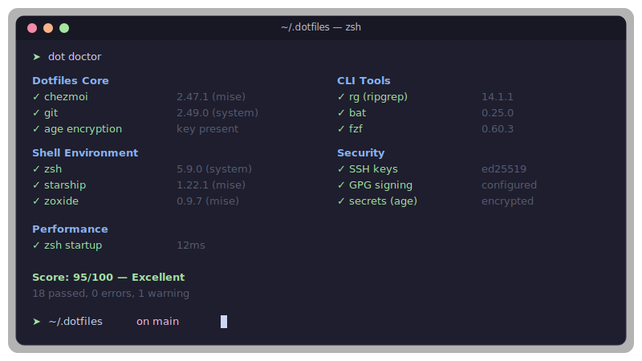
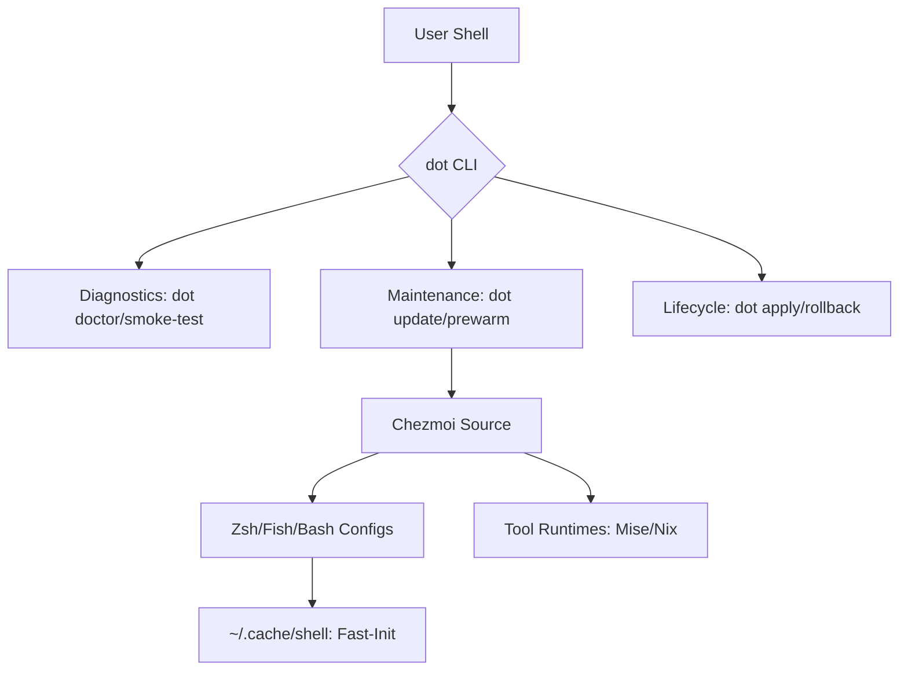

<p align="center">
  
</p>

<h1 align="center">.dotfiles</h1>

<p align="center">
  <strong>Stop wasting hours re-configuring your environment. Get a world-class developer experience on any machine in 60 seconds.</strong>
</p>

<p align="center">
  <a href="https://github.com/sebastienrousseau/dotfiles/actions"></a>
  <a href="https://github.com/sebastienrousseau/dotfiles/releases/tag/v{{ .dotfiles_version }}"></a>
  <a href="https://github.com/sebastienrousseau/dotfiles/releases"></a>
  <a href="https://codespaces.new/sebastienrousseau/dotfiles"></a>
</p>

<p align="center">
  
  <br>
  <em>The Sublime Terminal Experience: Neovim + Catppuccin + Starship</em>
</p>

---

## ✨ Overview

Dotfiles is a **high-performance, idempotent shell distribution** designed for developers who demand speed, security, and reproducibility. Managed by [Chezmoi](https://github.com/twpayne/chezmoi), it provides a curated infrastructure that evolves with you across **macOS, Linux, and WSL2**.

---

## 🚀 The 2026 Next-Gen Frontier

While others are still configuring Bash, we are building the future.

*   🏎️ **Zero-Cost Shell Startup**: Advanced `_cached_eval` logic for Zsh, Bash, and Fish, bypassing initializations for near-instant boot times.
*   ❄️ **Nix & Home Manager**: Declarative user environments with full Home Manager support for bit-for-bit identical setups.
*   🧠 **Unified AI Experience**: Centralized identity context (`~/.config/ai/identity.md`) shared across Claude, Gemini, and Aider.
*   🛡️ **Self-Healing**: Automated `dot heal` logic that detects and repairs configuration drift and broken dependencies.

---

## 🏗️ Architecture


```mermaid
graph TD
    A[User Shell] --> B{dot CLI}
    B --> C[Diagnostics: dot doctor/smoke-test]
    B --> D[Maintenance: dot update/prewarm]
    B --> E[Lifecycle: dot apply/rollback]
    D --> F[Chezmoi Source]
    F --> G[Zsh/Fish/Bash Configs]
    F --> H[Tool Runtimes: Mise/Nix]
    G --> I[~/.cache/shell: Fast-Init]
```

---

## 🛠️ Getting Started

### ✅ Pre-flight Checklist
Before installing, ensure your system meets these minimal requirements:
- [ ] **Git** 2.30+ installed (`command -v git`)
- [ ] **Curl** installed (`command -v curl`)
- [ ] **SSH Key** configured in GitHub (for signed commits)
- [ ] **Internet Access** (for initial bootstrap)

### ⚡ Instant Install
```bash
sh -c "$(curl -fsSL https://dotfiles.io/install.sh)"
```

---

## ⌨️ The `dot` CLI Showcase

| Command | Action | Why you'll love it |
| :--- | :--- | :--- |
| `dot apply` | Propagate changes | Instant synchronization of all configs |
| `dot update` | Pull & Pre-warm | Updates everything and primes your shell cache |
| `dot doctor` | Health Check | Validates paths, versions, and security |
| `dot smoke-test` | Verify Toolchain | Ensures Rust, Go, and AI tools are functional |
| `dot bundle` | Offline Archive | Create a zero-network portable environment |

---

## 📦 Features & Details

<details>
<summary><b>🐚 Shells & Modern UX</b></summary>

- **Zsh**: Primary shell with modular deferred loading.
- **Fish**: High-performance shell with `_cached_eval` logic.
- **Nushell**: Structured data processing via shell pipelines.
- **Starship**: Fast, cross-shell prompt showing only what you need.
- **Zoxide**: Smarter `cd` command that learns your habits.
- **Atuin**: Magically searchable shell history across all machines.
</details>

<details>
<summary><b>🛠️ Development & Runtimes</b></summary>

- **Mise**: Polyglot runtime manager (Node, Python, Go, Rust).
- **Nix Flakes**: Declarative, reproducible toolchains.
- **Home Manager**: Full environment state management.
- **Pueue**: Offload long-running tasks to a background daemon.
- **Wasmtime**: Run ultra-fast WebAssembly-based CLI tools.
</details>

<details>
<summary><b>🔐 Security & Hardening</b></summary>

- **Age & SOPS**: Enterprise-grade secret encryption.
- **Signed Commits**: Enforced SSH/GPG signing for every change.
- **Audit Logs**: Every `dot` command is logged for traceability.
- **Telemetry Disabling**: Privacy-first OS tuning out of the box.
</details>

---

## 📜 License

Licensed under the **MIT License**. See [LICENSE](LICENSE) for details.

<p align="right"><a href="#dotfiles">↑ Back to Top</a></p>
