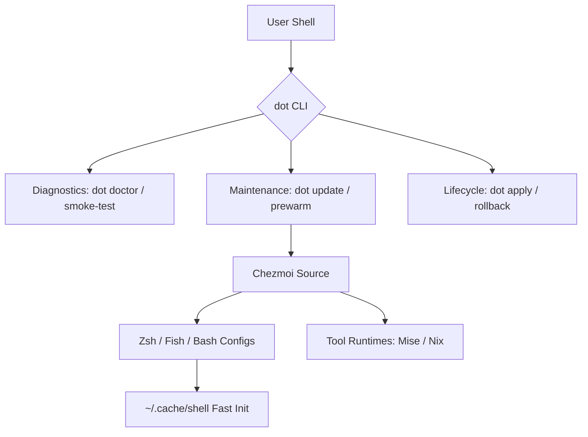

<p align="center">
  
</p>

<h1 align="center">.dotfiles</h1>

<p align="center">
  <strong>A signed, local-first Trusted agent workstation baseline for macOS, Linux, and WSL. One CLI to apply, diagnose, repair, and attest.</strong>
</p>

<p align="center">
  <a href="https://github.com/sebastienrousseau/dotfiles/actions"></a>
  <a href="https://github.com/sebastienrousseau/dotfiles/releases/latest"></a>
  <a href="https://github.com/sebastienrousseau/dotfiles/releases"></a>
  <a href="https://codespaces.new/sebastienrousseau/dotfiles"></a>
</p>

---

## Install

```bash
bash -c "$(curl -fsSL https://raw.githubusercontent.com/sebastienrousseau/dotfiles/master/install.sh)"
```

Then check your setup and take a tour:

```bash
dot doctor        # verify installation
dot learn         # interactive tour of your new dotfiles
```

You need `git` and `curl`. Works on macOS, Ubuntu/Debian, Arch, WSL2, and GitHub Codespaces.

<details>
<summary>CI/CD and Docker options</summary>

Silent install (no prompts):

```bash
DOTFILES_SILENT=1 DOTFILES_NONINTERACTIVE=1 \
  bash -c "$(curl -fsSL https://raw.githubusercontent.com/sebastienrousseau/dotfiles/master/install.sh)"
```

Docker sandbox:

```bash
docker run --rm -e DOTFILES_NONINTERACTIVE=1 ubuntu:24.04 bash -c \
  'apt-get update -qq && apt-get install -y -qq git curl sudo >/dev/null 2>&1 \
  && git clone --depth 1 https://github.com/sebastienrousseau/dotfiles.git ~/.dotfiles \
  && bash ~/.dotfiles/install.sh \
  && export PATH="$HOME/.local/bin:$PATH" \
  && dot doctor'
```

</details>

---

## Overview

This repo goes beyond a simple dotfiles collection. It works more like workstation infrastructure. Every file is tracked, the runtime scope is clear, and the workflow is simple: install, apply, diagnose, repair, attest, and recover. Chezmoi handles templates and platform differences. The `dot` CLI sits on top and ties it all together.

- **Encrypted secrets** with Age and SOPS
- **Portable runtimes** with Mise, plus Nix when you need fully repeatable builds
- **Built-in recovery** with `dot doctor`, `dot heal`, restore, rollback, and bundle tools
- **Tracked governance** with policy files, attestation output, and compliance checks stored in the repo

---

## Architecture

Run it once or a hundred times. The machine ends up in the same state.


```mermaid
graph TD
    A[User Shell] --> B{dot CLI}
    B --> C[Diagnostics: dot doctor / smoke-test]
    B --> D[Maintenance: dot update / prewarm]
    B --> E[Lifecycle: dot apply / rollback]
    D --> F[Chezmoi Source]
    F --> G[Zsh / Fish / Bash Configs]
    F --> H[Tool Runtimes: Mise / Nix]
    G --> I[~/.cache/shell Fast Init]
```

---

## Features

| | |
| :--- | :--- |
| **Startup** | Fast shell launch with lazy loading and cached setup |
| **Shells** | Fish, Zsh, Nushell, and PowerShell share one managed baseline |
| **Platforms** | Full support for macOS, Ubuntu/Debian, Arch, and WSL2 |
| **Runtimes** | Mise for managed toolchains, Nix Flakes for strict repeatable builds |
| **Secrets** | Age + SOPS for encrypted config and secret data |
| **Signing** | SSH ED25519 signing with trust-aware Git and release workflows |
| **Recovery** | Snapshot, restore, rollback, heal, and offline bundle tools |
| **Governance** | Agent profiles, MCP policy, registries, and workstation attestation files |
| **CI** | Compliance checks, SBOM diff, CodeQL, shell lint, and security gates |

---

## The `dot` CLI

| Command | What it does |
| :--- | :--- |
| `dot apply` | Apply the tracked config to the machine |
| `dot update` | Pull the latest state and pre-warm slow paths |
| `dot doctor` | Check tools, paths, portability, and security |
| `dot heal` | Auto-fix tools, chezmoi drift, broken symlinks, and missing files (`--dry-run|-n`, `--force|-f`) |
| `dot smoke-test` | Test critical toolchains and integrations |
| `dot attest` | Export machine-readable workstation evidence |
| `dot bundle` | Create a portable support or recovery archive |

Full reference: [docs/reference/UTILS.md](docs/reference/UTILS.md)

---

## First 5 Minutes

After you install:

1. **Check** — `dot doctor` checks tools, paths, and security
2. **Explore** — `dot learn` walks you through shell, secrets, themes, and performance
3. **Customize** — edit `~/.config/chezmoi/chezmoi.toml` for per-machine settings ([Profiles](docs/reference/PROFILES.md))
4. **Toggle features** — turn features on or off in `.chezmoidata.toml` ([Feature Flags](docs/reference/FEATURES.md))
5. **Apply** — `dot apply` applies the config; `dot prewarm` caches shell startup

See the [Migration Guide](docs/operations/MIGRATION.md) for version upgrades.

---

## What's Included

<details>
<summary><b>Shells and Navigation</b></summary>

- **Zsh** loads in stages through small modules, not one big startup script
- **Fish** is set up for fast interactive use with `_cached_eval` and deferred loading
- **Nushell** handles structured terminal workflows while fitting into the rest of the setup
- **PowerShell** keeps cross-platform and WSL sessions on the same baseline
- **Starship**, **Zoxide**, **Atuin**, and **fzf** handle navigation and command recall
</details>

<details>
<summary><b>Development and Runtimes</b></summary>

- **Mise** manages language and tool versions in user space, keeping the base system clean
- **Nix Flakes** offer strict repeatable builds when that matters more than speed
- **Pueue** gives long-running tasks a proper queue instead of extra terminal tabs
- **Neovim** ships as a full Lua-based editor, not a starter template
- **Lazygit** rounds out the terminal workflow without needing a GUI
</details>

<details>
<summary><b>Security, Trust, and Governance</b></summary>

- **Age / SOPS** keep secrets encrypted at rest and out of plaintext history
- **SSH signing** and trust metadata back up signed commits and verifiable changes
- **Gitleaks**, policy checks, and compliance workflows build security into the repo from the start
- **Telemetry controls** and local-first defaults keep you in charge of your workstation
- **Attestation and registry files** record machine state, policy, prompt, and model metadata in tracked JSON
</details>

For security hardening options, see the [Security docs](docs/security/SECURITY.md).

---

**THE ARCHITECT** ᛫ [Sebastien Rousseau](https://sebastienrousseau.com)
**THE ENGINE** ᛞ [EUXIS](https://euxis.co) ᛫ Enterprise Unified Execution Intelligence System

---

## License

Licensed under the **MIT License**. See [LICENSE](LICENSE) for details.

<p align="right"><a href="#dotfiles">Back to Top</a></p>
