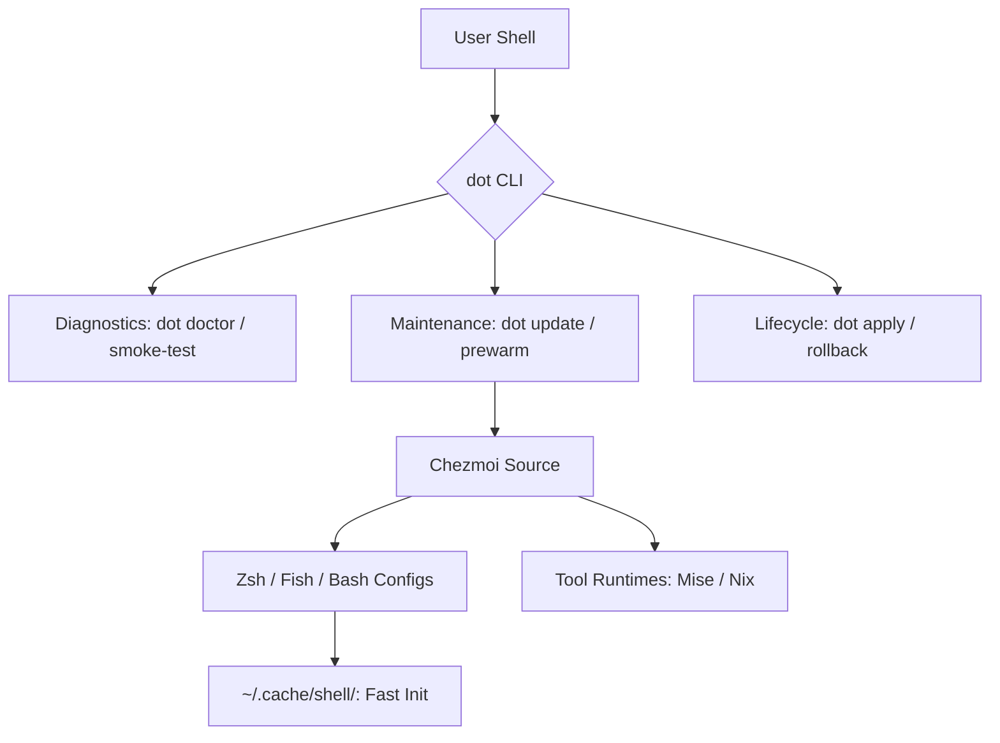

<p align="center">
  
</p>

<h1 align="center">.dotfiles</h1>

<p align="center">
  <strong>Cross-platform shell configuration for macOS, Linux, and WSL. Managed by Chezmoi.</strong>
</p>

<p align="center">
  <a href="https://github.com/sebastienrousseau/dotfiles/actions"></a>
  <a href="https://github.com/sebastienrousseau/dotfiles/releases/latest"></a>
  <a href="https://github.com/sebastienrousseau/dotfiles/releases"></a>
  <a href="https://codespaces.new/sebastienrousseau/dotfiles"></a>
</p>

<p align="center">
  
</p>

---

## Install

```bash
bash -c "$(curl -fsSL https://raw.githubusercontent.com/sebastienrousseau/dotfiles/master/install.sh)"
```

Then verify:

```bash
dot doctor
```

Requires `git` and `curl`. Works on macOS, Ubuntu/Debian, Arch, and WSL2.

<details>
<summary>CI/CD and Docker options</summary>

Non-interactive install:

```bash
DOTFILES_SILENT=1 DOTFILES_NONINTERACTIVE=1 \
  bash -c "$(curl -fsSL https://raw.githubusercontent.com/sebastienrousseau/dotfiles/master/install.sh)"
```

Docker sandbox:

```bash
docker run --rm -e DOTFILES_NONINTERACTIVE=1 ubuntu:24.04 bash -c \
  'apt-get update -qq && apt-get install -y -qq git curl sudo >/dev/null 2>&1 \
  && git clone --depth 1 https://github.com/sebastienrousseau/dotfiles.git ~/.dotfiles \
  && bash ~/.dotfiles/install.sh \
  && export PATH="$HOME/.local/bin:$PATH" \
  && dot doctor'
```

</details>

---

## Overview

An idempotent shell environment that gives you the same setup on every machine. Chezmoi handles templates, feature flags, and platform differences.

- **Encrypted secrets** via Age/SOPS — no plaintext credentials in the repo
- **Isolated runtimes** through Mise and Nix — nothing installed system-wide
- **Self-healing** with `dot heal` — auto-installs missing tools
- **Telemetry disabled** by default — no data leaves your machine

---

## Architecture

Run once or a hundred times — the result is the same.


```mermaid
graph TD
    A[User Shell] --> B{dot CLI}
    B --> C[Diagnostics: dot doctor / smoke-test]
    B --> D[Maintenance: dot update / prewarm]
    B --> E[Lifecycle: dot apply / rollback]
    D --> F[Chezmoi Source]
    F --> G[Zsh / Fish / Bash Configs]
    F --> H[Tool Runtimes: Mise / Nix]
    G --> I[~/.cache/shell/: Fast Init]
```

---

## Features

| | |
| :--- | :--- |
| **Startup** | < 50ms first prompt via lazy-hydration (`_cached_eval`) |
| **Shells** | Zsh, Fish, Nushell with shared alias and function core |
| **Platforms** | macOS, Ubuntu/Debian, Arch, WSL2 |
| **Runtimes** | Mise (polyglot) and Nix Flakes (deterministic) |
| **Secrets** | Age + SOPS encryption with provider-aware storage |
| **Signing** | SSH ED25519 commit signing enforced |
| **Backups** | Atomic snapshot on every `dot apply` |
| **Testing** | 1,200+ assertions, 100% module coverage |
| **CI** | ShellCheck, shfmt, compliance guard, CodeQL |

---

## The `dot` CLI

| Command | What it does |
| :--- | :--- |
| `dot apply` | Propagate configuration changes |
| `dot update` | Pull latest and pre-warm caches |
| `dot doctor` | Validate paths, versions, and security |
| `dot heal` | Auto-repair missing tools and broken state |
| `dot smoke-test` | Verify toolchains (Rust, Go, AI CLIs) |
| `dot bundle` | Create an offline portable archive |

Full reference: [docs/reference/UTILS.md](docs/reference/UTILS.md)

---

## What's Included

<details>
<summary><b>Shells and Navigation</b></summary>

- **Zsh** — primary shell with modular `rc.d` deferred loading
- **Fish** — interactive shell with `_cached_eval` startup optimization
- **Nushell** — structured data processing through shell pipelines
- **Starship** — cross-shell prompt that shows only what matters
- **Zoxide** — directory jumper that learns your habits
- **Atuin** — searchable shell history synced across machines
- **fzf** — fuzzy finder for files, history, and git
</details>

<details>
<summary><b>Development and Runtimes</b></summary>

- **Mise** — polyglot runtime manager (Node, Python, Go, Rust)
- **Nix Flakes** — declarative, reproducible toolchains
- **Pueue** — background task queue for long-running jobs
- **Neovim** — Lua-based IDE config with lazy.nvim
- **Lazygit** — terminal UI for Git workflows
</details>

<details>
<summary><b>Security and Secrets</b></summary>

- **Age / SOPS** — encrypted secrets at rest, never committed in plaintext
- **SSH signing** — ED25519 commit signing enforced on every commit
- **Gitleaks** — pre-commit scanning prevents credential leaks
- **Telemetry disabled** — OS-level kill switches, no opt-out needed
- **Audit trail** — every `dot` command logged to `~/.local/share/dotfiles.log`
</details>

For hardening options, see the [Security docs](docs/security/SECURITY.md).

---

**THE ARCHITECT** ᛫ [Sebastien Rousseau](https://sebastienrousseau.com)
**THE ENGINE** ᛞ [EUXIS](https://euxis.co) ᛫ Enterprise Unified Execution Intelligence System

---

## Links

- [Changelog](CHANGELOG.md)
- [Full documentation](docs/README.md)
- [Install guide](docs/guides/INSTALL.md)
- [Troubleshooting](docs/guides/TROUBLESHOOTING.md)

## License

Licensed under the **MIT License**. See [LICENSE](LICENSE) for details.

<p align="right"><a href="#dotfiles">Back to Top</a></p>
