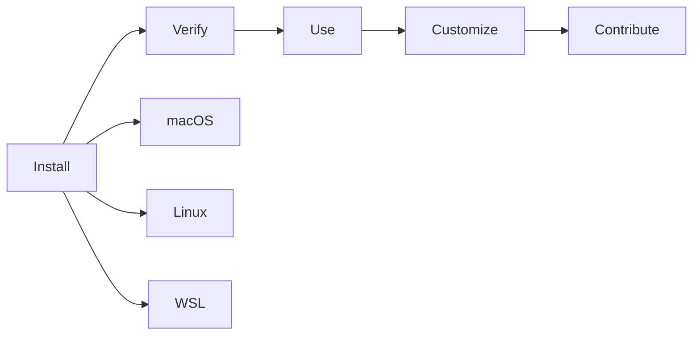

# Dotfiles

Fast, signed shell setup for macOS, Linux, WSL, and PowerShell. Managed by Chezmoi.

## Install

```bash
bash -c "$(
  curl -fsSL https://raw.githubusercontent.com/sebastienrousseau/dotfiles/master/install.sh
)"
```

Requires `git` and `curl`.

## Verify

```bash
dot --version
dot doctor
dot help
```

## Use

```bash
dot learn
dot update
dot apply
dot mode list
dot attest --json
```

## Platforms

- macOS
- Linux
- WSL
- PowerShell 7.5+

## What’s included

- Zsh, Fish, and Nushell
- PowerShell profile and cross-shell `dot` entrypoint
- Mise and Nix
- Encrypted secrets
- Signed commits
- Reliability and security gates
- Workstation attestation export
- Agent card and session logging

## Day 1 path

1. Install.
2. Verify with `dot doctor`.
3. Explore with `dot learn`.
4. Customize with files in `~/.config/shell/custom/`.
5. Select a bounded agent profile with `dot mode list`.

## Reference

- [Install guide](docs/guides/INSTALL.md)
- [Documentation index](docs/README.md)
- [Utilities and `dot` CLI](docs/reference/UTILS.md)
- [Support matrix](docs/reference/SUPPORT_MATRIX.md)
- [Troubleshooting](docs/guides/TROUBLESHOOTING.md)
- [Contributing](CONTRIBUTING.md)

## Architecture


```mermaid
flowchart LR
  A[Install] --> B[Verify]
  B --> C[Use]
  C --> D[Customize]
  D --> E[Contribute]

  A --> A1[macOS]
  A --> A2[Linux]
  A --> A3[WSL]
```

---

**THE ARCHITECT** ᛫ [Sebastien Rousseau](https://sebastienrousseau.com)
**THE ENGINE** ᛞ [EUXIS](https://euxis.co) ᛫ Enterprise Unified Execution Intelligence System

---

## License

Licensed under the [MIT License](LICENSE).
