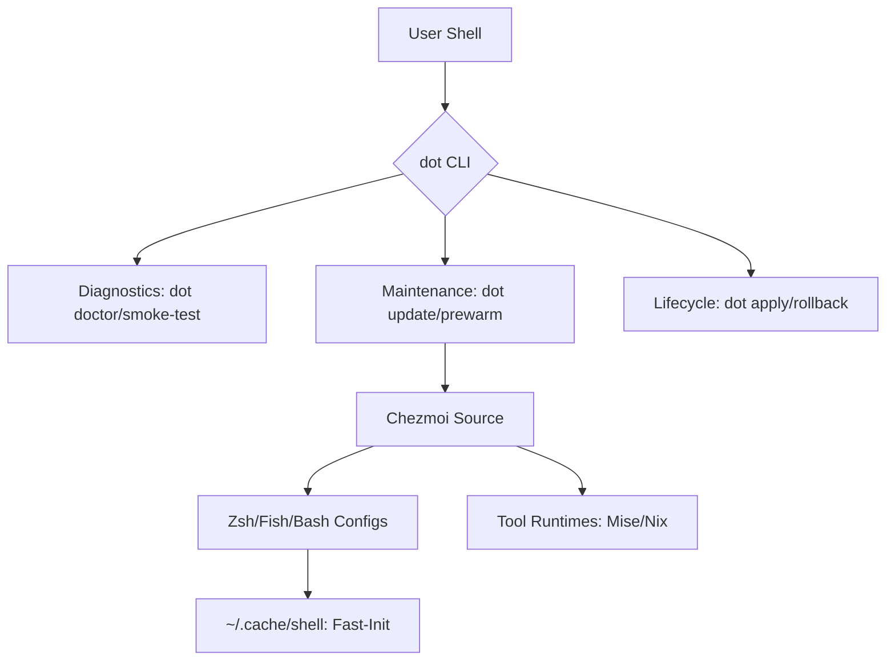

<p align="center">
  
</p>

<h1 align="center">.dotfiles</h1>

<p align="center">
  <strong>Cross-platform shell configuration for macOS, Linux, and WSL. Managed by Chezmoi.</strong>
</p>

<p align="center">
  <a href="https://github.com/sebastienrousseau/dotfiles/actions"></a>
  <a href="https://github.com/sebastienrousseau/dotfiles/releases/latest"></a>
  <a href="https://github.com/sebastienrousseau/dotfiles/releases"></a>
  <a href="https://codespaces.new/sebastienrousseau/dotfiles"></a>
</p>

---

## Overview

A reliable, idempotent shell environment for developers who need consistency across machines. Chezmoi manages templates, feature flags, and platform differences so you get the same setup on every device.

- **Telemetry disabled by default** — no data leaves your machine
- **Encrypted secrets** via Age/SOPS — no plaintext credentials in the repo
- **Isolated runtimes** through Mise and Nix — nothing installed system-wide
- **Built-in verification** with `dot doctor` and `dot smoke-test`
- **Atomic backups** on every apply (`~/.dotfiles.bak`)

---

## Architecture

Run once or a hundred times — the result is the same.


```mermaid
graph TD
    A[User Shell] --> B{dot CLI}
    B --> C[Diagnostics: dot doctor/smoke-test]
    B --> D[Maintenance: dot update/prewarm]
    B --> E[Lifecycle: dot apply/rollback]
    D --> F[Chezmoi Source]
    F --> G[Zsh/Fish/Bash Configs]
    F --> H[Tool Runtimes: Mise/Nix]
    G --> I[~/.cache/shell: Fast-Init]
```

---

## Quick Start

Works on macOS, Linux (Debian/Ubuntu/Arch), and WSL2.

### Prerequisites

- Git 2.30+
- curl
- SSH key configured in GitHub (for signed commits)

### Install

Get started in seconds. Run the universal installer to provision your environment. The script detects your OS and configures the appropriate shims.

```bash
bash -c "$(curl -fsSL https://raw.githubusercontent.com/sebastienrousseau/dotfiles/main/install.sh)"
```

For non-interactive use (CI/CD):

```bash
DOTFILES_SILENT=1 DOTFILES_NONINTERACTIVE=1 bash -c "$(curl -fsSL https://raw.githubusercontent.com/sebastienrousseau/dotfiles/main/install.sh)"
```

Try it in Docker first:

```bash
docker run --rm -e DOTFILES_SILENT=1 -e DOTFILES_NONINTERACTIVE=1 ubuntu:24.04 bash -c 'apt-get update -qq && apt-get install -y -qq git curl sudo >/dev/null 2>&1 && git clone --depth 1 https://github.com/sebastienrousseau/dotfiles.git ~/.dotfiles && bash ~/.dotfiles/install.sh && export PATH="$HOME/.local/bin:$PATH" && dot --version && dot doctor'
```

### Verify

```bash
dot doctor
```

### Update

```bash
dot update
```

---

## Features at a Glance

| Feature | Detail |
| :--- | :--- |
| **Startup** | < 50ms first prompt (lazy-hydration with `_cached_eval`) |
| **Shells** | Zsh, Fish, Nushell — shared alias/function core |
| **Platforms** | macOS, Ubuntu/Debian, Arch, WSL2 |
| **Runtimes** | Mise (polyglot) and Nix Flakes (deterministic) |
| **Secrets** | Age + SOPS encryption, provider-aware storage |
| **Signing** | SSH ED25519 commit signing enforced |
| **Telemetry** | Disabled by default — no opt-out required |
| **Backups** | Atomic snapshot on every `dot apply` |
| **Testing** | 1,100+ unit tests, 100% module coverage |
| **CI** | ShellCheck, shfmt, compliance guard, CodeQL |

---

## The `dot` CLI

| Command | Action |
| :--- | :--- |
| `dot apply` | Propagate configuration changes |
| `dot update` | Pull latest changes and pre-warm caches |
| `dot doctor` | Validate paths, versions, and security |
| `dot smoke-test` | Verify toolchain (Rust, Go, AI tools) |
| `dot bundle` | Create an offline portable archive |

---

## What's Included

<details>
<summary><b>Shells</b></summary>

- **Zsh** — primary shell with modular deferred loading
- **Fish** — fast shell with `_cached_eval` startup optimization
- **Nushell** — structured data processing through shell pipelines
- **Starship** — cross-shell prompt showing only what matters
- **Zoxide** — directory jumper that learns your habits
- **Atuin** — searchable shell history synced across machines
</details>

<details>
<summary><b>Development and Runtimes</b></summary>

- **Mise** — polyglot runtime manager (Node, Python, Go, Rust)
- **Nix Flakes** — declarative, reproducible toolchains
- **Home Manager** — full environment state management
- **Pueue** — background task queue for long-running jobs
</details>

---

## Security and Privacy

Your credentials and configuration stay under your control.

- **Encrypted secrets** — Age and SOPS encrypt sensitive data at rest. No plaintext tokens in the repo.
- **Signed commits** — SSH or GPG signing enforced on every commit.
- **Audit trail** — every `dot` command is logged to `~/.local/share/dotfiles.log`.
- **Telemetry disabled** — OS-level telemetry is turned off out of the box. No opt-out required.
- **No network calls** — the shell environment works fully offline after initial install.

For hardening options (`dot firewall`, `dot dns-doh`, `dot encrypt-check`), see the [Security docs](docs/SECURITY.md).

---

**THE ARCHITECT** ᛫ [Sebastien Rousseau](https://sebastienrousseau.com)
**THE ENGINE** ᛞ [EUXIS](https://euxis.co) ᛫ Enterprise Unified Execution Intelligence System

---

## License

Licensed under the **MIT License**. See [LICENSE](LICENSE) for details.

<p align="right"><a href="#dotfiles">Back to Top</a></p>
