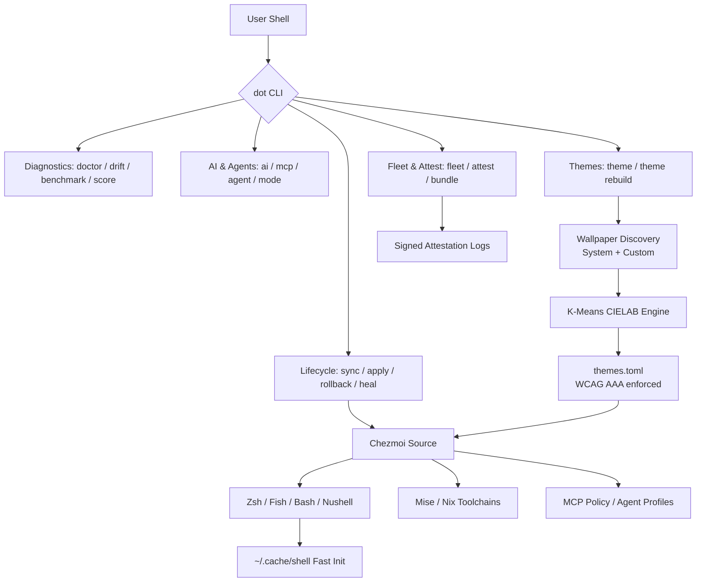

<p align="center">
  
</p>

<h1 align="center">.dotfiles</h1>

<p align="center">
  <strong>Declarative dotfiles for macOS, Linux, and WSL. Multi-shell by default, with sub-second startup, wallpaper-driven themes, and signed releases.</strong>
</p>

<p align="center">
  <a href="https://github.com/sebastienrousseau/dotfiles/actions"></a>
  <a href="https://github.com/sebastienrousseau/dotfiles/releases/latest"></a>
  <a href="https://github.com/sebastienrousseau/dotfiles/releases"></a>
  <a href="https://codespaces.new/sebastienrousseau/dotfiles"></a>
</p>

---

## Install

```bash
bash -c "$(curl -fsSL https://raw.githubusercontent.com/sebastienrousseau/dotfiles/master/install.sh)"
```

Then verify and explore:

```bash
dot doctor        # verify installation
dot learn         # interactive tour
```

Requires `git` and `curl`. Works on macOS, Ubuntu/Debian, Arch, WSL2, and GitHub Codespaces.

<details>
<summary>CI/CD and Docker options</summary>

Silent install (no prompts):

```bash
DOTFILES_SILENT=1 DOTFILES_NONINTERACTIVE=1 \
  bash -c "$(curl -fsSL https://raw.githubusercontent.com/sebastienrousseau/dotfiles/master/install.sh)"
```

Docker sandbox:

```bash
docker run --rm -e DOTFILES_NONINTERACTIVE=1 ubuntu:24.04 bash -c \
  'apt-get update -qq && apt-get install -y -qq git curl sudo >/dev/null 2>&1 \
  && git clone --depth 1 https://github.com/sebastienrousseau/dotfiles.git ~/.dotfiles \
  && bash ~/.dotfiles/install.sh \
  && export PATH="$HOME/.local/bin:$PATH" \
  && dot doctor'
```

</details>

---

## Why this repo is different

Most dotfiles repos are personal collections. This one ships as workstation infrastructure: signed, attested, multi-platform, AI-aware, and self-healing.

| Capability | What you get | Where |
|:---|:---|:---|
| **Wallpaper-Driven Themes** | K-Means clustering in CIELAB extracts terminal palettes from any wallpaper. WCAG AAA enforced. Dynamic HEIC dark/light. | `dot theme rebuild` |
| **AI & MCP Native** | Agent profiles, MCP policy enforcement, attestation logs, AI commit messages | `dot ai`, `dot mcp`, `dot agent`, `dot mode` |
| **Cryptographic Attestation** | Signed commits, machine-readable evidence, policy bundle releases | `dot attest`, `dot verify` |
| **Fleet Management** | Multi-node drift dashboard, per-host profiles | `dot fleet` |
| **Self-Healing** | Auto-repair tools, chezmoi drift, broken symlinks, missing files | `dot heal`, `dot chaos`, `dot rollback`, `dot bundle` |
| **Sub-second Startup** | Lazy loading, `_cached_eval` pattern, mtime-based cache invalidation | `dot benchmark`, `dot perf` |
| **Multi-shell Parity** | Fish, Zsh, Nushell, PowerShell share one templated baseline | `dot env`, `dot profile` |
| **Build Artifacts → /tmp** | Cargo, Go, pip, uv, Zig caches redirected; project dirs stay clean | `~/.config/mise/config.toml`, `~/.cargo/config.toml` |
| **Encrypted Secrets** | Age + SOPS for per-machine secrets out of plaintext history | `dot secrets` |
| **Portable Runtimes** | Mise for managed toolchains, Nix Flakes for strict reproducibility | `dot env`, `dot upgrade` |

---

## Architecture

Idempotent. Run it once or a hundred times. Same machine state.


```mermaid
graph TD
    A[User Shell] --> B{dot CLI}
    B --> C[Lifecycle: sync / apply / rollback / heal]
    B --> D[Diagnostics: doctor / drift / benchmark / score]
    B --> E[AI & Agents: ai / mcp / agent / mode]
    B --> F[Themes: theme / theme rebuild]
    B --> G[Fleet & Attest: fleet / attest / bundle]

    C --> H[Chezmoi Source]
    F --> I[Wallpaper Discovery<br/>System + Custom]
    I --> J[K-Means CIELAB Engine]
    J --> K[themes.toml<br/>WCAG AAA enforced]
    K --> H

    H --> L[Zsh / Fish / Bash / Nushell]
    H --> M[Mise / Nix Toolchains]
    H --> N[MCP Policy / Agent Profiles]
    L --> O[~/.cache/shell Fast Init]

    G --> P[Signed Attestation Logs]
```

---

## Wallpaper-Driven Themes

Drop a wallpaper. Get a theme.

`dot theme rebuild` discovers system wallpapers (macOS `/System/Library/Desktop Pictures/`, Linux `/usr/share/backgrounds/`) plus your custom wallpapers (`~/Pictures/Wallpapers/`). K-Means clustering in CIELAB color space extracts dominant colors, generates a 16-color terminal palette, enforces WCAG AAA contrast, and assembles `themes.toml` automatically.

| Tier | Source | Format |
|:---|:---|:---|
| **System** | macOS `/System/Library/Desktop Pictures/`<br/>Linux `/usr/share/backgrounds/` | `.heic`, `.jpg`, `.png` |
| **Custom** | `~/Pictures/Wallpapers/` (overrides system on name collision) | Apple-compatible dynamic HEIC (single file, both appearances) |

```bash
dot theme              # interactive picker (paired themes only)
dot theme tahoe-dark   # switch directly
dot theme toggle       # swap dark↔light within current family
dot theme rebuild      # regenerate from current wallpapers
```

On theme switch, every managed surface updates: terminal colors (Ghostty, Alacritty, Kitty, WezTerm, tmux), editor (Neovim, VS Code), GTK/icons, macOS accent + dark mode (forced UI refresh), browser color mode, wallpaper. Linux auto-converts HEIC → PNG via `magick`/`heif-convert`.

Full guide: [docs/guides/THEMING.md](docs/guides/THEMING.md)

---

## The `dot` CLI

30+ commands grouped by intent. Run `dot help` for the full reference.

### Start Here
| | |
|:---|:---|
| `dot sync` | Apply dotfiles to this machine |
| `dot doctor` | Check the environment and surface issues |
| `dot learn` | Open the guided tour |

### Daily Use
| | |
|:---|:---|
| `dot status` / `dot diff` | Show local drift / preview pending changes |
| `dot edit` | Open the source directory |
| `dot upgrade` | Update tools and dotfiles |

### Inspect & Repair
| | |
|:---|:---|
| `dot heal` | Auto-fix tools, chezmoi drift, broken symlinks |
| `dot rollback` | Return to a previous known-good state |
| `dot attest` | Export workstation evidence |
| `dot chaos` | Simulate corruption to test self-healing |

### AI & Agents
| | |
|:---|:---|
| `dot ai` | Show installed AI tools |
| `dot mcp` | Inspect MCP policy and registry |
| `dot mode` | Show or set the agent profile |
| `dot agent` | Agent metadata, logs, checkpoints, conformance |

### Configuration
| | |
|:---|:---|
| `dot theme` / `dot theme rebuild` | Switch theme / regenerate from wallpapers |
| `dot env` | Show managed tool versions |
| `dot profile` | Show or switch active profile |
| `dot secrets` | Edit encrypted secrets |

### Fleet & Performance
| | |
|:---|:---|
| `dot fleet` | Multi-node status, drift, namespace |
| `dot benchmark` / `dot perf` | Measure shell startup |
| `dot score` | Health and security scorecard |

Full reference: [docs/reference/UTILS.md](docs/reference/UTILS.md) · Complete manual: [docs/manual/](docs/manual/) or `dot manual`

---

## Documentation

The `.dotfiles` Manual is published in 9 formats: HTML (single + multi-page), PDF, EPUB, ASCII text, compressed variants, Markdown source. Auto-built on every change.

- **Online** — <https://sebastienrousseau.github.io/dotfiles/manual/>
- **Terminal** — `dot manual text | less`
- **PDF** — `dot manual pdf`
- **Offline bundle** — `dot bundle --manual`
- **Sources** — [`docs/manual/`](docs/manual/)

---

## First 5 Minutes

1. **Check** — `dot doctor` validates tools, paths, and security
2. **Explore** — `dot learn` walks through shells, secrets, themes, performance
3. **Customize** — edit `~/.config/chezmoi/chezmoi.toml` for per-machine settings ([Profiles](docs/reference/PROFILES.md))
4. **Toggle features** — flip features in `.chezmoidata.toml` ([Feature Flags](docs/reference/FEATURES.md))
5. **Apply** — `dot sync` applies the config; `dot prewarm` caches shell startup

See the [Migration Guide](docs/operations/MIGRATION.md) for version upgrades.

---

## What's Included

<details>
<summary><b>Shells and Navigation</b></summary>

- **Zsh** loads in stages through small modules, not one big startup script
- **Fish** uses `_cached_eval` and deferred loading for fast interactive use
- **Nushell** handles structured terminal workflows
- **PowerShell** keeps cross-platform and WSL sessions on the same baseline
- **Starship**, **Zoxide**, **Atuin**, and **fzf** for navigation and command recall
</details>

<details>
<summary><b>Development and Runtimes</b></summary>

- **Mise** manages language versions in user space (no system pollution)
- **Nix Flakes** for strict reproducible builds when speed isn't the priority
- **Pueue** queues long-running tasks instead of spawning extra terminal tabs
- **Neovim** ships as a full Lua-based editor, not a starter template
- **Lazygit** for terminal git workflow without a GUI
- **Build caches** (Cargo, Go, pip, uv, Zig) redirected to `/tmp/builds/` — cleared on reboot
</details>

<details>
<summary><b>AI, Agents, and MCP</b></summary>

- **Agent profiles** (`dot mode`) — switch between architect, hardener, refactor patterns
- **MCP policy enforcement** (`dot mcp`) — validate Model Context Protocol registry against policy
- **AI commit messages** (`dot commit`) — conventional commits generated from staged diff
- **AI tools** (`dot ai`) — Claude Code, Codex, GitHub Copilot, Gemini CLI managed via Mise
- **Attestation logs** — every agent session logged with policy hash + outcome
</details>

<details>
<summary><b>Security, Trust, and Governance</b></summary>

- **Age + SOPS** keep secrets encrypted at rest and out of plaintext history
- **SSH ED25519 signing** + trust metadata back signed commits and verifiable changes
- **Gitleaks**, policy checks, compliance workflows
- **Workstation attestation** (`dot attest`) records machine state, policy, prompt, model metadata in tracked JSON
- **Telemetry controls** and local-first defaults — you own your data
- **SBOM (CycloneDX)** + Grype CVE scanning in CI
</details>

For security hardening options, see [Security docs](docs/security/SECURITY.md).

---

## Comparison

| | This repo | chezmoi | holman/dotfiles | nikitabobko/dotfiles |
|:---|:---:|:---:|:---:|:---:|
| Cross-platform (macOS/Linux/WSL) | ✓ | ✓ | macOS-leaning | macOS only |
| Multi-shell parity (zsh/fish/nu/pwsh) | ✓ | — | bash only | zsh only |
| Wallpaper-driven themes (K-Means) | ✓ | — | — | — |
| AI / MCP integration | ✓ | — | — | — |
| Cryptographic attestation | ✓ | — | — | — |
| Self-healing CLI | ✓ | — | — | — |
| Fleet management | ✓ | — | — | — |
| Encrypted secrets (Age/SOPS) | ✓ | ✓ | — | — |
| Build artifact redirection | ✓ | — | — | — |

`chezmoi` is the underlying templating engine. This repo is the opinionated reference implementation.

---

**THE ARCHITECT** ᛫ [Sebastien Rousseau](https://sebastienrousseau.com)
**THE ENGINE** ᛞ [EUXIS](https://euxis.co) ᛫ Enterprise Unified Execution Intelligence System

---

## License

Licensed under the **MIT License**. See [LICENSE](LICENSE) for details.

<p align="right"><a href="#dotfiles">Back to Top</a></p>
