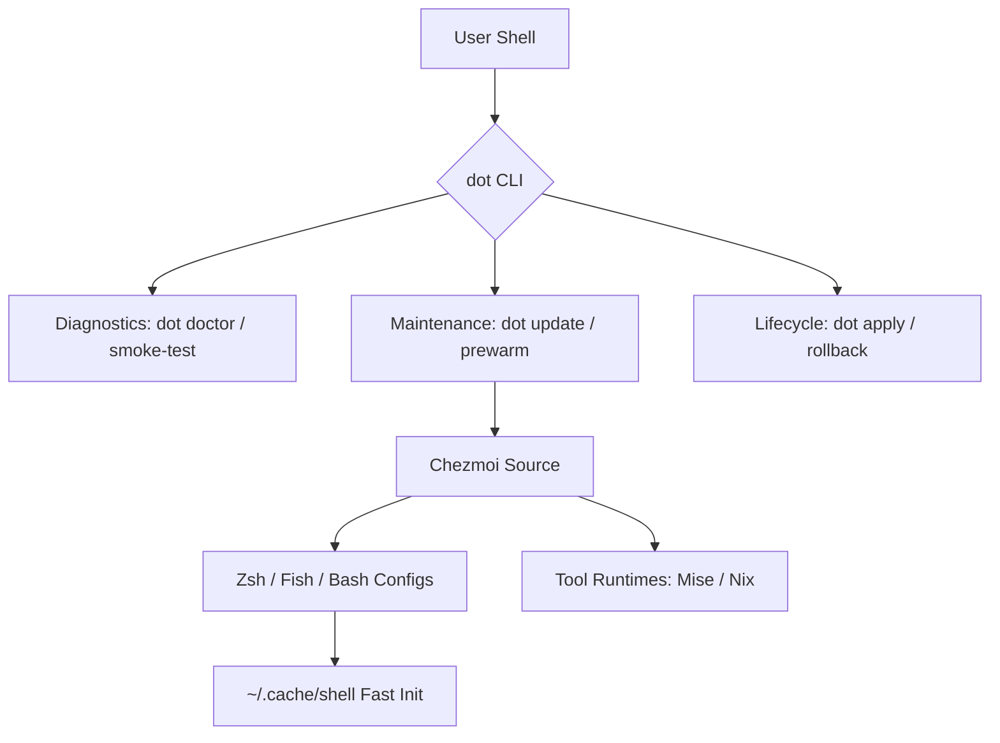

<p align="center">
  
</p>

<h1 align="center">.dotfiles</h1>

<p align="center">
  <strong>A signed, local-first Trusted agent workstation baseline for macOS, Linux, and WSL, with one CLI for apply, diagnostics, repair, and attestation.</strong>
</p>

<p align="center">
  <a href="https://github.com/sebastienrousseau/dotfiles/actions"></a>
  <a href="https://github.com/sebastienrousseau/dotfiles/releases/latest"></a>
  <a href="https://github.com/sebastienrousseau/dotfiles/releases"></a>
  <a href="https://codespaces.new/sebastienrousseau/dotfiles"></a>
</p>

---

## Install

```bash
bash -c "$(curl -fsSL https://raw.githubusercontent.com/sebastienrousseau/dotfiles/master/install.sh)"
```

Then verify:

```bash
dot doctor
```

Requires `git` and `curl`. Works on macOS, Ubuntu/Debian, Arch, and WSL2.

<details>
<summary>CI/CD and Docker options</summary>

Non-interactive install:

```bash
DOTFILES_SILENT=1 DOTFILES_NONINTERACTIVE=1 \
  bash -c "$(curl -fsSL https://raw.githubusercontent.com/sebastienrousseau/dotfiles/master/install.sh)"
```

Docker sandbox:

```bash
docker run --rm -e DOTFILES_NONINTERACTIVE=1 ubuntu:24.04 bash -c \
  'apt-get update -qq && apt-get install -y -qq git curl sudo >/dev/null 2>&1 \
  && git clone --depth 1 https://github.com/sebastienrousseau/dotfiles.git ~/.dotfiles \
  && bash ~/.dotfiles/install.sh \
  && export PATH="$HOME/.local/bin:$PATH" \
  && dot doctor'
```

</details>

---

## Overview

This repository is deliberately closer to workstation infrastructure than to a typical dotfiles dump. The source tree is tracked, the runtime surface is bounded, and the operational path is explicit: install, apply, diagnose, repair, attest, and recover. Chezmoi handles rendering and platform variance; `dot` is the control plane on top.

- **Encrypted secrets** through Age and SOPS
- **Portable runtimes** through Mise, with Nix available when deterministic environments matter
- **Operational recovery** through `dot doctor`, `dot heal`, restore, rollback, and bundle flows
- **Tracked governance** with policy artifacts, attestation output, and compliance controls in-tree

---

## Architecture

Run once or a hundred times, the machine converges on the same state.


```mermaid
graph TD
    A[User Shell] --> B{dot CLI}
    B --> C[Diagnostics: dot doctor / smoke-test]
    B --> D[Maintenance: dot update / prewarm]
    B --> E[Lifecycle: dot apply / rollback]
    D --> F[Chezmoi Source]
    F --> G[Zsh / Fish / Bash Configs]
    F --> H[Tool Runtimes: Mise / Nix]
    G --> I[~/.cache/shell Fast Init]
```

---

## Features

| | |
| :--- | :--- |
| **Startup** | Fast shell bring-up shaped around lazy loading and cached evaluation |
| **Shells** | Fish, Zsh, Nushell, and PowerShell share one managed baseline |
| **Platforms** | First-class support for macOS, Ubuntu/Debian, Arch, and WSL2 |
| **Runtimes** | Mise for managed toolchains, Nix Flakes for stricter reproducibility |
| **Secrets** | Age + SOPS for encrypted configuration and secret material |
| **Signing** | SSH ED25519 signing with trust-aware Git and release workflows |
| **Recovery** | Snapshot, restore, rollback, heal, and offline bundle paths |
| **Governance** | Agent profiles, MCP policy, registries, and workstation attestation artifacts |
| **CI** | Compliance guard, SBOM diff, CodeQL, shell lint, reliability, and security gates |

---

## The `dot` CLI

| Command | What it does |
| :--- | :--- |
| `dot apply` | Converge the machine onto the tracked configuration |
| `dot update` | Pull the latest state and pre-warm slow paths |
| `dot doctor` | Audit tools, paths, portability, and security posture |
| `dot heal` | Repair missing tools and known broken state automatically |
| `dot smoke-test` | Exercise critical toolchains and integrations |
| `dot attest` | Export machine-readable workstation evidence |
| `dot bundle` | Produce a portable support or recovery archive |

Full reference: [docs/reference/UTILS.md](docs/reference/UTILS.md)

---

## What's Included

<details>
<summary><b>Shells and Navigation</b></summary>

- **Zsh** runs as a modular staged shell rather than one monolithic startup script
- **Fish** is tuned for interactive work with `_cached_eval` and deferred initialization
- **Nushell** covers structured terminal workflows without abandoning the rest of the setup
- **PowerShell** keeps cross-platform and WSL-adjacent sessions in the same baseline
- **Starship**, **Zoxide**, **Atuin**, and **fzf** form the navigation and recall layer
</details>

<details>
<summary><b>Development and Runtimes</b></summary>

- **Mise** keeps language and tool runtimes under user control instead of leaking into the base system
- **Nix Flakes** provide the stricter path when reproducibility matters more than convenience
- **Pueue** gives long-running background work an actual queue instead of a pile of terminal tabs
- **Neovim** ships as a real Lua-based editor environment, not a starter template
- **Lazygit** rounds out the terminal workflow without forcing a GUI detour
</details>

<details>
<summary><b>Security, Trust, and Governance</b></summary>

- **Age / SOPS** keep secrets encrypted at rest and out of plaintext history
- **SSH signing** and trust metadata reinforce signed commits and verifiable change flow
- **Gitleaks**, policy checks, and compliance workflows push security into the repo lifecycle instead of bolting it on later
- **Telemetry controls** and local-first defaults keep the workstation biased toward operator control
- **Attestation and registry artifacts** expose machine state, policy, prompt, and model metadata in tracked JSON
</details>

For hardening options, see the [Security docs](docs/security/SECURITY.md).

---

**THE ARCHITECT** ᛫ [Sebastien Rousseau](https://sebastienrousseau.com)
**THE ENGINE** ᛞ [EUXIS](https://euxis.co) ᛫ Enterprise Unified Execution Intelligence System

---

## License

Licensed under the **MIT License**. See [LICENSE](LICENSE) for details.

<p align="right"><a href="#dotfiles">Back to Top</a></p>
