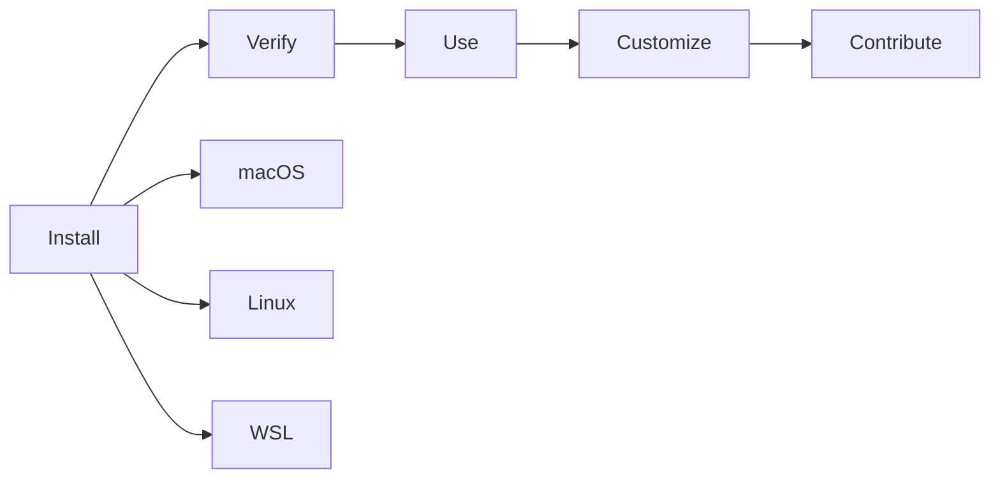

# Dotfiles

[](https://github.com/sebastienrousseau/dotfiles/actions/workflows/ci.yml "CI build status")

Trusted agent workstation for macOS, Linux, WSL, and PowerShell. Signed. Local-first. Managed by Chezmoi.

**Default shell:** Fish. Change it later in `.chezmoidata.toml` (Zsh and Nushell also supported).

## Prerequisites

- `git`
- `curl`

## Install

```bash
bash -c "$(
  curl -fsSL https://raw.githubusercontent.com/sebastienrousseau/dotfiles/master/install.sh
)"
```

## Verify

```bash
dot --version        # Confirm installation
dot doctor           # Check shell, git, and essential tools
dot help             # Browse available commands
```

## Use

```bash
dot learn            # Interactive onboarding tour
dot update           # Pull latest changes and apply
dot apply            # Apply configuration
```

## Platforms

- macOS
- Linux
- WSL
- PowerShell 7.5+

## What’s included

**Core:**
- Zsh, Fish, and Nushell with modular configuration
- PowerShell profile and cross-shell `dot` entrypoint
- Mise and Nix toolchain management
- Encrypted secrets (age)
- Signed commits (SSH ED25519)

**Advanced:**
- Reliability and security gates
- Workstation attestation export
- Agent card and session logging
- Replayable agent checkpoints
- Fleet attestation export
- Policy bundles and change-control registries

## Day 1 path

**For users:**

1. Install.
2. Run `dot doctor` to verify shell, git, and tools.
3. Run `dot learn` for an interactive tour.
4. Customize files in `~/.config/shell/custom/`.

**For contributors:**

1. Clone the repo and run `./install.sh`.
2. Run `make test` or `./tests/framework/test_runner.sh`.
3. Read [Contributing](CONTRIBUTING.md) for signed-commit and PR guidelines.

## Reference

- [Install guide](docs/guides/INSTALL.md)
- [Documentation index](docs/README.md)
- [Utilities and `dot` CLI](docs/reference/UTILS.md)
- [Support matrix](docs/reference/SUPPORT_MATRIX.md)
- [Trusted agent workstation](docs/operations/TRUSTED_AGENT_WORKSTATION.md)
- [Troubleshooting](docs/guides/TROUBLESHOOTING.md)
- [Contributing](CONTRIBUTING.md)

## Architecture


```mermaid
flowchart LR
  A[Install] --> B[Verify]
  B --> C[Use]
  C --> D[Customize]
  D --> E[Contribute]

  A --> A1[macOS]
  A --> A2[Linux]
  A --> A3[WSL]
```

---

**THE ARCHITECT** ᛫ [Sebastien Rousseau](https://sebastienrousseau.com)
**THE ENGINE** ᛞ [EUXIS](https://euxis.co) ᛫ Enterprise Unified Execution Intelligence System

---

## License

Licensed under the [MIT License](LICENSE).
