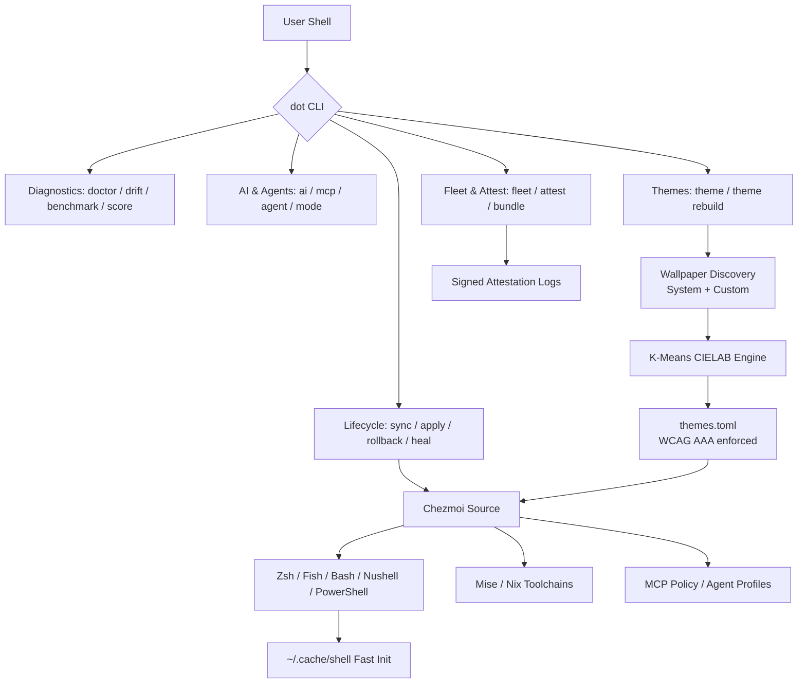

<p align="center">
  
</p>

<h1 align="center">.dotfiles</h1>

<p align="center">
  Declarative dotfiles for macOS, Linux, WSL, and Windows-native
  PowerShell 7.4 LTS / 7.5+. Multi-shell by default. Sub-100ms
  <code>dot</code> cold-start. Wallpaper-driven themes. Signed and
  attested releases. Fleet apply over SSH.
</p>

<p align="center">
  <a href="https://github.com/sebastienrousseau/dotfiles/actions"></a>
  <a href="https://github.com/sebastienrousseau/dotfiles/releases/latest"></a>
  <a href="https://www.npmjs.com/package/@sebastienrousseau/dotfiles"></a>
  <a href="https://doc.dotfiles.io/"></a>
  <a href="https://github.com/sebastienrousseau/dotfiles/releases"></a>
  <a href="https://codespaces.new/sebastienrousseau/dotfiles"></a>
  <a href="https://scorecard.dev/viewer/?uri=github.com/sebastienrousseau/dotfiles"></a>
  <a href="https://www.bestpractices.dev/projects/12840"></a>
  <a href="#license"></a>
  <a href="#requirements"></a>
  <a href="https://repology.org/project/dot-cli/versions"></a>
</p>

---

## Contents

**Getting started**

- [Install](#install) — one-line installer, verified installer, release archive, Homebrew, Scoop, AUR, npm, Nix, chezmoi, source
- [Requirements](#requirements) — toolchain floor, platforms, shells
- [Quick Start](#quick-start) — install, verify, switch a theme, apply in six commands

**The dotfiles family** (framework + four in-repo satellites)

- [The dotfiles family](#the-dotfiles-family) — `dot`, `dot-ui`, `dot-ai-tui`, `dot mcp`, `dot-sys`, the module registry at a glance

**Framework reference**

- [One-minute migration from another dotfiles manager](#one-minute-migration-from-another-dotfiles-manager) — yadm, GNU Stow, a bare repository, plain chezmoi
- [Why this approach?](#why-this-approach) — design rationale
- [Capabilities at a glance](#capabilities-at-a-glance) — the current surface by theme
- [Five shells, one alias hub](#five-shells-one-alias-hub) — parity tiers from ADR-007
- [Comparison](#comparison) — short matrix against chezmoi, holman, nikitabobko
- [Benchmarks](#benchmarks) — startup budgets and the measurement method
- [Features](#features) — what is included, by area

**What it does**

- [Wallpaper-driven themes](#wallpaper-driven-themes) — K-Means in CIELAB, WCAG AAA, 228 generated themes
- [Agent governance (ask / plan / apply / audit)](#agent-governance-ask--plan--apply--audit) — bounded profiles, MCP policy, attestation
- [Self-healing and rollback](#self-healing-and-rollback) — `dot doctor`, `dot heal`, `dot chaos`, `dot rollback`
- [Fleet apply](#fleet-apply) — every host in `fleet.toml` over SSH
- [The `dot` CLI](#the-dot-cli) — 75 indexed subcommands grouped by intent
- [Configuration](#configuration) — `.chezmoidata.toml`, profiles, session flags
- [Examples](#examples) — runnable example index

**Operational**

- [When not to use .dotfiles](#when-not-to-use-dotfiles) — limitations
- [Development](#development) — make targets, fuzzing, hardening gates, CI
- [Security](#security) — reporting, posture, supply chain
- [Documentation](#documentation) — all reference docs
- [Acknowledgements](#acknowledgements)
- [Stability guarantees](#stability-guarantees) — SemVer axis, output stability, toolchain discipline
- [License](#license)

---

## Install

### One-line installer

```bash
bash -c "$(curl -fsSL https://raw.githubusercontent.com/sebastienrousseau/dotfiles/main/install.sh)"
```

The script needs `git` and `curl`. It fetches a SHA256-verified
`chezmoi` binary, clones this repository to `~/.dotfiles`, runs
`chezmoi init --apply`, and puts `dot` on your `PATH`. It runs on
macOS, Ubuntu, Debian, Arch, WSL2, and GitHub Codespaces, and it is
idempotent: run it once or a hundred times, same machine state.

### Verified installer (recommended for primary workstations)

Pin to a release tag, download the installer, check its SHA256
against the value published with the release, then run it. The
per-release hash and how it is generated are documented in
[`docs/security/INSTALL_VERIFICATION.md`](docs/security/INSTALL_VERIFICATION.md).

```bash
curl -fsSL -o /tmp/dotfiles-install.sh \
  https://raw.githubusercontent.com/sebastienrousseau/dotfiles/v0.2.519/install.sh
echo "3b5d1332fb07a1261da117e53f69acc0097c3d9bd676fc9f53a000257b72978e  /tmp/dotfiles-install.sh" \
  | shasum -a 256 -c
bash /tmp/dotfiles-install.sh
```

The verified path also needs `shasum` or `sha256sum`. The one-line
form above skips this check; use it for sandboxes and ephemeral CI.

### Pre-built release archive (`dot` CLI only)

Every tag publishes `dot-<version>.tar.gz` and `.zip` with the
dispatcher, `lib/dot`, the man page, zsh / bash / fish completions,
and a `Makefile` honouring the usual install prefix and staging
directory. The archive
carries SLSA build provenance (keyless, via Fulcio + Rekor):

```bash
gh release download v0.2.519 --repo sebastienrousseau/dotfiles --pattern 'dot-*.tar.gz'
gh attestation verify dot-0.2.519.tar.gz --repo sebastienrousseau/dotfiles
tar -xzf dot-0.2.519.tar.gz
make -C dot-0.2.519 install PREFIX=/usr/local
```

[`release-install-smoke.yml`](.github/workflows/release-install-smoke.yml)
repeats exactly this sequence on a clean Ubuntu and macOS runner
after every release: verify provenance, `make install` into an
empty staging directory, run `dot version`, `make uninstall`, assert
nothing is left behind.

### Package managers

| Channel | Install |
|---|---|
| Homebrew (macOS / Linux) | `brew install sebastienrousseau/tap/dot` |
| Scoop (Windows) | `scoop bucket add sebastienrousseau https://github.com/sebastienrousseau/scoop-bucket && scoop install dot` |
| AUR (Arch) | `paru -S dot-cli-git` |
| npm | `npx -p @sebastienrousseau/dotfiles dotfiles-install` (runs the same `install.sh`) |
| Nix | `nix profile install ~/.dotfiles/nix#dot-utils` after cloning; `nix develop ~/.dotfiles/nix` for the dev shell |

The Homebrew formula and Scoop manifest are regenerated per tag by
[`release-distribute-homebrew.yml`](.github/workflows/release-distribute-homebrew.yml)
and
[`release-distribute-scoop.yml`](.github/workflows/release-distribute-scoop.yml)
from the templates under [`install/`](install/README.md); the AUR
package is pushed by
[`release-distribute-aur.yml`](.github/workflows/release-distribute-aur.yml).
The per-channel templates and the maintainer runbook are in
[`install/README.md`](install/README.md); the end-to-end pipeline is
[`docs/operations/RELEASE_PIPELINE.md`](docs/operations/RELEASE_PIPELINE.md).

### With chezmoi directly

The repository is a chezmoi source tree (`.chezmoiroot` points at
`defaults/`), so chezmoi's own bootstrap works:

```bash
chezmoi init --apply sebastienrousseau
```

This is what `install.sh` runs after its preflight checks; you give
up the verified `chezmoi` download and the `git` / `curl` checks.

### Build from source

```bash
git clone https://github.com/sebastienrousseau/dotfiles.git ~/.dotfiles
cd ~/.dotfiles
./install.sh                  # full install from the local checkout
make install PREFIX=~/.local  # or: stage only the dot CLI
```

`./install.sh --minimal` installs shells and core tools only.
`dot bundle ~/Downloads` builds an offline `.tar.zst` for an
air-gapped host; unpack it and run `./install.sh --force`.

<details>
<summary>CI/CD and Docker options</summary>

Silent install (no prompts):

```bash
DOTFILES_SILENT=1 DOTFILES_NONINTERACTIVE=1 \
  bash -c "$(curl -fsSL https://raw.githubusercontent.com/sebastienrousseau/dotfiles/main/install.sh)"
```

Docker sandbox:

```bash
docker run --rm -e DOTFILES_NONINTERACTIVE=1 ubuntu:24.04 bash -c \
  'apt-get update -qq && apt-get install -y -qq git curl sudo >/dev/null 2>&1 \
  && git clone --depth 1 https://github.com/sebastienrousseau/dotfiles.git ~/.dotfiles \
  && bash ~/.dotfiles/install.sh \
  && export PATH="$HOME/.local/bin:$PATH" \
  && dot doctor'
```

`dot sandbox` launches the same preview through Docker or Podman
from an installed machine.

</details>

### Profiles and session flags

Everything heavy is off, deferred, or cached by default. Pick a
profile per machine and flip session flags when you need less.

| Switch | Where | Effect | Documented in |
| :--- | :--- | :--- | :--- |
| `profile = "laptop"` *(default)* | `~/.config/chezmoi/chezmoi.toml` | All tools, AI CLIs, themes, completions | [`docs/reference/PROFILES.md`](docs/reference/PROFILES.md) |
| `profile = "minimal"` | same | Core shell, git, basic aliases only | same |
| `profile = "server"` | same | Shell, git, monitoring tools, no desktop | same |
| `[features]` flags | `.chezmoidata.toml` | `alias_wrapper`, `dms`, `zellij`, `linux_desktop`, `niri`, `waybar`, `fuzzel`, `mako`, `foot`, `kanshi`, `touch`, `t2`, `surface` — schema-checked in CI | [`docs/reference/FEATURES.md`](docs/reference/FEATURES.md) |
| `DOTFILES_FAST=1` | environment | Skip heavy layers (zinit, completions, lazy runtime managers) | [Configuration](#configuration) |
| `DOTFILES_ULTRA_FAST=1` | environment | Bare minimum shell: paths, aliases, prompt | [`docs/architecture/ARCHITECTURE.md`](docs/architecture/ARCHITECTURE.md) |
| `DOTFILES_DEFER_TOOLS=1` *(default)* | environment | Resolve heavy binaries asynchronously after the first prompt | `defaults/dot_config/zsh/dot_zshrc.tmpl` |
| `DOTFILES_AI=1` | environment | Enable AI helper scripts | [`docs/reference/PROFILES.md`](docs/reference/PROFILES.md) |
| `DOTFILES_ARTIFACT_MODE=1` | environment | Minimal prompt plus the async Bento dashboard | [`docs/architecture/ARCHITECTURE.md`](docs/architecture/ARCHITECTURE.md) |
| `DOTFILES_DEBUG=1` / `DOTFILES_TRACE=1` | environment | Per-stage startup timing / full trace to stderr | [`docs/manual/03-reference/03-environment.md`](docs/manual/03-reference/03-environment.md) |
| `EVALCACHE_DISABLE=true` | environment | Bypass `_cached_eval` for debugging | [Features](#features) |

---

## Requirements

- **Bash 5.0 or newer, zsh 5.8 or newer.** These are the Tier-1
  shells and the floor the test suite runs on: Ubuntu, macOS (Intel
  and Apple Silicon), and Windows runners on every push. `install.sh`
  and `lib/dot` avoid bash-4-only constructs where macOS's stock
  `/bin/bash` 3.2 has to run them (the notes are in `lib/dot/ui.sh`),
  but 3.2 is not a supported interactive shell.

- **chezmoi 2.40 or newer, git 2.35 or newer, curl.** CI pins
  chezmoi `2.47.1` and installs it through a checksum-verified
  fetch; `install.sh` does the same on your machine.

- **A supported platform.** macOS 14+ (Apple Silicon and Intel),
  Ubuntu 22.04+, Debian 12+, WSL2, NixOS 23.11+ are CI-tested or
  supported; Fedora and Arch are community-supported. The full
  table, with per-tool floors, is
  [`docs/reference/SUPPORT_MATRIX.md`](docs/reference/SUPPORT_MATRIX.md).

- **Windows.** PowerShell 7.4 LTS / 7.5+ runs the native
  `dot.ps1` for the daily workflow (apply, status, doctor, mise
  inventory, agent checks, fleet status); the `Test / Windows` job
  exercises the cmdlets on `windows-latest` every push.

**Minimum-toolchain policy.** The floor is the version CI
exercises, not the oldest version that happens to work. It is
raised only in a release whose `CHANGELOG.md` entry names the new
floor and the reason, never silently. The version axis on which it
may move, and the table mapping every supported platform and tool
to its floor live in
[`docs/reference/SUPPORT_MATRIX.md`](docs/reference/SUPPORT_MATRIX.md);
this README makes no distro-compatibility claim that table does not
back.

---

## Quick Start

```bash
bash -c "$(curl -fsSL https://raw.githubusercontent.com/sebastienrousseau/dotfiles/main/install.sh)"
dot doctor            # audit tools, paths, portability, security
dot learn             # interactive tour of shells, secrets, themes, performance
dot theme rebuild     # generate themes from the wallpapers on this machine
dot theme toggle      # swap dark and light within the current family
dot sync              # apply the source tree; the next shell hydrates its caches
```

### First 5 Minutes

1. **Check** — `dot doctor` validates tools, paths, and security.
2. **Explore** — `dot learn` walks through shells, secrets, themes,
   and performance.
3. **Customize** — edit `~/.config/chezmoi/chezmoi.toml` for
   per-machine settings
   ([Profiles](docs/reference/PROFILES.md)).
4. **Toggle features** — flip flags in `.chezmoidata.toml`
   ([Feature Flags](docs/reference/FEATURES.md)).
5. **Apply** — `dot sync` applies the config, and the next
   interactive shell hydrates its caches through `_cached_eval`.

Upgrades between versions are covered in
[`docs/operations/MIGRATION.md`](docs/operations/MIGRATION.md).

---

## The dotfiles family

One repository, one release train: the `dot` framework plus four
satellites that ship inside it and version with it. The version
number in `.chezmoidata.toml` is the compatibility contract — CI's
`Generators / version-consistency` job checks it against eight
human-visible surfaces (`package.json`, `bin/dot`, the man page, the
`bento` banner, this README's badge, `CLAUDE.md`, [`AGENTS.md`](AGENTS.md)) on
every push.

| Component | What it is | Use case |
|---|---|---|
| **`dot`** ([`bin/dot`](bin/dot) + [`lib/dot`](lib/dot/README.md)) | Bash dispatcher and shared library — lifecycle, diagnostics, themes, secrets, fleet, agents | Everything below; also shipped alone as the release archive. |
| **`dot-ui`** ([`defaults/dot_local/share/dot-ui`](defaults/dot_local/share/dot-ui)) | Go renderer for tables, pickers, and progress used by `dot` | Consistent terminal UI across every subcommand; built on apply by a `run_onchange` hook. |
| **`dot-ai-tui`** ([`defaults/dot_local/share/dot-ai-tui`](defaults/dot_local/share/dot-ai-tui)) | Go Bubble Tea cockpit behind `dot ai` | Install, run, chat with, and meter Claude, Codex, Copilot, Aider, OpenCode and friends from one screen. |
| **`dot mcp`** ([`docs/security/MCP_POLICY.md`](docs/security/MCP_POLICY.md)) | MCP policy, supply-chain, and registry audit over `mcp-policy.json` / `mcp-registry.json` | Keep Model Context Protocol servers inside an allowlist before an agent touches them. |
| **`dot-sys`** ([`lib/wasm-tools`](lib/wasm-tools)) | Rust source compiled to WebAssembly and run under `wasmtime` | Portable, sandboxed helper binaries for the shell. |
| **Module registry** ([`docs/operations/REGISTRY.md`](docs/operations/REGISTRY.md)) | JSON index of reusable dotfile modules, schema at [`docs/schema/dot-registry-v1.json`](docs/schema/dot-registry-v1.json) | `dot registry list / search / install` with SHA-256-verified archives and a chezmoi preview before apply. |

### Install the pieces

```bash
# The framework (everything, chezmoi-managed)
bash -c "$(curl -fsSL https://raw.githubusercontent.com/sebastienrousseau/dotfiles/main/install.sh)"

# Only the dot CLI, from the attested release archive
gh release download v0.2.519 --repo sebastienrousseau/dotfiles --pattern 'dot-*.tar.gz'

# The Go satellites are (re)built on apply by
#   defaults/run_onchange_24-build-dot-ui.sh.tmpl
#   defaults/run_onchange_25-build-dot-ai-tui.sh.tmpl

# A registry module
dot registry search fonts && dot registry install <module> --yes
```

### Per-host quick links

| If you use… | Drop-in config |
|---|---|
| **Claude Code** | the shipped [`dotfiles-bootstrap` skill](defaults/dot_claude/skills/dotfiles-bootstrap/SKILL.md) — `/skills` discovers it and runs `dot init` with profile-aware safety defaults |
| **Cursor / Codex / Windsurf / Zed / Roo / Aider / Continue / Jules** | `dot agents render` regenerates every harness stub from [`CLAUDE.md`](CLAUDE.md); `dot agents check` fails when they drift |
| **A2A-capable agents** | the agent card at [`.well-known/agent.json`](.well-known/agent.json), validated by `dot agent a2a-card` and `dot agent conformance` ([`docs/interop/A2A.md`](docs/interop/A2A.md)) |
| **Ghostty / Alacritty / Kitty / WezTerm / Warp / iTerm2 / tmux / Neovim / VS Code** | themed on every `dot theme` switch — see [Wallpaper-driven themes](#wallpaper-driven-themes) |

### How good is this, really?

The rating is a set of programs, and each one prints the command
next to the number.

```sh
dot score                 # system health and security scorecard
dot security-score -j     # workstation security posture, JSON
dot doctor --score        # tools, paths, portability, AI analysis
make test                 # the reliability audit CI runs
```

What the repository can show today:

- **OpenSSF Scorecard 7.6 / 10** at the last recorded snapshot
  (2026-05-17), regenerated weekly and written into
  [`docs/security/SCORECARD.md`](docs/security/SCORECARD.md) with
  the per-check breakdown. The badge above is live.
- **OpenSSF Best Practices: passing (100%)**, project
  [12840](https://www.bestpractices.dev/projects/12840).
- **652 unit test files, 14 integration suites, 18 regression
  tests**, a golden-snapshot suite for `dot --help` / `version` /
  `doctor` / `perf` / `health`, and an `install.sh` fuzz harness —
  see [`tests/README.md`](tests/README.md).
- **Bash line coverage floor 58%** measured by pure `xtrace`, no
  kcov, ratcheted up slice by slice with the history recorded in
  [`coverage.yml`](.github/workflows/coverage.yml).
- **51 workflows**, every third-party action SHA-pinned, Harden
  Runner in every one of them.

The gaps, so nobody has to find them:

- Scorecard's `Code-Review` check scores **0**: one maintainer,
  merges gated by CI rather than by a second reviewer.
- OSS-Fuzz onboarding is prepared under
  [`oss-fuzz-integration/`](oss-fuzz-integration/project.yaml) but
  **not yet submitted**; ClusterFuzzLite runs in the meantime.
- Repology tracks one packaging (AUR `dot-cli-git`); Homebrew and
  Scoop go through this project's own tap and bucket.
- Nushell sits at Tier 3 with under 5% feature parity
  ([ADR-011](docs/adr/ADR-011-nushell-tier3-keep.md)).

Each number above names the command or the file that produced it.
The Scorecard breakdown is
[`docs/security/SCORECARD.md`](docs/security/SCORECARD.md), the
coverage history is in
[`coverage.yml`](.github/workflows/coverage.yml), and
[`docs/STRUCTURE.md`](docs/STRUCTURE.md) maps every top-level path
to the component that owns it. The rest of this README covers the
**framework** surface.

---

## One-minute migration from another dotfiles manager

The one-minute version is `dot init`. It clones any GitHub user's
dotfiles repository through this harness, refuses to clobber an
existing chezmoi source without `--force`, insists on HTTPS, and
previews with `--dry-run`:

```bash
dot init alice --dry-run     # preview: what github.com/alice/dotfiles would do
dot init alice               # clone + apply through the dot harness
dot init https://... --no-apply
```

Coming from a specific tool? The headline mapping is below, and
`dot init --dry-run` shows what the move would produce on this
machine before anything is written.

| Coming from | What changes |
|---|---|
| **yadm** | bare-repo tracking → a chezmoi source tree; `yadm alt` → `.tmpl` files driven by `.chezmoidata.toml`; `yadm encrypt` → age / SOPS through `dot secrets` |
| **GNU Stow** | one package directory per tool → one `dot_config/<tool>/` tree, deployed by `chezmoi apply` instead of a symlink farm |
| **bare git repository** (`config` alias) | `$HOME` as work tree → `~/.dotfiles` as source; `config status` → `dot status` / `dot diff` |
| **plain chezmoi** | keep your source tree as it is; gain `dot doctor` / `heal` / `theme` / `secrets` / `fleet` on top; `chezmoi apply` → `dot sync` |

Upgrades between versions of this project are a different document:
[`docs/operations/MIGRATION.md`](docs/operations/MIGRATION.md).

---

## Why this approach?

Most dotfiles repositories are personal collections. This one is
built as workstation infrastructure: chezmoi is the templating
engine ([ADR-005](docs/adr/ADR-005-chezmoi-choice.md)), `dot` is the
lifecycle CLI on top ([ADR-004](docs/adr/ADR-004-cli-architecture.md)),
and every claim on this page has a test, a workflow, or a document
behind it.

Three choices you will not find in `mathiasbynens/`, `holman/`, or
`paulirish/`:

1. **Wallpaper-driven terminal themes.** K-Means clustering in
   CIELAB extracts a palette from any wallpaper; the engine enforces
   WCAG AAA (7:1) contrast and writes `themes.toml` itself. 228
   generated themes ship today
   ([ADR-009](docs/adr/ADR-009-wallpaper-driven-theming.md)).
2. **First-class agent governance.** Bounded profiles (`ask` /
   `plan` / `apply` / `audit`), MCP policy enforcement, A2A
   discovery, and signed attestation logs for every agent session
   ([`docs/security/MCP_POLICY.md`](docs/security/MCP_POLICY.md),
   [`docs/interop/A2A.md`](docs/interop/A2A.md)).
3. **Verified multi-shell parity.** One alias and function hub
   feeds zsh, bash, fish, nushell, and PowerShell; a parity contract
   runs the canonical command surface in every available shell on
   every PR ([ADR-007](docs/adr/ADR-007-multi-shell-parity.md)).

Two architectural choices make the rest cheap:

- **Lazy hydration.** The prompt paints first from static escape
  codes; tool initialisations (`mise`, `atuin`, `zoxide`, `starship`)
  run through `_cached_eval`, which sources cached `init` output and
  invalidates on the binary's mtime and realpath. Heavy binaries
  resolve asynchronously after the first prompt
  ([ADR-002](docs/adr/ADR-002-shell-performance.md)).
- **Idempotent, verifiable apply.** `dot sync` is chezmoi apply plus
  drift detection; `dot heal` repairs tools, symlinks, and missing
  files; `dot rollback` returns to a known-good state; `dot chaos`
  breaks things on purpose to prove the loop closes.

The default install is signed (SSH ed25519 commits enforced on
`main`), attested (SLSA provenance and Cosign-signed SBOM per
release), multi-platform (macOS, Linux, WSL2, Apple Silicon CI
runners, Windows PowerShell), and schema-checked (`.chezmoidata.toml`
against [`config/chezmoidata.schema.json`](config/chezmoidata.schema.json)
via taplo on every PR).

---

## Capabilities at a glance

| Theme | Headline deliverables |
| :--- | :--- |
| Wallpaper-driven themes | K-Means clustering in CIELAB extracts terminal palettes from any wallpaper; WCAG AAA enforced; Apple-compatible dynamic HEIC dark/light; 228 generated themes; `dot theme rebuild` |
| AI and MCP native | Agent profiles (`dot mode`), MCP policy and registry audit (`dot mcp`), agent card, checkpoints and conformance (`dot agent`), AI commit messages (`dot commit`), the `dot ai` cockpit and local gateway |
| Cryptographic attestation | Signed commits and tags, machine-readable workstation evidence (`dot attest`), policy-bundle releases, `dot keys sign-check`, `dot secret-audit` |
| Fleet management | Multi-node status, drift, events, namespaces and RBAC enforcement mode (`dot fleet`); `dot fleet apply` over SSH; `dot teleport` to bring up a remote host |
| Self-healing | `dot heal`, `dot chaos`, `dot rollback`, `dot bundle`; chezmoi drift, broken symlinks, missing files, checksum-verified tool recovery |
| Sub-second startup | Lazy loading, `_cached_eval`, mtime-based cache invalidation, realpath sidecar pins; `dot perf`, `dot benchmark`, `dot health` |
| Multi-shell parity | Tier 1 (full): zsh, bash. Tier 2 (bridged): fish. Tier 3 (compatible): nushell. PowerShell as a contract-tested parity target ([`tests/integration/test_shell_parity.sh`](tests/integration/test_shell_parity.sh)) |
| Build artifacts to `/tmp` | Cargo, Go, pip, uv, and Zig caches redirect to `/tmp/builds/` via `~/.config/mise/config.toml` and `~/.cargo/config.toml`; project directories stay clean |
| Encrypted secrets | age and SOPS at rest; macOS Keychain, `pass`, or age-encrypted store selected by policy; `dot secrets`, `dot secret-audit`, `dot ssh-key`, `dot ssh-cert` |
| Portable runtimes | mise for managed toolchains with a cross-platform `mise.lock`; Nix flake for strict reproducibility; `dot env`, `dot tools`, `dot upgrade` |
| Schema-validated config | `.chezmoidata.toml` checked against a JSON Schema in CI; `dot env emit` writes a v1-schema environment manifest; the registry index has its own schema |
| Supply chain | SHA-pinned actions, Harden Runner, SLSA L3 provenance, Cosign keyless signing, SPDX SBOM, OpenSSF Scorecard and Best Practices, gitleaks + detect-secrets + TruffleHog, dependency review, CodeQL, Checkov |

---

## Five shells, one alias hub

The dotfiles expose one command surface over five shells through a
hub-and-spoke bridge ([ADR-007](docs/adr/ADR-007-multi-shell-parity.md)):

- **Hub** — canonical aliases and functions live once, in Bash/POSIX,
  under `defaults/.chezmoitemplates/aliases/` and
  `defaults/.chezmoitemplates/functions/`. Adding one propagates to
  every shell.
- **Tier 1 (full): zsh, bash** — direct inclusion, lazy loading,
  `_cached_eval`, staged `rc.d` modules.
- **Tier 2 (bridged): fish** — a runtime bash bridge with a cached
  `abbr` table (878 entries source in 34 ms, down from 170 ms when
  they were `alias` functions), plus native `dot` completions.
- **Tier 3 (compatible): nushell** — simple aliases extracted and
  cached to `~/.cache/nushell/bash-aliases.nu`; functions delegate to
  bash at roughly 5 ms per call
  ([ADR-011](docs/adr/ADR-011-nushell-tier3-keep.md) explains why it
  stays).
- **PowerShell** — a managed profile, the native `dot.ps1` for the
  daily workflow, and a parity contract that runs on every PR
  ([`docs/reference/POWERSHELL_PARITY.md`](docs/reference/POWERSHELL_PARITY.md)).

[`tests/integration/test_shell_parity.sh`](tests/integration/test_shell_parity.sh)
verifies the canonical command surface and a runtime smoke in every
shell present on the runner; the `Reliability Gate` workflow adds
WSL and PowerShell contract jobs.

```bash
dot completion zsh     # completions are generated from the command registry,
dot completion fish    # never hand-maintained — bash, zsh, fish, and nu
dot aliases tiers      # which alias tiers and ecosystems are enabled here
dot aliases why gco    # provenance and deprecation status of one alias
```

---

## Comparison

`.dotfiles` is the only dotfiles distribution in this comparison
that ships wallpaper-derived WCAG-AAA themes, agent governance,
cryptographic attestation, a self-healing CLI, and fleet apply on
top of a stock chezmoi source tree.

| | This repo | chezmoi | holman/dotfiles | nikitabobko/dotfiles |
|:---|:---:|:---:|:---:|:---:|
| Cross-platform (macOS/Linux/WSL) | ✓ | ✓ | macOS-leaning | macOS only |
| Multi-shell parity (zsh/fish/nu/pwsh) | ✓ | — | bash only | zsh only |
| Wallpaper-driven themes (K-Means) | ✓ | — | — | — |
| AI / MCP integration | ✓ | — | — | — |
| Cryptographic attestation | ✓ | — | — | — |
| Self-healing CLI | ✓ | — | — | — |
| Fleet management | ✓ | — | — | — |
| Encrypted secrets (age/SOPS) | ✓ | ✓ | — | — |
| Build artifact redirection | ✓ | — | — | — |
| Schema-validated config | ✓ | — | — | — |

`chezmoi` is the underlying templating engine. This repo is the
opinionated reference implementation on top of it, and
[plain chezmoi users can adopt it without moving their source tree](#one-minute-migration-from-another-dotfiles-manager).

---

## Benchmarks

Two budgets are enforced in CI, and both state their method.

**`dot` cold start** — `tools/ci/dot-cli-startup-bench.sh` runs
`dot version` eleven times under a clean `env -i` shell and takes
the median. [`dot-cli-bench.yml`](.github/workflows/dot-cli-bench.yml)
fails the build above the budget on every push and PR touching
`bin/dot` or `scripts/dot/`; a median more than 15% over the previous
baseline is a warning.

| Runner | Budget (median of 11) | Observed |
|---|---:|---:|
| Linux (`ubuntu-latest`) | 150 ms | within budget on every green run |
| macOS | 200 ms | within budget on every green run |
| Windows (PowerShell) | 300 ms | within budget on every green run |
| Local macOS, bash 5.x | — | **~47 ms** (recorded in the workflow header and `CHANGELOG.md`) |

**Interactive shell startup** — `dot perf` (backed by
`scripts/diagnostics/perf.sh`, `hyperfine`-style warm-up plus three
runs, mean) measures every installed shell against a per-shell
target, compares with a recorded baseline in
`~/.cache/dotfiles/perf-baseline.json`, and flags any shell more
than 10% slower. [`perf-baseline.yml`](.github/workflows/perf-baseline.yml)
records the reference weekly on Ubuntu and measures every push to a
`feat/**` branch that touches shell code.

| Shell | Target (mean) | Override |
|---|---:|---|
| zsh | 250 ms | `DOTFILES_PERF_TARGET_ZSH_MS` |
| bash | 60 ms | `DOTFILES_PERF_TARGET_BASH_MS` |
| fish | 200 ms | `DOTFILES_PERF_TARGET_FISH_MS` |
| nushell | 500 ms | `DOTFILES_PERF_TARGET_NU_MS` |
| PowerShell | 600 ms | `DOTFILES_PERF_TARGET_PWSH_MS` |

Measured deltas that shipped with their method in `CHANGELOG.md`:
fish startup **217 ms → 119 ms** by emitting the alias bridge as
`abbr` instead of `alias` (#963); ~140 ms saved per fish start by
shadowing Homebrew's eager `direnv` / `mise` `vendor_conf.d` hooks;
20–50 ms saved per tool by `_cached_eval`
([`docs/architecture/ARCHITECTURE.md`](docs/architecture/ARCHITECTURE.md)).
The original threshold and the `hyperfine --warmup 3 --runs 10
"zsh -i -c exit"` recipe are in
[ADR-002](docs/adr/ADR-002-shell-performance.md).

Numbers on your own machine:

```bash
dot perf                  # every installed shell vs its target
dot perf --baseline       # record this machine's known-good point
dot benchmark             # per-component startup profile
dot load-bench            # time to heavy-layer readiness
```

Budgets, baseline lifecycle, and the regression-issue pipeline are
documented in
[`docs/operations/PERFORMANCE.md`](docs/operations/PERFORMANCE.md);
the harnesses are
[`tools/ci/dot-cli-startup-bench.sh`](tools/ci/dot-cli-startup-bench.sh)
and [`tests/performance/`](tests/performance/).

---

## Features

| | |
| :--- | :--- |
| **Shells and navigation** | Zsh loads in stages through small `rc.d` modules, not one startup script. Fish uses `_cached_eval` and deferred loading. Bash ships full parity with zsh for tooling and aliases. Nushell handles structured workflows (Tier 3). PowerShell keeps cross-platform and WSL sessions on the same baseline with a `pwsh` parity contract in CI. Starship, Zoxide, Atuin, and fzf for navigation and recall. Starship Transient Prompt collapses past prompts to a single glyph on fish; the zsh hook is in place for when upstream lands the matching function ([ADR-010](docs/adr/ADR-010-starship-transient-prompt.md)). |
| **Development and runtimes** | mise manages language versions in user space with a cross-platform `mise.lock` (Linux, macOS, Windows, exact URLs and SHA-256s). Nix Flakes for strict reproducibility when speed is not the priority. Pueue queues long-running tasks instead of extra tabs. Neovim ships as a full Lua editor, not a starter template. Lazygit for terminal git. Build caches (Cargo, Go, pip, uv, Zig) redirect to `/tmp/builds/` and clear on reboot. `_cached_eval` caches expensive `tool init` output with mtime and realpath invalidation; `EVALCACHE_DISABLE=true` bypasses it. |
| **AI, agents, and MCP** | Agent profiles (`dot mode`): ask, plan, apply, audit. Pattern library (`dot patterns`): architect, hardener, refactor, bundled in `dot_config/ai/patterns/`. MCP policy enforcement (`dot mcp`). AI commit messages (`dot commit`). The `dot ai` cockpit installs and runs Codex, Copilot, Antigravity, Aider, OpenCode and friends from one Bubble Tea TUI; `dot ai serve` exposes your Claude subscription locally to any Anthropic- or OpenAI-protocol tool ([ADR-012](docs/adr/ADR-012-ai-fleet-local-proxy.md), [`docs/AI.md`](docs/AI.md)). Every agent session is logged with a policy hash and an outcome. |
| **Security, trust, governance** | age and SOPS keep secrets encrypted at rest and out of history. SSH ed25519 signing plus trust metadata back every commit. Gitleaks, detect-secrets, TruffleHog, policy checks, and compliance workflows. `dot attest` records machine state, policy, prompt, and model metadata in tracked JSON. Telemetry controls and local-first defaults (`dot telemetry`, `dot dns-doh`, `dot firewall`, `dot usb-safety`, `dot lock-screen`, `dot encrypt-check`). SPDX SBOM and Grype CVE scanning in CI. npm releases authenticate through OIDC trusted publishing with provenance, never a long-lived token. |
| **Themes** | 228 wallpaper-derived themes, dark and light paired; `dot theme`, `dot theme toggle`, `dot theme family`, `dot theme sync` with the OS appearance; `dot wallpaper rotate` and `dot wallpaper sync`. See [Wallpaper-driven themes](#wallpaper-driven-themes). |
| **Fleet and remote** | `dot fleet` status, drift, events, namespace, RBAC enforce mode; `dot fleet apply` runs `dot sync` (or a custom `--cmd`) on every host in `fleet.toml`; `dot teleport` deploys the environment to a fresh host over SSH; `dot bundle` builds an offline archive. |
| **Diagnostics** | `dot doctor` (deep audit, `--ai` analysis), `dot health` dashboard, `dot score`, `dot security-score`, `dot fleet drift`, `dot snapshot`, `dot metrics` (JSONL observability), `dot history`, `dot packages`. |
| **Distribution** | Release archives with a `PREFIX` / `DESTDIR` Makefile, man page (`share/man/man1/dot.1`), generated completions, Homebrew tap, Scoop bucket, AUR, npm, Nix; `dot uninstall` removes the managed environment. |

---

## Wallpaper-driven themes

Drop a wallpaper. Get a theme.

`dot theme rebuild` discovers system wallpapers and your custom
ones. On macOS it looks in `/System/Library/Desktop Pictures/`. On
Linux it looks in `/usr/share/backgrounds/`. Custom wallpapers live
in `~/Pictures/Wallpapers/` (`DOTFILES_WALLPAPER_DIR` overrides).
K-Means clustering in CIELAB colour space extracts the dominant
colours; the engine generates a 16-colour terminal palette, enforces
WCAG AAA contrast (7:1 for fg/bg, accent text on accent, and c15 on
bg), and assembles `defaults/.chezmoidata/themes.toml` on its own.
Extraction runs four jobs in parallel, results are cached in
`~/.cache/dotfiles/themes/`, and only changed wallpapers are
regenerated.

| Tier | Source | Format |
|:---|:---|:---|
| **System** | macOS `/System/Library/Desktop Pictures/`<br/>Linux `/usr/share/backgrounds/` | `.heic`, `.jpg`, `.png` |
| **Custom** | `~/Pictures/Wallpapers/` (overrides system on name collision) | Apple-compatible dynamic HEIC (single file, both appearances) |

```bash
dot theme              # interactive picker (paired themes only)
dot theme tahoe-dark   # switch directly
dot theme toggle       # swap dark and light within the current family
dot theme family       # cycle between theme families
dot theme sync         # follow the OS dark/light setting
dot theme rebuild      # regenerate from current wallpapers
```

On theme switch, every managed surface updates. Terminals: Ghostty,
Alacritty, Kitty, WezTerm, Warp, iTerm2, tmux. Editors: Neovim and
VS Code. The theme also sets GTK and icon themes, the macOS accent
colour and dark-mode toggle (with a forced UI refresh), the browser
colour mode, and the wallpaper. On Linux the engine converts HEIC to
PNG through `magick` or `heif-convert`.

Full guide: [`docs/guides/THEMING.md`](docs/guides/THEMING.md).
Rationale: [ADR-009](docs/adr/ADR-009-wallpaper-driven-theming.md).

---

## Agent governance (ask / plan / apply / audit)

Agents run under a named profile that bounds what they may do, and
every run leaves evidence:

```bash
dot mode list                      # ask / plan / apply / audit
dot mode set plan                  # switch the active profile
dot mode run plan git status       # run one command under a profile, with a checkpoint
dot mode doctor                    # validate agent-profiles.json and the default
dot agent log                      # tail the session audit log
dot agent checkpoint list          # saved run checkpoints (save / list / show / replay)
dot fleet enforce strict           # advisory → strict RBAC for agent profiles
```

The MCP side is policy-first: `dot mcp doctor` audits configured
Model Context Protocol servers against
`defaults/dot_config/dotfiles/mcp-policy.json` (allowlist, supply
chain, config), and `dot mcp registry` shows the registry it was
checked against. `dot attest` exports the workstation's version,
platform, signing settings, active profile, and policy hash as
tracked JSON ([`docs/operations/ATTESTATION.md`](docs/operations/ATTESTATION.md)).
The A2A agent card and conformance suite are in
[`docs/interop/A2A.md`](docs/interop/A2A.md); the trust model that
ties signing, secrets, profiles, and attestation together is
[`docs/manual/01-concepts/02-trust-model.md`](docs/manual/01-concepts/02-trust-model.md).

---

## Self-healing and rollback

The CLI is idempotent, and it checks its own work.

```bash
dot doctor             # deep audit: tools, paths, portability, AI analysis
dot heal               # auto-fix tools, chezmoi drift, broken symlinks, missing files
dot chaos --dry-run    # simulate config corruption, then prove heal closes the loop
dot rollback           # return to a previous known-good state
dot snapshot           # capture a baseline to compare against later
```

Tool recovery is checksum-verified: Nushell, Pueue, Wasmtime, SOPS,
Yazi, and Zellij are restored from exact mise / aqua pins, never
from a mutable release URL. `dot health` renders the cache and tool
state as a live dashboard (`-j` for JSON); its output, like
`doctor`, `perf`, `version`, and `--help`, is pinned by golden
snapshots in [`tests/snapshots/`](tests/snapshots/).

---

## Fleet apply

```toml
# ~/.config/dotfiles/fleet.toml  (DOTFILES_FLEET_HOSTS overrides the path)
[hosts.laptop]
ssh     = "user@laptop.local"
profile = "workstation"
```

```bash
dot fleet                     # this node: id, namespace, version, OS, drift, last apply
dot fleet drift               # configuration drift across managed files
dot fleet apply               # every host runs: dot sync && dot doctor --quiet
dot fleet apply --cmd uptime  # or an arbitrary command — this is the trust boundary
dot fleet namespace staging   # multi-tenant isolation
dot fleet events              # recent fleet events from the local log
```

Hostnames are validated against `[A-Za-z0-9._@:+/-]+` before any SSH
fan-out; first connections use `StrictHostKeyChecking=accept-new`,
so pre-populate `~/.ssh/known_hosts` if your threat model allows no
TOFU window. `dot teleport` brings a fresh machine up over SSH
before it joins the fleet. The concept chapter is
[`docs/manual/01-concepts/04-fleet.md`](docs/manual/01-concepts/04-fleet.md).

---

## The `dot` CLI

75 subcommands, 144 indexed entries, grouped by intent. `dot help`
shows the overview, `dot help all` the full reference, `dot search
<keyword>` filters it. The generated
[command index](docs/manual/command-index.md) is checked against
`dot help all` on every PR.

### Start here

| | |
|:---|:---|
| `dot init <user>` | Bootstrap any GitHub user's dotfiles repository through this harness |
| `dot sync` | Apply dotfiles to this machine (`--pull` to fetch first, `--check` to preview) |
| `dot doctor` | Check the environment and surface issues |
| `dot learn` | Open the guided tour |
| `dot agents render` | Sync `CLAUDE.md` → `AGENTS.md` + Cursor + Codex stubs |
| `dot fleet apply` | SSH out to every host in `~/.config/dotfiles/fleet.toml` |
| `dot registry list` | Browse reusable dotfile modules from the registry |

### Daily use

| | |
|:---|:---|
| `dot status` / `dot diff` | Show local drift; preview pending changes |
| `dot edit` / `dot add` | Open the source directory; add a file to the source |
| `dot upgrade` | Update toolchains, plugins, and dotfiles |
| `dot commit` | Generate an AI commit message from the staged diff |
| `dot search` | Find commands by keyword |

### Inspect and repair

| | |
|:---|:---|
| `dot heal` | Auto-fix tools, chezmoi drift, and broken symlinks |
| `dot rollback` | Return to a previous known-good state |
| `dot attest` | Export workstation evidence |
| `dot chaos` | Simulate corruption to test self-healing |
| `dot bundle` | Create an offline tarball of the dotfiles environment |

### AI and agents

| | |
|:---|:---|
| `dot ai` | AI fleet cockpit — run, chat, install, serve a local gateway, cost |
| `dot mcp` | Inspect MCP policy and registry |
| `dot mode` | Show or set the agent profile (ask / plan / apply / audit) |
| `dot agent` | Agent metadata, logs, checkpoints, conformance |
| `dot patterns` | List bundled AI patterns (architect, hardener, refactor) |

### Configuration commands

| | |
|:---|:---|
| `dot theme` / `dot theme rebuild` | Switch theme or regenerate from wallpapers |
| `dot env` | Managed tool versions (list, install, use, prune, emit) |
| `dot profile` | Show or switch the active profile |
| `dot secrets` | Edit, get, set, list, load encrypted secrets |
| `dot fonts` | Install or patch Nerd Fonts |

### Fleet and performance

| | |
|:---|:---|
| `dot fleet` | Multi-node status, drift, events, namespace |
| `dot perf` | Measure shell startup |
| `dot score` / `dot security-score` | Health and security scorecards |
| `dot health` | Live dashboard for caches and tool state |

Full reference: [`docs/reference/UTILS.md`](docs/reference/UTILS.md)
· manual chapter:
[`docs/manual/03-reference/01-dot-cli.md`](docs/manual/03-reference/01-dot-cli.md)
· `man dot` after install.

<details>
<summary><b>Architecture</b></summary>


```mermaid
graph TD
    A[User Shell] --> B{dot CLI}
    B --> C[Lifecycle: sync / apply / rollback / heal]
    B --> D[Diagnostics: doctor / drift / benchmark / score]
    B --> E[AI & Agents: ai / mcp / agent / mode]
    B --> F[Themes: theme / theme rebuild]
    B --> G[Fleet & Attest: fleet / attest / bundle]

    C --> H[Chezmoi Source]
    F --> I[Wallpaper Discovery<br/>System + Custom]
    I --> J[K-Means CIELAB Engine]
    J --> K[themes.toml<br/>WCAG AAA enforced]
    K --> H

    H --> L[Zsh / Fish / Bash / Nushell / PowerShell]
    H --> M[Mise / Nix Toolchains]
    H --> N[MCP Policy / Agent Profiles]
    L --> O[~/.cache/shell Fast Init]

    G --> P[Signed Attestation Logs]
```

Root layout: `bin/` (dispatcher), `lib/dot/`
(shared bash library), `defaults/` (the chezmoi source tree, via
`.chezmoiroot`), `scripts/` (runtime subcommands), `tools/`
(repo-only ops), `install/` (bootstrap and channel templates). The
map of every top-level path, with the history of the reorganisation
that produced it, is [`docs/STRUCTURE.md`](docs/STRUCTURE.md); the
contributor-facing
design is
[`docs/architecture/ARCHITECTURE.md`](docs/architecture/ARCHITECTURE.md).

</details>

---

## Configuration

<details>
<summary><b>Machine data (<code>.chezmoidata.toml</code>)</b></summary>

```toml
# defaults/.chezmoidata.toml — repo-wide defaults, schema-checked in CI
dotfiles_version = "0.2.519"

[features]
alias_wrapper = false   # confirm destructive aliases
dms = true              # Dank Material Shell theming for GNOME
zellij = false
linux_desktop = false   # niri, waybar, fuzzel, mako, foot, kanshi follow it

[tools]
node_manager = "mise"   # mise | fnm | nvm

[secrets.policy]
provider = "auto"       # auto | macos-keychain | pass | plain-enc
auto_load = true
```

Typos in a flag or profile name fail the `Lint / Chezmoidata Schema`
job before merge
([`config/chezmoidata.schema.json`](config/chezmoidata.schema.json)).

</details>

<details>
<summary><b>Per-machine overrides (<code>~/.config/chezmoi/chezmoi.toml</code>)</b></summary>

```toml
[data]
profile = "laptop"        # laptop | minimal | server
machine = "work-macbook"
default_shell = "zsh"

[data.features]
linux_desktop = false
```

Hardware presets (`macbook-t2`, `surface-pro`) live under
`defaults/.chezmoidata/` and are selected through the `t2` /
`surface` flags. Run `dot sync` after editing.

</details>

<details>
<summary><b>Session flags</b></summary>

| Variable | Default | Effect |
|---|---|---|
| `DOTFILES_FAST=1` | 0 | Skip heavy layers (zinit, completions) |
| `DOTFILES_ULTRA_FAST=1` | 0 | Bare minimum shell (aliases + prompt) |
| `DOTFILES_AI=1` | 0 | Enable AI helper scripts |
| `DOTFILES_PROFILE=custom` | laptop | Override the profile for one session |
| `DOTFILES_NONINTERACTIVE=1` | unset | Skip prompts (CI) |
| `DOTFILES_SILENT=1` | unset | Suppress non-error output |
| `DOTFILES_SOURCE_DIR` | `~/.dotfiles` | Override the source directory |
| `DOTFILES_CACHE_DIR` | `~/.cache/dotfiles` | Override the cache location |
| `DOTFILES_WALLPAPER_DIR` | `~/Pictures/Wallpapers` | Custom wallpaper directory |
| `DOTFILES_DEBUG=1` | unset | Print shell-init timing to stderr |

The complete list is
[`docs/manual/03-reference/03-environment.md`](docs/manual/03-reference/03-environment.md);
the strategy for choosing chezmoi data over Nix over runtime flags is
[`docs/CONFIG_STRATEGY.md`](docs/CONFIG_STRATEGY.md).

</details>

---

## Examples

Run all examples (each one is bounded by a 60 s timeout and executed
in CI by the `Examples Contract` job):

```bash
make examples
```

<details>
<summary><b>All examples</b></summary>

| Category | Example | Purpose |
| :--- | :--- | :--- |
| **CLI** | `example-dot-commands` | `dot` CLI command modules |
| | `example-command-reference` | Complete `dot` command reference, one usage line per public command |
| | `example-cli-utilities` | CLI utility scripts deployed to `~/.local/bin` |
| | `example-functions` | Shell function library categories |
| **Operations** | `example-install-uninstall` | Installation and uninstall scripts |
| | `example-ops` | Operations and maintenance scripts |
| | `example-diagnostics` | Diagnostics and health-check utilities |
| | `example-platform-contract` | `lib/dot/platform.sh`: platform id, host OS, the portability contract |
| | `example-fleet` | Fleet management (multi-machine dotfiles operations) |
| **Themes** | `example-theme` | Theme and wallpaper engine |
| **Security** | `example-secrets` | Encrypted secrets (age) management |
| | `example-security` | Security operations and hardening scripts |
| | `example-git-hooks` | The hook installer and the pre-push reliability gate |
| **AI** | `example-ai-patterns` | The `dot ai` fleet: command surface, steering styles, gateway |
| **Quality** | `example-test-suite` | Running the unit and integration suites |
| | `example-testing-framework` | Testing framework capabilities: assertions and mocks |
| | `example-coverage-gate` | The module coverage gate |
| | `example-qa` | Quality assurance and validation scripts |
| **Packaging** | `mise-plugin-dot/` | A mise plugin that installs `dot` |

</details>

---

## When not to use .dotfiles

A few cases where another tool fits better, listed because the
short answer is "we don't do that" rather than because of a
disagreement on priorities.

- **You want a dependency-free shell config.** The default profile
  brings chezmoi, mise, starship, zoxide, atuin, fzf, and a Go
  toolchain for the TUI satellites. `profile = "minimal"` and
  `DOTFILES_ULTRA_FAST=1` cut that down, but the framework assumes
  it may install things. A single `.zshrc` is lighter.

- **You need full parity on nushell.** Nushell is Tier 3: simple
  aliases plus bash-delegated functions, under 5% of the zsh feature
  set, kept deliberately as a reference target
  ([ADR-011](docs/adr/ADR-011-nushell-tier3-keep.md)).

- **You need Windows without WSL to be first-class.** The native
  `dot.ps1` covers the daily workflow (apply, status, doctor, mise,
  agents, fleet status); themes, `heal`, and most diagnostics still
  need bash. Windows CI verifies the PowerShell surface, not the
  whole CLI.

- **You are on Fedora or Arch and need CI-backed support.** Both
  are community-supported: the code is expected to work, but the
  matrix runs Ubuntu, macOS (Intel and Apple Silicon), and Windows
  ([`docs/reference/SUPPORT_MATRIX.md`](docs/reference/SUPPORT_MATRIX.md)).

- **You do not want `apply` to run scripts.** Provisioning hooks
  under `install/provision/` (`run_onchange_*`) install packages,
  fonts, and tmux plugins when their source changes. They are
  idempotent and previewable with `dot sync --check`, but they are
  scripts running as you.

- **You need a second reviewer on every merge.** This is a
  single-maintainer project gated by CI, DCO, and signed commits,
  not by code review; the Scorecard `Code-Review` check says so.

If you hit a case that should be on this list, please open an issue;
that is how it gets fixed or moved into the supported set.

---

## Development

```bash
make                    # reliability audit: syntax, unit, module coverage, examples, docs + traceability coverage
make test-quick         # the same, quick mode
make test-unit          # unit only
make test-integration   # with integration suites
make examples           # run every example under a timeout
make install            # stage the dot CLI under $(DESTDIR)$(PREFIX) (default /usr/local)
make uninstall

./tests/framework/test_runner.sh --jobs auto   # unit suite, parallel
bash tests/snapshots/test_snapshots.sh         # golden CLI output
bash tests/fuzz/fuzz_install.sh                # install.sh under adversarial input
bash tools/docs/generate-command-index.sh --check
bash scripts/qa/check-version-consistency.sh
```

Toolchain setup, the task map, and how to reproduce every CI gate
locally are in [`CONTRIBUTING.md`](CONTRIBUTING.md) and
[`docs/operations/TESTING.md`](docs/operations/TESTING.md). Commit signing,
the DCO trailer, branch names, and the regression-test convention
are in [`CONTRIBUTING.md`](CONTRIBUTING.md). A
[devcontainer](.devcontainer/devcontainer.json) boots to a working
`make` for Codespaces.

### Fuzzing

Two native Go fuzz harnesses ship under
[`oss-fuzz-integration/fuzz/`](oss-fuzz-integration/fuzz/) for the
user-input surfaces that were ported out of the shell so they could
be fuzzed at all: `FuzzValidateName` (the name validator behind
`lib/dot/utils.sh`) and `FuzzInitURLResolver` (the URL resolver
behind `dot init`). A third harness,
[`tests/fuzz/fuzz_install.sh`](tests/fuzz/fuzz_install.sh), drives
`install.sh` itself with unknown flags, garbage positionals, symlink
loops in `$HOME`, an empty `PATH`, 4 KB arguments, and NUL bytes in
the environment, and asserts every case exits cleanly or fails fast
but never hangs. It has already found two real bugs (a missing `-h`
alias; unknown positionals triggering a 30 s network fetch).

- [`fuzz.yml`](.github/workflows/fuzz.yml) runs each Go harness for
  60 s on every push to `main` and on every PR touching the parsing
  surfaces. Go replays the committed seed corpus under
  `testdata/fuzz/` before exploring, so a fixed crash cannot
  silently return.
- [`cflite_pr.yml`](.github/workflows/cflite_pr.yml) runs
  ClusterFuzzLite in code-change mode (120 s, AddressSanitizer,
  SARIF upload) on PRs touching the harnesses or
  [`.clusterfuzzlite/`](.clusterfuzzlite/build.sh).
- [`install-fuzz.yml`](.github/workflows/install-fuzz.yml) runs the
  `install.sh` harness weekly on Ubuntu and macOS, and on every PR
  touching `install.sh`; a scheduled failure opens a tracking issue.
- **OSS-Fuzz:** the project definition is ready in
  [`oss-fuzz-integration/`](oss-fuzz-integration/project.yaml)
  (libFuzzer, ASan + UBSan, x86_64); the upstream submission to
  `google/oss-fuzz` has not been filed yet.

```bash
cd oss-fuzz-integration/fuzz
go test -run TestNothing -fuzz='^FuzzValidateName$' -fuzztime=60s ./...
go test -run TestNothing -fuzz='^FuzzInitURLResolver$' -fuzztime=60s ./...
```

The harness layout and the OSS-Fuzz submission steps are in
[`docs/security/FUZZING.md`](docs/security/FUZZING.md); the shared
corpus lives beside the harnesses under
[`oss-fuzz-integration/fuzz/testdata/`](oss-fuzz-integration/fuzz/testdata/).

### Hardening gates in place of Miri

- **ShellCheck at severity `error` is a hard gate** on every push
  (`reusable-shell-lint.yml`, `fail_on_shellcheck: true`), with
  `shfmt` formatting checked alongside; the same hooks run in
  pre-commit. Fish and Nushell configs have their own lint jobs.
- **Coverage by `xtrace`, not kcov.** `tools/ci/run-coverage.sh`
  turns on `set -x` through `BASH_ENV` in every bash process the
  suite spawns and aggregates the lines that executed. The floor is
  **58%** and rises with each slice; the measured history is in the
  workflow file. A separate 100% *module-mapping* floor
  (`tests/framework/module_coverage.sh`) fails the build when an
  executable module has no test file at all.
- **Reliability Gate** runs the audit on `ubuntu-latest`,
  `macos-latest` (Intel), and `macos-14` (Apple Silicon), then the
  examples contract, the WSL contract, and the PowerShell contract
  ([`docs/operations/RELIABILITY.md`](docs/operations/RELIABILITY.md)).
- **Cross-platform portability scan** rejects GNU-only `sed`,
  `grep`, and `date` idioms and runs the critical scripts on each OS
  ([`cross-platform-test.yml`](.github/workflows/cross-platform-test.yml)).
- **Generators cannot drift:** the command index is regenerated
  from `dot help all` and diffed; eight version surfaces
  (`package.json`, `bin/dot` twice, the man page, `lib/dot/bento.sh`,
  this README's badge, `CLAUDE.md`, [`AGENTS.md`](AGENTS.md)) are checked against
  `.chezmoidata.toml`; `.chezmoidata.toml` itself is validated
  against its JSON Schema. `dot agents check` does the same for the
  AI-harness stubs locally.
- **Golden snapshots** pin the user-facing text of `dot --help`,
  `dot version`, `dot doctor`, `dot perf`, and `dot health` after
  scrubbing paths, timings, and colours.

### CI

| Workflow | Trigger | Purpose |
| :--- | :--- | :--- |
| `ci.yml` | push, PR, schedule | Shell / Lua / Fish / Nushell / copyright lint, chezmoidata schema, secrets scan, dependency audit, TruffleHog, SBOM + Grype, link check, tests on Linux, macOS, Windows, Docker |
| `ci-enforced.yml` | push, PR | The stricter enforced gate reusing the shared lint and test-suite workflows |
| `reliability-gate.yml` | push, PR | Reliability audit on three runners + examples, WSL, PowerShell contracts |
| `coverage.yml` | push, PR | xtrace line coverage with the 58% floor and delta gate |
| `cross-platform-test.yml` | push, PR | Portability scan and runtime checks per OS |
| `dot-cli-bench.yml` / `perf-baseline.yml` | push, PR / weekly + `feat/**` | Cold-start budget; shell-startup baseline and regression issues |
| `fuzz.yml` / `cflite_pr.yml` / `install-fuzz.yml` | push, PR / PR / weekly + PR | Go harnesses; ClusterFuzzLite; `install.sh` fuzz |
| `doc-drift.yml` | push, PR | Command index and version-consistency generators |
| `dco.yml` / `pr-signature.yml` / `verify-tag-signature.yml` | PR / PR / tag | DCO trailer, signed PR commits, signed annotated tags |
| `scorecard.yml` / `codeql.yml` / `dependency-review.yml` / `security-enhanced.yml` / `deps-dev-validation.yml` | weekly / push, PR | OpenSSF Scorecard, CodeQL, dependency review (`fail-on-severity: high`), Checkov, deps.dev validation |
| `release-package-dot.yml` / `security-release.yml` | release | `dot-<v>.tar.gz` + `.zip` with SLSA provenance; SPDX SBOM, Cosign signature, unified `ALL_SHA256SUMS` manifest |
| `release-install-smoke.yml` / `release-distribute-*.yml` | release | Clean-install smoke on Ubuntu + macOS; Homebrew, Scoop, AUR fan-out |
| `npm-publish.yml` / `manual-publish.yml` / `pages.yml` | release, push | npm via OIDC trusted publishing; the manual in nine formats; the site |

51 workflows in total; the cadence and the composite actions are
documented in
[`docs/operations/CI_CADENCE.md`](docs/operations/CI_CADENCE.md) and
[`docs/operations/CI_COMPOSITES.md`](docs/operations/CI_COMPOSITES.md).

---

## Security

**Reporting:** never open a public issue for a vulnerability — use
[GitHub Security Advisories](https://github.com/sebastienrousseau/dotfiles/security/advisories)
or <security@sebastienrousseau.com>; see
[`.github/SECURITY.md`](.github/SECURITY.md) for the response SLA (Critical: 24 h
initial response, 48 h target; High: 72 h / 7 days; Medium: 5 / 30
business days; Low: 10 / 90), the supported-version table, and the
GPG key for encrypted reports
([`docs/security/DISCLOSURE.md`](docs/security/DISCLOSURE.md),
[`docs/security/KEYS.md`](docs/security/KEYS.md)).

A dotfiles framework is code that runs as you, on every login, on
every machine you own. The posture below closes the vectors that
matter for that shape — remote script execution, secrets at rest,
agents with shell access, and the pipeline that ships it — at the
architectural level, not behind opt-in flags. The full analysis is
[`docs/security/THREAT_MODEL.md`](docs/security/THREAT_MODEL.md).

### Installer and remote-execution controls

- **No unverified download runs.** `install.sh` fetches `chezmoi`
  through `tools/ci/install-chezmoi-verified.sh`, which downloads the
  release tarball *and* the upstream checksum file and refuses on
  mismatch. Where that helper is unavailable, the fallback still
  requires the installer to be under 100 KiB and to begin with
  `#!/`.
- **Every third-party installer the framework can execute is
  allowlisted by SHA-256** in
  [`security/remote-installers.sha256`](security/remote-installers.sha256)
  (Claude, Kimi, Goose, Antigravity, xAI, and the rest). CI rejects
  any `curl | sh` that bypasses the verifier.
- **Size and structure limits.** `lib/dot/verified-download.sh` caps
  scripts at 512 KiB and archives at 100 MiB by default, caps
  checksum manifests at 2 MiB, and fails closed on empty files;
  registry archives are rejected when they contain path traversal
  or link entries. Fonts, distro signing keys, and binary archives
  go through the same path.
- **`dot init` is HTTPS-only**, refuses to overwrite an existing
  source directory without `--force`, and prints the source URL it
  is about to run scripts from.
- **Self-healing never fetches mutable URLs.** Tool recovery uses
  exact mise / aqua pins with checksums.

### Secrets

- `dot secrets` selects a provider by policy — macOS Keychain,
  `pass`, or an age-encrypted local store — and loads buckets into
  the environment on demand (`eval "$(dot secrets load ai)"`), so
  keys are never in plaintext files or shell history.
- age and SOPS encrypt chezmoi-managed secret files at rest;
  `dot secrets-init` bootstraps the key, `dot ssh-key` encrypts an
  SSH key locally, `dot ssh-cert` manages short-lived certificates.
- `dot secret-audit` audits hygiene and leakage surface on the
  workstation; gitleaks, detect-secrets, and TruffleHog run on every
  push and in pre-commit; the history-filtering procedure is written
  down in
  [`docs/security/HISTORY_FILTERING.md`](docs/security/HISTORY_FILTERING.md).

### Agents and MCP

- Every agent runs under a bounded profile (`ask` / `plan` /
  `apply` / `audit`) with checkpoints and a session audit log;
  `dot fleet enforce strict` turns the profile RBAC from advisory
  into enforced.
- MCP servers must appear in `mcp-policy.json` and pass
  `dot mcp doctor` (policy, supply chain, config) before use.
- `dot attest` records the workstation state with the policy hash so
  an audit can check what an agent was allowed to do when it ran.

### Supply chain

- **Every third-party GitHub Action is pinned to a commit SHA**, and
  the pins are linted (`Lint / Reusable Workflow Pins`). The one
  tag reference is the SLSA generator reusable workflow, which its
  maintainers require to be referenced by release tag
  ([`docs/security/CI_PINNING.md`](docs/security/CI_PINNING.md)).
- **Harden Runner in all 51 workflows**, six jobs in egress-block
  mode with an explicit endpoint list
  ([`docs/security/CI_EGRESS_ALLOWLIST.md`](docs/security/CI_EGRESS_ALLOWLIST.md)).
- **Releases carry provenance:** SLSA L3 build attestation on the
  `dot` archive (`gh attestation verify`), an SPDX SBOM signed with
  Cosign keyless (Fulcio + Rekor), and one signed `ALL_SHA256SUMS`
  manifest covering every asset; the verification recipe is
  [`docs/security/VERIFY_RELEASE.md`](docs/security/VERIFY_RELEASE.md).
- **Signed everything:** SSH ed25519 commit signatures enforced on
  `main`, signed annotated tags verified by workflow, DCO and PR
  signature checks required, GPG key published over WKD and checked
  weekly (`verify-gpg-wkd.yml`).
- **npm via OIDC trusted publishing** with provenance attached, no
  long-lived token.
- **Scans on every push:** dependency review (`fail-on-severity:
  high`), CodeQL, Checkov, Grype against the SBOM, Dependabot with
  grouped updates; OpenSSF Scorecard weekly with the snapshot
  committed to [`docs/security/SCORECARD.md`](docs/security/SCORECARD.md).
- **SPDX headers** on source files, checked by the copyright lint
  job.

### Notes

- Template injection is a real surface for a chezmoi tree: `.tmpl`
  files render with chezmoi data before deployment, so
  `.chezmoidata.toml` is schema-validated and the trust boundary is
  documented per surface in the threat model.
- `_cached_eval` output files under `~/.cache/shell/` are sourced on
  startup; the cache key includes the tool binary's mtime and
  realpath so a swapped binary invalidates its cache.

---

## Documentation

The four entry points, identical across every repo in the family:

- **[User Manual](https://doc.dotfiles.io/)** — the rendered book:
  concepts, tutorials, reference, cookbook, appendices; also
  `dot manual`, `dot manual pdf`, `dot manual text | less`, and
  `dot manual --offline` from the bundled snapshot
- **[Command reference](docs/manual/command-index.md)** — every
  `dot` subcommand, generated from `dot help all`; `man dot` after
  install
- **[Developer docs](CONTRIBUTING.md)** — toolchain, task map,
  reproducing every CI gate locally
- **[Family map](docs/STRUCTURE.md)** — every top-level path, the
  component that owns it, and where to make which change

The manual is published in nine formats (single- and multi-page
HTML, PDF, EPUB, ASCII text, compressed variants, Markdown source)
and rebuilds on every change from [`docs/manual/`](docs/manual/).

| Document | Covers |
|---|---|
| [`docs/STRUCTURE.md`](docs/STRUCTURE.md) | Every top-level path, the chezmoi naming contract, where to make which change. |
| [`docs/architecture/ARCHITECTURE.md`](docs/architecture/ARCHITECTURE.md) | Startup strategies, `_cached_eval`, lazy hydration, artifact and ultra-fast modes. |
| [`docs/adr/`](docs/adr/README.md) | Twelve decision records: CI/CD, shell performance, security-first, CLI architecture, chezmoi, shell selection, multi-shell parity, aliases, wallpaper theming, transient prompt, nushell tier, AI local proxy. |
| [`docs/reference/`](docs/reference/) | Aliases, feature flags, fonts, PowerShell parity, profiles, scripts, support matrix, themes, tools, `dot` utilities. |
| [`docs/security/`](docs/security/README.md) | Threat model, install verification, fuzzing, secrets, encryption, MCP policy, commit signing, CI pinning, egress allowlist, key rotation, release verification, Scorecard, compliance, incident response. |
| [`docs/operations/`](docs/operations/OPERATIONS.md) | Release pipeline, version sync, performance, reliability, coverage, drift, registry, attestation, CI cadence, migration between versions. |
| [`docs/guides/`](docs/guides/INSTALL.md) | Install, theming, Neovim IDE, troubleshooting, WSL2 + Nix. |
| [`install/README.md`](install/README.md) | For distro maintainers: the bootstrap path, the per-channel templates, and the publication checklist. |
| [`.github/SECURITY.md`](.github/SECURITY.md) · [`GOVERNANCE.md`](GOVERNANCE.md) · [`CONTRIBUTING.md`](CONTRIBUTING.md) · [`CODE_OF_CONDUCT.md`](CODE_OF_CONDUCT.md) | Reporting, decision model, contribution workflow, community expectations. |
| [`CHANGELOG.md`](CHANGELOG.md) | Per-release notes. **The complete record** — every release appears here. |
| [`AGENTS.md`](AGENTS.md) / [`CLAUDE.md`](CLAUDE.md) | Invariants for AI-assisted contributors; `CLAUDE.md` is canonical, `AGENTS.md` is rendered from it. |

---

## Acknowledgements

This framework stands on tools whose maintainers did the hard part:
[chezmoi](https://github.com/twpayne/chezmoi) for the source-tree
model that makes every `apply` reproducible, [mise](https://mise.jdx.dev)
and [Nix](https://nixos.org) for toolchains that survive a reinstall,
[age](https://age-encryption.org) and [SOPS](https://github.com/getsops/sops)
for secrets that stay encrypted, and the Charmbracelet libraries
behind the Go satellites. The security posture leans on
[Sigstore](https://www.sigstore.dev), [SLSA](https://slsa.dev),
[OpenSSF Scorecard](https://scorecard.dev), and
[StepSecurity Harden Runner](https://github.com/step-security/harden-runner).

Bug reports with a reproduction and a failing test are the most
useful contribution this project receives; the regression-test
convention in [`CONTRIBUTING.md`](CONTRIBUTING.md) exists so that
every one of them stays fixed.

## Stability guarantees

- **Versioning.** [SemVer](https://semver.org) with
  `defaults/.chezmoidata.toml` as the source of truth, mirrored to
  eight surfaces by `scripts/version-sync.sh` and checked in CI.
  During the `0.2.x` series every release is a patch bump; a change
  that breaks an existing machine (a renamed command, a moved
  managed path, a changed flag default) is called out in its
  `CHANGELOG.md` entry and, where relevant, in
  [`docs/operations/MIGRATION.md`](docs/operations/MIGRATION.md)
  with a migration or rollback script under `install/migrate/`
  ([`GOVERNANCE.md`](GOVERNANCE.md)).

- **Output stability.** For a tool that generates files, output *is*
  API. Machine-readable outputs carry a schema version —
  `dot env emit` conforms to
  [`docs/schema/dot-env-v1.json`](docs/schema/dot-env-v1.json), the
  registry index to
  [`docs/schema/dot-registry-v1.json`](docs/schema/dot-registry-v1.json) —
  and a change to their shape is a new schema version, not an edit
  to `v1`. Generated artefacts that other tools consume
  (`themes.toml`, shell completions, [`AGENTS.md`](AGENTS.md) and the harness
  stubs, the command index) are produced by generators whose output
  is diffed in CI; a behavioural change to what a generator emits is
  treated as breaking and recorded in the changelog even when no
  command-line flag moves. The human-facing text of `dot --help`,
  `version`, `doctor`, `perf`, and `health` is pinned by golden
  snapshots and changes only with a deliberate snapshot update in
  the same commit.

- **Minimum toolchain.** Raised only with the reason recorded in the
  `CHANGELOG.md` entry, never silently — policy, version axis, and
  history in
  [`docs/reference/SUPPORT_MATRIX.md`](docs/reference/SUPPORT_MATRIX.md).

- **Deprecations** are announced before removal with the removal
  release named up front:
  [`docs/reference/ALIASES_DEPRECATIONS.md`](docs/reference/ALIASES_DEPRECATIONS.md)
  records each deprecated alias, its replacement, and its `Remove In`
  version, and `dot aliases why <alias>` reports the same from the
  CLI. The deprecation window is the span between the release that
  adds the row and the release named in `Remove In`.

## License

Dual-licensed under [Apache 2.0](https://www.apache.org/licenses/LICENSE-2.0) or [MIT](https://opensource.org/licenses/MIT), at your option. See [`LICENSE-APACHE`](LICENSE-APACHE) and [`LICENSE-MIT`](LICENSE-MIT).

See [CHANGELOG.md](CHANGELOG.md) for release history.

---

**THE ARCHITECT** ᛫ [Sebastien Rousseau](https://sebastienrousseau.com)
**THE ENGINE** ᛞ [EUXIS](https://euxis.co) ᛫ Enterprise Unified Execution Intelligence System

<p align="right"><a href="#contents">Back to Top</a></p>
