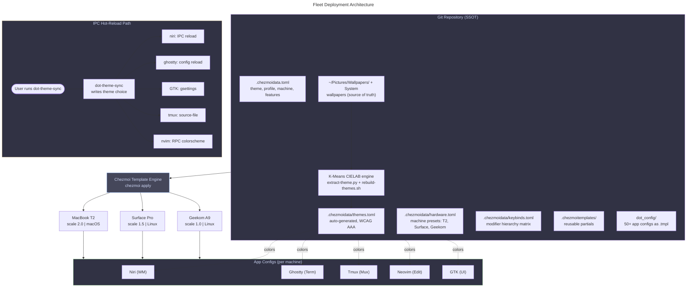

# Fleet Deployment Architecture

## Deployment Flow

> **Note — Keybind Modifier Hierarchy:** Each input layer owns a
> non-overlapping modifier prefix. The compositor (Super) never collides
> with the multiplexer (Ctrl+a prefix), which never collides with the
> editor (Space leader). `Ctrl+h/j/k/l` is the sole shared binding,
> resolved by `tmux-vim-navigator` interop.

## Keybind Conflict Resolution Matrix

| Modifier | Layer | Owner | Examples |
|---|---|---|---|
| `Super` (Mod) | Compositor | Niri | `Super+1`-`9` workspaces, `Super+Enter` terminal |
| `Alt` | Window Switch | Niri | `Alt+Tab`, `Alt+grave` |
| `Ctrl+a` prefix | Multiplexer | Tmux | `Ctrl+a h/j/k/l` panes, `Ctrl+a N` new window |
| `Ctrl+h/j/k/l` | Smart Navigation | Tmux / Neovim | Seamless pane/split traversal |
| `Ctrl+c/v/t/w` | Terminal | Ghostty | Copy, paste, new tab, close |
| `Space` (leader) | Editor | Neovim | `Space+ff` find, `Space+ca` code action |
