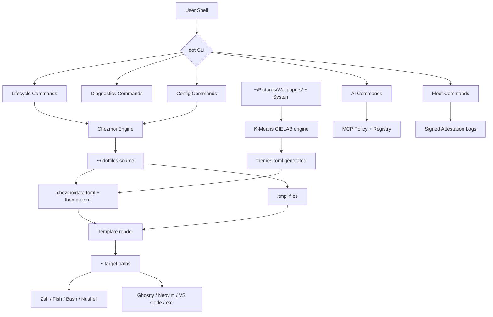

# Architecture

`.dotfiles` is composed of four loosely coupled subsystems, coordinated by a single command-line interface.

## The Four Subsystems

### 1. Templating Engine — Chezmoi

[Chezmoi](https://chezmoi.io) reads the source directory (`~/.dotfiles/` or `~/.local/share/chezmoi/`), renders templates using data from `.chezmoidata.toml`, and writes the results to the target paths in `$HOME`.

Every file in the source directory follows chezmoi naming conventions:

| Prefix / Suffix | Effect |
|:---|:---|
| `dot_` | Deployed with leading `.` (`dot_zshrc` → `~/.zshrc`) |
| `executable_` | Sets `+x` permission on the destination |
| `private_` | Sets `0600` permission on the destination |
| `.tmpl` | Processed as a Go template with chezmoi data |
| `run_onchange_` | Script runs when the target changes |
| `run_before_` | Script runs before apply |
| `run_after_` | Script runs after apply |

### 2. Runtime Management — Mise and Nix

**Mise** ([mise.jdx.dev](https://mise.jdx.dev)) manages per-user language runtimes and CLI tools. All entries in `~/.config/mise/config.toml` are installed to `~/.local/share/mise/installs/`, activated by PATH shimming. No system-level packages are touched.

**Nix Flakes** (`nix/flake.nix`) provide strictly reproducible builds when Mise's approximate semver-pinning is insufficient — for example, for declaring an entire system via Home Manager.

### 3. The `dot` CLI

`dot` is the entry point for all lifecycle operations. It is a pure Bash script (no runtime dependencies) that dispatches to command handlers in `scripts/dot/commands/`.

Each command is self-contained — any command can be invoked directly as a script if needed:

```sh
bash ~/.dotfiles/scripts/dot/commands/diagnostics.sh doctor
# equivalent to:
dot doctor
```

The CLI follows a grouping convention (see [dot CLI Reference](../03-reference/01-dot-cli.md)):

- **Lifecycle** — `sync`, `apply`, `rollback`, `heal`, `bundle`
- **Diagnostics** — `doctor`, `drift`, `benchmark`, `score`, `metrics`
- **AI & Agents** — `ai`, `mcp`, `agent`, `mode`
- **Configuration** — `theme`, `env`, `profile`, `secrets`
- **Fleet** — `fleet`, `attest`
- **Reference** — `help`, `search`, `version`, `manual`

### 4. Secrets and Attestation

Secrets are encrypted at rest using **Age** (modern file encryption) with **SOPS** (YAML-aware envelope) or `chezmoi encrypt`. The private key never leaves `~/.config/age/keys.txt` (or the user's password manager).

Attestation produces signed, machine-readable JSON recording:

- Host identity (kernel, arch, hostname hash)
- Policy hash (MCP policy, agent profiles)
- Tool versions (mise, nix, key binaries)
- Git HEAD and signature status
- Timestamp and verification hash

See [Trust Model](02-trust-model.md) for the full threat model.

## Data Flow



## Startup Performance Model

Shell startup is optimized via a three-tier caching strategy:

1. **Bake-at-apply-time** — values computed once during `chezmoi apply` (HOSTNAME, platform, OS version) are written directly into config files, avoiding subshells at startup.
2. **`_cached_eval` pattern** — slow initializers (mise, zoxide, atuin, starship) write their output to `~/.cache/shell/<tool>-init.sh`. Subsequent shells `source` the cache. Cache is invalidated when the binary's mtime changes.
3. **Lazy loading** — heavy layers (nvm, rbenv, direnv) are loaded on first invocation via shell function stubs.

Target: ≤500ms cold shell startup, ≤100ms per component. Enforced by CI benchmark (see [Performance Reference](../03-reference/01-dot-cli.md#benchmark)).

## Per-Machine Profiles

The `machine` key in `.chezmoidata.toml` (or the per-host override in `~/.config/chezmoi/chezmoi.toml`) selects a hardware preset from `.chezmoidata/hardware.toml`. Presets define:

- Display scale (1.0, 1.5, 2.0)
- Keyboard modifier hierarchy
- Performance profile (desktop, laptop, low-power)
- Feature flags (e.g. `features.dms = true` for Niri on Wayland)

A single source tree deploys correctly to a MacBook, a Surface, a Linux desktop, and a WSL2 session — each rendering a platform-appropriate config.

## Trust Boundaries

| Boundary | Trusted | Untrusted |
|:---|:---|:---|
| Source tree | Your Git history, signed commits | Unverified pull requests |
| Secret store | `~/.config/age/keys.txt` | Environment variables, cloud storage |
| Attestation logs | Signed by SSH ED25519 key | Unsigned JSON reports |
| Template data | `.chezmoidata.toml` | User-provided template input |

Every boundary is enforced: unsigned commits fail CI gates, secrets never appear in plaintext git history, attestation logs are hash-chained.

## Next

- [Trust Model](02-trust-model.md) — detailed threat model and verification procedures
- [Theme Engine](03-theme-engine.md) — K-Means CIELAB pipeline
- [Fleet Architecture](04-fleet.md) — multi-host deployment model
