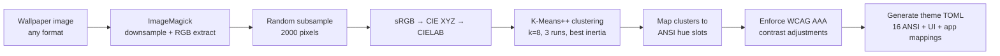

# The Theme Engine

`.dotfiles` generates terminal color palettes directly from wallpaper images. There are no hand-crafted themes — dominant colors are extracted via K-Means clustering in CIELAB color space, mapped to ANSI slots, and enforced to WCAG AAA contrast.

This chapter explains the pipeline end to end.

## The Why

Hand-crafted themes are expensive to maintain and constrain the user to a fixed palette. Wallpaper-driven themes:

- **Adapt to any wallpaper** — drop a new image, run `dot theme rebuild`, get a new theme
- **Guarantee contrast** — WCAG AAA is enforced algorithmically, not by taste
- **Avoid IP issues** — we never redistribute Apple/Microsoft wallpapers; the engine works with whatever is already on the user's system
- **Produce matched pairs** — every wallpaper yields a dark and light variant with a golden-ratio brightness relationship

## The Pipeline



### Stage 1 — Pixel Extraction

`ImageMagick` resizes the wallpaper to 80×80 maximum dimension (preserving aspect ratio) and emits pixel-by-pixel text output:

```sh
magick input.heic -resize 80x80\> -depth 8 txt:-
```

At 80×80 we have ~6,400 pixels. For dynamic HEIC files (`image.heic[0]`, `image.heic[1]`), each frame is processed independently.

### Stage 2 — Subsampling

2,000 pixels are sampled uniformly from the downsampled image using a seeded PRNG (`random.Random(42)`). This gives a reproducible run and keeps K-Means iteration fast.

### Stage 3 — Color Space Conversion

Each RGB triplet is converted:

1. **sRGB → linear RGB** — gamma correction using the sRGB companding curve
2. **Linear RGB → CIE XYZ** — D65 illuminant, matrix multiplication
3. **CIE XYZ → CIELAB** — nonlinear transform; distances in Lab approximate human perception

Why CIELAB? In RGB, a "distance" of 30 between two colors might look identical to one eye and drastically different to another. In CIELAB, Δ*E* distances are perceptually uniform — a Δ*E* of 2 is the threshold for "just noticeable different" regardless of which axis moves.

### Stage 4 — K-Means Clustering

**K-Means++** initialization places initial centroids spread across the color space (reducing "bad seed" failures). The algorithm:

1. Pick one random pixel as centroid 1
2. For centroids 2..k, pick a pixel with probability proportional to D(x)² (squared distance to nearest existing centroid)
3. Iterate: assign each pixel to its nearest centroid, recompute centroid as mean of assigned pixels
4. Stop when assignments stabilize or max iterations reached

We run the algorithm 3 times with different seeds and keep the clustering with lowest inertia (sum of squared distances from each pixel to its centroid). This avoids local minima without the cost of more runs.

### Stage 5 — ANSI Hue Mapping

The 6 chromatic ANSI slots (red, green, yellow, blue, magenta, cyan) are assigned target hue angles:

| ANSI Slot | Target Hue (degrees) |
|:---|---:|
| red | 30 |
| yellow | 95 |
| green | 145 |
| cyan | 210 |
| blue | 275 |
| magenta | 330 |

For each slot, we pick the most chromatic cluster whose hue is nearest to the target. If no cluster is close enough, we synthesize the color by projecting the accent chroma onto the target hue angle.

Structural slots (`c0`/black, `c7`/white, `c8`, `c15`) are computed from the background Lab with fixed lightness offsets — they exist to provide the required contrast ratios, not to carry hue information.

### Stage 6 — WCAG AAA Contrast Enforcement

Every color pair is checked and adjusted:

| Pair | Minimum Ratio |
|:---|---:|
| `fg` / `bg` | 7:1 |
| `accent_text` / `accent` | 7:1 |
| `c15` / `bg` | 7:1 |
| `fg` / `sel_bg` | 4.5:1 |
| `c8` / `bg` | 2.5:1 |
| `c0` / `bg` | 1.5:1 |
| `panel` / `bg` | 1.03-2.0 (bounded) |
| `border` / `bg` | 1.08-3.5 (bounded) |

For the accent, we darken in Lab space until white text has 7:1 contrast. For fg and bright ANSI colors, we adjust lightness until the target ratio is met. The output is guaranteed AAA on launch — the `test_themes_toml.sh` unit test verifies this for every generated theme.

## Wallpaper Discovery

`rebuild-themes.sh` scans two tiers of wallpapers:

### System Wallpapers

- **macOS** — `/System/Library/Desktop Pictures/*.heic` and `/System/Library/Desktop Pictures/.thumbnails/*.heic`
- **Linux** — `/usr/share/backgrounds/` and `/usr/share/wallpapers/` (recursive)

### Custom Wallpapers

- `~/Pictures/Wallpapers/*.{heic,jpg,png}` (or `$DOTFILES_WALLPAPER_DIR`)

### Deduplication

Custom wallpapers override system wallpapers on name collision. For Apple's dynamic HEIC files that contain multiple appearances in one file, the engine extracts each frame (`file.heic[0]`, `file.heic[1]`) and generates one theme per appearance.

If a base wallpaper has explicit `-dark` and `-light` variants (e.g. `Big Sur Graphic.heic` + `Big Sur Graphic Dark.heic` + `Big Sur Graphic Light.heic`), the base is skipped to avoid duplicate theme names.

## Dynamic HEIC (Apple Appearance Metadata)

macOS dynamic wallpapers embed the `apple_desktop:apr` XMP metadata — a base64-encoded plist mapping image indices to appearance modes:

```xml
<rdf:Description rdf:about=""
  xmlns:apple_desktop="http://ns.apple.com/namespace/1.0/"
  apple_desktop:apr="YnBsaXN0MDDSAQIDBFFsUWQQABABCA0PERMAAAAAAAABAQAAAAAAAAAFAAAAAAAAAAAAAAAAAAAAFQ=="/>
```

Decoded:

```xml
<dict>
    <key>l</key><integer>0</integer>  <!-- light = image 0 -->
    <key>d</key><integer>1</integer>  <!-- dark = image 1 -->
</dict>
```

`scripts/theme/merge-wallpaper.sh` combines separate dark+light files into a single dynamic HEIC with this metadata:

```sh
bash scripts/theme/merge-wallpaper.sh           # merge all pairs
bash scripts/theme/merge-wallpaper.sh tahoe     # merge a specific family
bash scripts/theme/merge-wallpaper.sh --dry-run # preview
```

macOS then auto-switches the displayed image based on the current Light/Dark mode — no application-level logic required.

## Caching

Per-wallpaper themes are cached in `~/.cache/dotfiles/themes/<name>.toml`. The cache is invalidated when the wallpaper's mtime is newer than the cached TOML. `dot theme rebuild --force` skips the cache.

Full parallel rebuild of ~150 wallpapers takes ~3-5 minutes on modern hardware (4 parallel jobs, ~4 seconds per wallpaper). Incremental rebuilds (after adding 1-2 new wallpapers) take ~10 seconds.

## Theme Application

`dot-theme-sync` orchestrates the switch across every managed surface:

| Surface | Mechanism |
|:---|:---|
| Ghostty | `chezmoi apply config.tmpl` + DBus reload or SIGUSR2 |
| Alacritty | `chezmoi apply alacritty.toml.tmpl` |
| Kitty | `chezmoi apply kitty.conf.tmpl` + SIGUSR1 |
| WezTerm | `chezmoi apply wezterm.lua.tmpl` |
| Tmux | `chezmoi apply tmux.conf.tmpl` + `source-file` |
| Neovim | `chezmoi apply` + `--remote-expr` colorscheme switch over socket |
| VS Code | `chezmoi apply settings.json.tmpl` |
| GTK | `chezmoi apply gtk.css.tmpl` + `gsettings set gtk-theme` |
| macOS accent | `defaults write -g AppleAccentColor` + `killall cfprefsd SystemUIServer Dock` |
| Desktop wallpaper | `osascript` (macOS) or `gsettings picture-uri` (Linux) |

See [Theming Reference](../03-reference/01-dot-cli.md#theme) for the exact command surface.

## Bibliography

- MacQueen, J. (1967). *Some methods for classification and analysis of multivariate observations.* Proceedings of the Fifth Berkeley Symposium on Mathematical Statistics and Probability.
- Arthur, D. & Vassilvitskii, S. (2007). *K-Means++: The advantages of careful seeding.* ACM-SIAM Symposium on Discrete Algorithms.
- CIE (1976). *Recommendations on uniform color spaces, color-difference equations, psychometric color terms.* Supplement No. 2 to CIE Publication No. 15.
- W3C (2023). *Web Content Accessibility Guidelines (WCAG) 2.2.* <https://www.w3.org/TR/WCAG22/>

## See Also

- [Theming Guide](../../guides/THEMING.md) — quick-start and troubleshooting
- [Theme Reference](../../reference/THEMES.md) — data schema and runtime behaviour
- [Tutorial: Add a Wallpaper](../02-tutorials/02-add-wallpaper.md)
