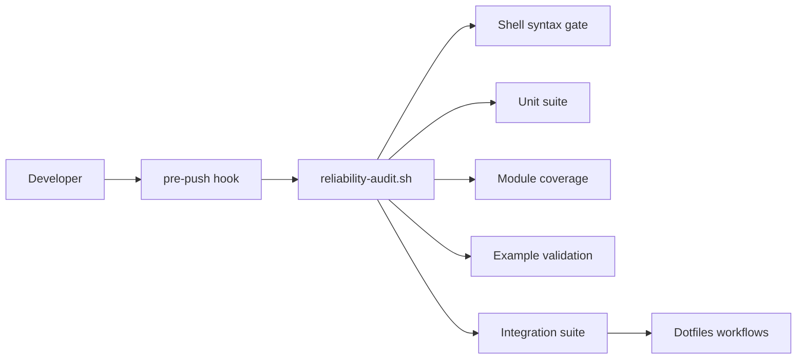
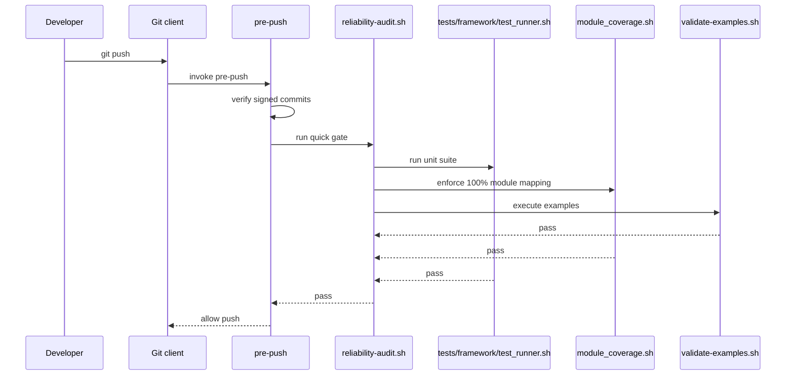

# Reliability

## Reliability scorecard

- Unit coverage: 100% module mapping target, enforced by `tests/framework/module_coverage.sh`
- Integration depth: 8/10
- Regression automation: 9/10

## Coverage gap map

| Module | Missing path | Risk level | Proposed test case |
| :--- | :--- | :--- | :--- |
| `scripts/qa/reliability-audit.sh` | Quick mode and integration mode branch handling | Medium | Run `--quick`, `--unit-only`, and `--with-integration` with mocked runners |
| `scripts/git-hooks/pre-push` | Audit command failure path | High | Stub audit script to exit non-zero and verify push is blocked |
| `tests/framework/module_coverage.sh` | False-positive module matches | Medium | Add fixtures with overlapping names and verify uncovered modules remain visible |
| `examples/*.sh` | Drift between examples and real commands | Medium | Run examples in CI as an executable contract |

## Integration boundaries





## CI gate

```yaml
name: Reliability Gate

on:
  pull_request:
  push:
    branches: [master]
  workflow_dispatch:

jobs:
  reliability:
    strategy:
      fail-fast: false
      matrix:
        os: [ubuntu-latest, macos-latest]
    runs-on: ${{ matrix.os }}
    steps:
      - uses: actions/checkout@v6
      - name: Reliability audit
        run: bash ./scripts/qa/reliability-audit.sh --with-integration

  wsl:
    if: github.event_name == 'workflow_dispatch'
    runs-on: [self-hosted, linux, x64, wsl2]
    steps:
      - uses: actions/checkout@v6
      - name: Reliability audit
        run: bash ./scripts/qa/reliability-audit.sh --with-integration
```

## Functional examples

- `examples/example-test-suite.sh`: Runs a focused unit slice.
- `examples/example-coverage-gate.sh`: Runs the module coverage contract.
- `examples/example-git-hooks.sh`: Shows the local hook entrypoints.

## Local guardrail

`make test` is the canonical reliability command. It runs syntax checks, unit tests, module coverage, executable examples, and integration tests.
