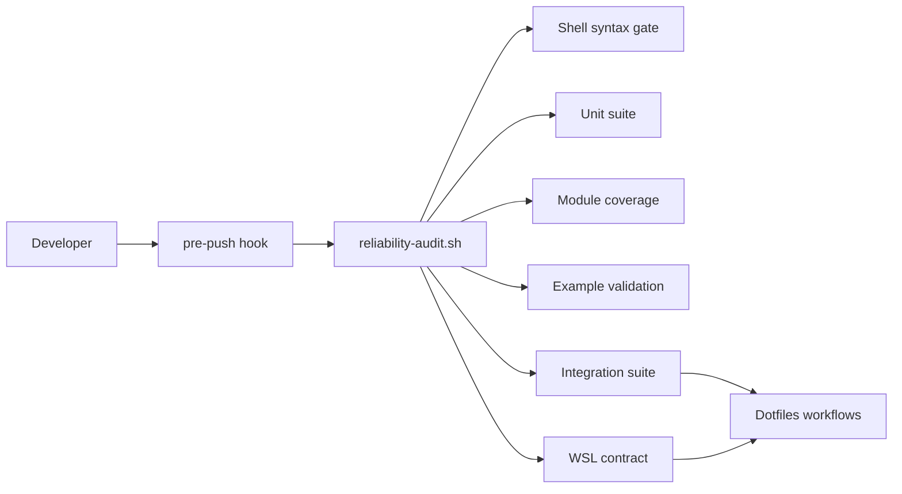
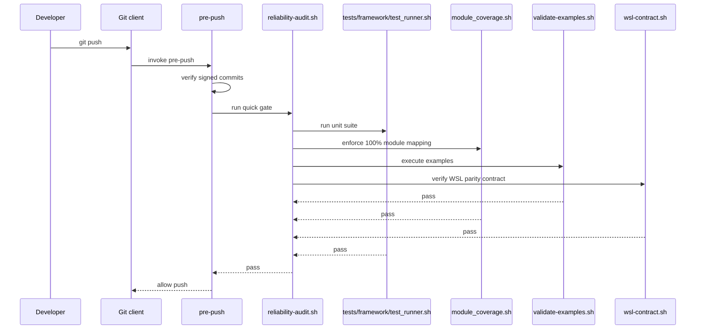

# Reliability

## Reliability scorecard

- Unit coverage: 100% module mapping target, enforced by `tests/framework/module_coverage.sh`
- Integration depth: 11 integration test files in `tests/integration/`
- Regression automation: 436 discovered test files and 2149 named tests in the current baseline

## Coverage gap map

| Module | Missing path | Risk level | Proposed test case |
| :--- | :--- | :--- | :--- |
| `scripts/qa/reliability-audit.sh` | Quick mode and integration mode branch handling | Closed | Covered by `tests/unit/misc/test_qa_reliability_behaviour.sh` |
| `scripts/git-hooks/pre-push` | Audit command failure path | Closed | Covered by `tests/unit/misc/test_git_hooks_pre_push_behaviour.sh` |
| `tests/framework/module_coverage.sh` | False-positive module matches | Closed | Covered by `tests/unit/misc/test_module_coverage_behaviour.sh` |
| `examples/*.sh` | Drift between examples and real commands | Closed | Examples execute in CI through `Examples Contract` and `validate-examples.sh` |

## Integration boundaries





## CI gate

```yaml
name: Reliability Gate

on:
  pull_request:
  push:
    branches: [master]
  workflow_dispatch:

jobs:
  reliability:
    strategy:
      fail-fast: false
      matrix:
        os: [ubuntu-latest, macos-latest]
    runs-on: ${{ matrix.os }}
    steps:
      - uses: actions/checkout@v6
      - name: Reliability audit
        run: bash ./scripts/qa/reliability-audit.sh --with-integration

  examples-contract:
    runs-on: ubuntu-latest
    steps:
      - uses: actions/checkout@v6
      - name: Validate executable examples
        run: bash ./scripts/qa/validate-examples.sh

  wsl-contract:
    runs-on: ubuntu-latest
    steps:
      - uses: actions/checkout@v6
      - name: Validate WSL parity contract
        run: bash ./scripts/qa/wsl-contract.sh

  reliability-summary:
    needs: [reliability, examples-contract, wsl-contract]
    runs-on: ubuntu-latest
```

## Functional examples

- `examples/example-test-suite.sh`: Runs a focused unit slice.
- `examples/example-coverage-gate.sh`: Runs the module coverage contract.
- `examples/example-git-hooks.sh`: Shows the local hook entrypoints.
- `examples/example-platform-contract.sh`: Shows the platform and host contract across macOS, Linux, and WSL.

## Local guardrail

`make test` is the canonical reliability command. It runs syntax checks, unit tests, module coverage, executable examples, and integration tests.

For a lightweight repository-wide snapshot, run `bash ./scripts/qa/coverage-baseline.sh --with-module-coverage`.
